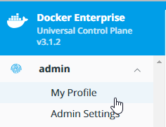
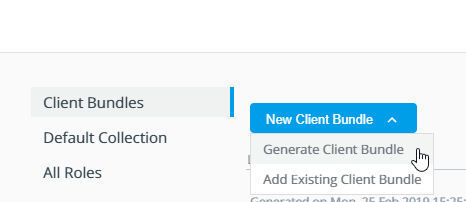

# Use the Client Bundle to administrate your cluster

By the end of this exercise, you should be able to:

 - Log into UCP and find the Client bundle download link
 - Apply the Client Bundle to your desktop to manage your UCP cluster remotely

## Part 1

The Client Bundle can be downloaded by logging into your UCP user account.

1. Log into your UCP installation with an admin user, e.g. `admin`

/

2. Select your username on the left menu and select `My Profile`

/

3. Select `New Client Bundle` and click `Generate Client Bundle`

/

## Part 2

After downloading the client bundle, we will apply the settings to our system.

1. Unzip the client bundle package. Make sure to store the client bundle in a `save place`, e.g. `user owned directory` or `password safe`.

2. Make sure all content of the ZIP file has been unpacked properly and stored in the same directory:
```
[workshop@ee-client01 ucp-aws-admin]$ ls -la
total 40
drwxrwxr-x. 2 workshop workshop 4096 Feb 27 09:24 .
drwx------. 3 workshop workshop 4096 Feb 27 09:24 ..
-rw-r--r--. 1 workshop workshop 1133 Feb 26 15:06 ca.pem
-rw-r--r--. 1 workshop workshop  741 Feb 26 15:06 cert.pem
-rw-r--r--. 1 workshop workshop  177 Feb 26 15:06 cert.pub
-rw-r--r--. 1 workshop workshop 1462 Feb 26 15:06 env.cmd
-rw-r--r--. 1 workshop workshop 1627 Feb 26 15:06 env.ps1
-rw-r--r--. 1 workshop workshop 1446 Feb 26 15:06 env.sh
-rw-------. 1 workshop workshop  227 Feb 26 15:06 key.pem
-rw-------. 1 workshop workshop 3624 Feb 26 15:06 kube.yml
```
3. Apply the Client Bundle fitting to your operating system.

#Linux/Mac
`eval "$(<env.sh)"`

```
[workshop@ee-client01 ucp-aws-admin]$ eval "$(<env.sh)"
Cluster "ucp_dci-1tgb167v-ucp-6d2671e59c369811.elb.eu-central-1.amazonaws.com:6443_admin" set.
User "ucp_dci-1tgb167v-ucp-6d2671e59c369811.elb.eu-central-1.amazonaws.com:6443_admin" set.
Context "ucp_dci-1tgb167v-ucp-6d2671e59c369811.elb.eu-central-1.amazonaws.com:6443_admin" created.
```

#Windows
`.\env.ps1` for Powershell
`env.cmd` for CMD

```
PS C:\Users\workshop> .\env.ps1
Cluster "ucp_dci-1tgb167v-ucp-6d2671e59c369811.elb.eu-central-1.amazonaws.com:6443_admin" set.
User "ucp_dci-1tgb167v-ucp-6d2671e59c369811.elb.eu-central-1.amazonaws.com:6443_admin" set.
Context "ucp_dci-1tgb167v-ucp-6d2671e59c369811.elb.eu-central-1.amazonaws.com:6443_admin" created.
```

## Part 3

We will use the client bundle to check our current running containers in our remote cluster

1. Run the command `docker container ls`

```
[workshop@ee-client01 ucp-aws-admin]$ docker container ls
CONTAINER ID        IMAGE                            COMMAND                  CREATED             STATUS                  PORTS                                                NAMES
8c233c54fe8c        docker/dtr-postgres:2.6.1        "/bin/postgreswrapper"   41 hours ago        Up 41 hours             5432/tcp                                             ip-172-31-64-13.eu-central-1.compute.internal/dtr-scanningstore-b94abec8d9b4
0917b0d8920e        docker/dtr-notary-signer:2.6.1   "/bin/notarywrapper …"   41 hours ago        Up 41 hours                                                                  ip-172-31-64-13.eu-central-1.compute.internal/dtr-notary-signer-b94abec8d9b4
bc3833bf2dfc        docker/dtr-jobrunner:2.6.1       "/bin/jobrunner work…"   41 hours ago        Up 41 hours                                                                  ip-172-31-64-13.eu-central-1.compute.internal/dtr-jobrunner-b94abec8d9b4
f379d698702f        docker/dtr-nginx:2.6.1           "/bin/nginxwrapper"      41 hours ago        Up 41 hours (healthy)   172.31.64.13:80->80/tcp, 172.31.64.13:443->443/tcp   ip-172-31-64-13.eu-central-1.compute.internal/dtr-nginx-b94abec8d9b4
b2d08bf3a352        docker/dtr-notary-server:2.6.1   "/bin/notarywrapper …"   41 hours ago        Up 41 hours                                                                  ip-172-31-64-13.eu-central-1.compute.internal/dtr-notary-server-b94abec8d9b4
a3a88944decf        docker/dtr-api:2.6.1             "/bin/api"               41 hours ago        Up 41 hours                                                                  ip-172-31-64-13.eu-central-1.compute.internal/dtr-api-b94abec8d9b4
f4733617c2ae        docker/dtr-garant:2.6.1          "/bin/garant"            41 hours ago        Up 41 hours                                                                  ip-172-31-64-13.eu-central-1.compute.internal/dtr-garant-b94abec8d9b4
fc567dd7c586        docker/dtr-registry:2.6.1        "/bin/registry"          41 hours ago        Up 41 hours                                                                  ip-172-31-64-13.eu-central-1.compute.internal/dtr-registry-b94abec8d9b4
0123eb14a809        docker/dtr-rethink:2.6.1         "/bin/rethinkwrapper"    41 hours ago        Up 41 hours                                                                  ip-172-31-64-13.eu-central-1.compute.internal/dtr-rethinkdb-b94abec8d9b4
```

2. Run the command `docker volume ls`

```
[workshop@ee-client01 ucp-aws-admin]$ docker volume ls
DRIVER              VOLUME NAME
local               ip-172-31-64-7.eu-central-1.compute.internal/a62843ffad7401a497c2b01a79f80f61b7fab7eca342e58b1c65450dc60ac300
local               ip-172-31-64-7.eu-central-1.compute.internal/ucp-auth-api-certs
local               ip-172-31-64-7.eu-central-1.compute.internal/ucp-auth-store-certs
local               ip-172-31-64-7.eu-central-1.compute.internal/ucp-auth-store-data
local               ip-172-31-64-7.eu-central-1.compute.internal/ucp-auth-worker-certs
local               ip-172-31-64-7.eu-central-1.compute.internal/ucp-auth-worker-data
local               ip-172-31-64-7.eu-central-1.compute.internal/ucp-client-root-ca
local               ip-172-31-64-7.eu-central-1.compute.internal/ucp-cluster-root-ca
local               ip-172-31-64-7.eu-central-1.compute.internal/ucp-controller-client-certs
local               ip-172-31-64-7.eu-central-1.compute.internal/ucp-controller-server-certs
local               ip-172-31-64-7.eu-central-1.compute.internal/ucp-kv
local               ip-172-31-64-7.eu-central-1.compute.internal/ucp-kv-certs
local               ip-172-31-64-7.eu-central-1.compute.internal/ucp-metrics-data
local               ip-172-31-64-7.eu-central-1.compute.internal/ucp-node-certs
local               ip-172-31-64-8.eu-central-1.compute.internal/ff6a1f9d1c5611e88197b6e89dbf391e3aa5c99b4aa17497e37856c2ca45d83b
local               ip-172-31-64-8.eu-central-1.compute.internal/ucp-auth-api-certs
local               ip-172-31-64-8.eu-central-1.compute.internal/ucp-auth-store-certs
local               ip-172-31-64-8.eu-central-1.compute.internal/ucp-auth-store-data
local               ip-172-31-64-8.eu-central-1.compute.internal/ucp-auth-worker-certs
local               ip-172-31-64-8.eu-central-1.compute.internal/ucp-auth-worker-data
local               ip-172-31-64-8.eu-central-1.compute.internal/ucp-client-root-ca
local               ip-172-31-64-8.eu-central-1.compute.internal/ucp-cluster-root-ca
local               ip-172-31-64-8.eu-central-1.compute.internal/ucp-controller-client-certs
local               ip-172-31-64-8.eu-central-1.compute.internal/ucp-controller-server-certs
local               ip-172-31-64-8.eu-central-1.compute.internal/ucp-kv
local               ip-172-31-64-8.eu-central-1.compute.internal/ucp-kv-certs
local               ip-172-31-64-8.eu-central-1.compute.internal/ucp-metrics-data
local               ip-172-31-64-8.eu-central-1.compute.internal/ucp-node-certs
local               ip-172-31-64-13.eu-central-1.compute.internal/589f1c4d4064955f600df6a3f457908bc1e02bede9ec304559b73edb8c605700
local               ip-172-31-64-13.eu-central-1.compute.internal/dtr-ca-b94abec8d9b4
local               ip-172-31-64-13.eu-central-1.compute.internal/dtr-postgres-b94abec8d9b4
local               ip-172-31-64-13.eu-central-1.compute.internal/dtr-registry-b94abec8d9b4
local               ip-172-31-64-13.eu-central-1.compute.internal/dtr-rethink-b94abec8d9b4
local               ip-172-31-64-13.eu-central-1.compute.internal/ucp-auth-api-certs
local               ip-172-31-64-13.eu-central-1.compute.internal/ucp-auth-store-certs
local               ip-172-31-64-13.eu-central-1.compute.internal/ucp-auth-store-data
local               ip-172-31-64-13.eu-central-1.compute.internal/ucp-auth-worker-certs
local               ip-172-31-64-13.eu-central-1.compute.internal/ucp-auth-worker-data
local               ip-172-31-64-13.eu-central-1.compute.internal/ucp-client-root-ca
local               ip-172-31-64-13.eu-central-1.compute.internal/ucp-cluster-root-ca
local               ip-172-31-64-13.eu-central-1.compute.internal/ucp-controller-client-certs
local               ip-172-31-64-13.eu-central-1.compute.internal/ucp-controller-server-certs
local               ip-172-31-64-13.eu-central-1.compute.internal/ucp-kv
local               ip-172-31-64-13.eu-central-1.compute.internal/ucp-kv-certs
local               ip-172-31-64-13.eu-central-1.compute.internal/ucp-metrics-data
local               ip-172-31-64-13.eu-central-1.compute.internal/ucp-node-certs
```


## Conclusion

Client Bundles are used to operate your UCP cluster remotely. Make sure your Bundles are stored in a save place! If Client Bundles are lost, you can revoke them in the UCP Web UI. Client Bundles can be also used for other UCP/DTR related tasks, such as signing images. You can also switch between Client Bundles by reapplying the shell scripts of different user folders.
