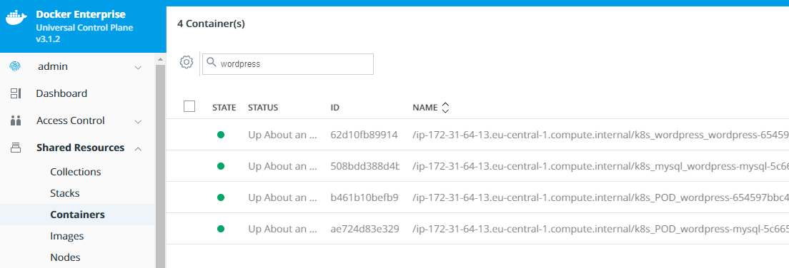
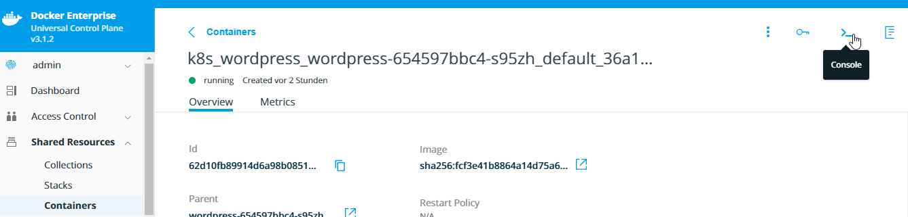
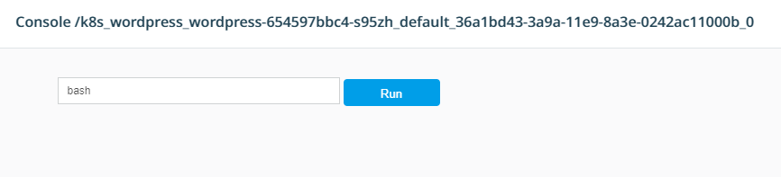
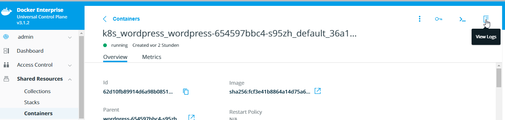

# Container Management

By the end of this exercise, you should be able to:

 - Use UCP Web UI to execute commands within your container
 - Use UCP Web UI to receive container logs

## Part 1 - Getting started

Before you get started with the exercise please make sure you have finished one of these exercises:

- https://github.com/stefantrimborn/workshop-pe/blob/master/exercises/part01-service-swarm.md
- https://github.com/stefantrimborn/workshop-pe/blob/master/exercises/part01-service-kubernetes.md

1. Log into your UCP installation with an admin user, e.g. `admin`

/

## Part 2 - Execute a BASH inside a running container

1. Select `Shared Resources` and select `Containers`. 

2. Use the search field to search for the `wordpress` container 

/

3. Select the wordpress container and click the `console icon` in the upper right corner

/

4. You can enter a command in the next window. This will be run in the container and the output will be forwarded to you. Please enter `bash`and press `Run`

/

5. You are now inside the container running a bash session. Try to ping the mysql container with the following commands

Kubernetes: `ping wordpress-mysql`

Swarm: `ping mysql01`

## Part 3 - Receive container logs

1. Exit the shell by pressing `ESC`or closing the shell by clicking `X` in the upper right corner

2. Press the `log icon` in the upper right corner

/

3. You will receive the logs from the running container-

## Conclusion

UCP allows you to run daily management or troubleshooting tasks by simply clicking the management icons within running containers.

