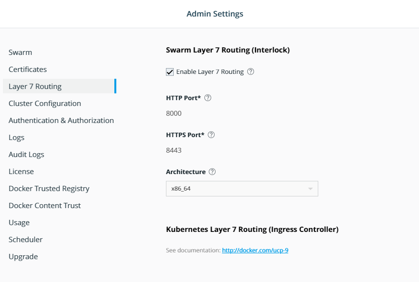
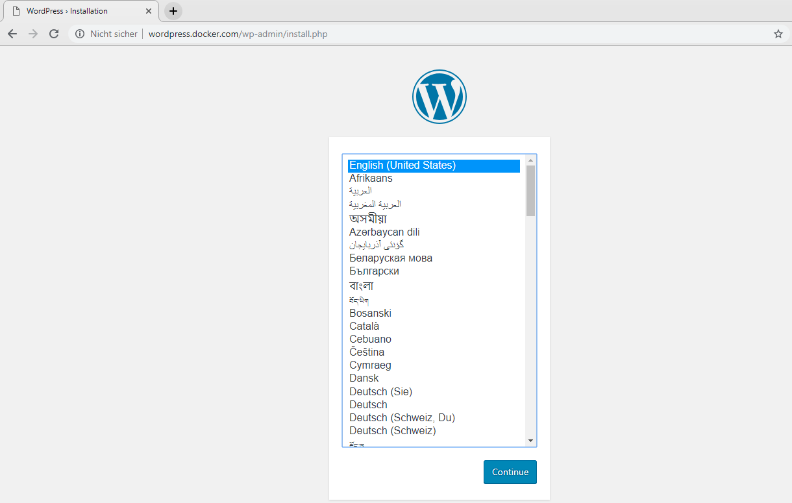

# Interlock/Layer-7 configuration

By the end of this exercise, you should be able to:

 - Use UCP provided ingress layer 7 (interlock) feature for SWARM serrvices
 

## Part 1 - Enable Interlock feature

We will use a multilayer WORDPRESS app to be available through the interlock service.

1. Log into your UCP installation with an admin user, e.g. `admin`

/

2. Make sure all services and deployments have been deleted

3. Select your admin username and select `Admin Settings`

4. Navigate to Layer 7 Routing and set the following values:
 - Enable Layer 7 Routing: switched on
 - HTTP Port: 8000
 - HTTPS Port: 8443

/


## Part 2 - Deploy the service as STACK via UCP Web UI

1. Make sure the previouse created services have been deleted.

2. Select `Shared Resources` and select `Stacks`. Click the `Create Stack` button on the upper right side.

3. Provide the application name **MYAPP** in `Application Name`, select Orchestrator Mode `Swarm`and choose the `Application File Mode - Compose File` and click `Next`

4. Copy and paste the following COMPOSE-FILE:
```
version: '3.3'

services:
   db:
     image: mysql:5.7
     volumes:
       - db_data:/var/lib/mysql
     networks:
       - backend
     restart: always
     environment:
       MYSQL_ROOT_PASSWORD: ThisIsSecret
       MYSQL_DATABASE: wordpress
       MYSQL_USER: wordpress
       MYSQL_PASSWORD: ThisIsAlsoSecret

   wordpress:
     deploy:
      labels:
        com.docker.lb.hosts: wordpress.docker.com
        com.docker.lb.network: MYAPP_frontend
        com.docker.lb.port: 80
     image: wordpress:latest   
     volumes:
       - web_data:/var/www/html
     networks:
       - backend
       - frontend         
     environment:
       WORDPRESS_DB_HOST: db:3306
       WORDPRESS_DB_USER: wordpress
       WORDPRESS_DB_NAME: wordpress
       WORDPRESS_DB_PASSWORD: ThisIsAlsoSecret

networks:
  backend:
  frontend:

volumes:
  db_data: 
  web_data: 
```

Click `Create` and `Done`

## Part 3 - Change your HOSTS to reflect the Linux Worker Node

Our service will now react on http://wordpress.docker.com:8000. Since this is not an official adress, we need to create a HOSTS entry to reflect the host.

Your HOSTS file should mirror something like this:
```
3.122.151.145 wordpress.docker.com
```

**NOTE:** When you use DCI, Loadbalancers at Azure/AWS might already point to Port 8000 so you can actually use the NORMAL HTTP 80 to look at your page.

/

## Conclusion

UCP provides an easy to use, build in ingress controller.

Further reading: 

- https://docs.docker.com/ee/ucp/kubernetes/layer-7-routing/
- https://docs.docker.com/ee/ucp/interlock/usage/
- https://docs.docker.com/ee/ucp/interlock/usage/tls/
- https://docs.docker.com/ee/ucp/interlock/usage/redirects/


