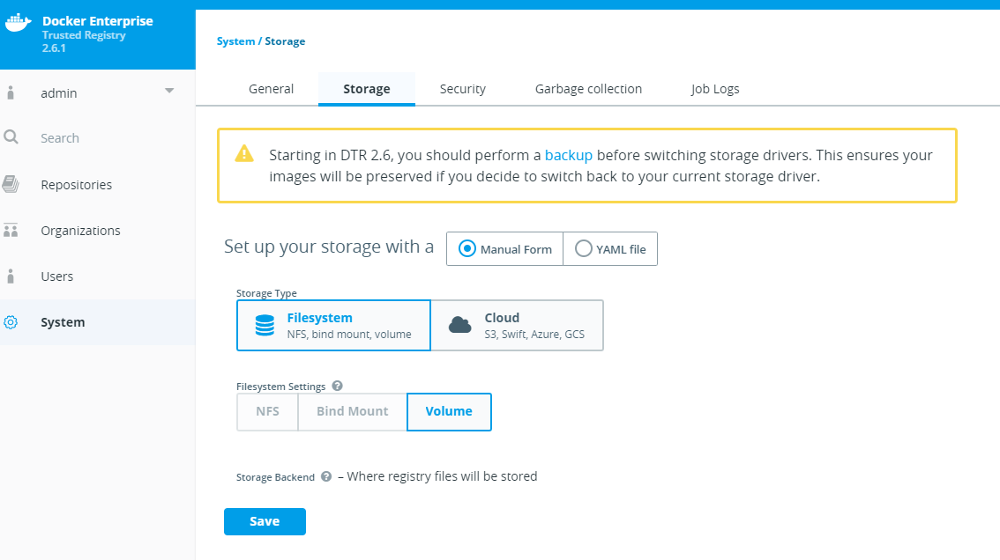

# Configure DTR to use NFS

By the end of this exercise, you should be able to:

 - Reconfigure your DTR cluster to use NFS as shared storage
 

## Part 1 - Check the prerequisites

DTR can be configured to use NFS storage. Before you begin, you should make sure that all your DTR worker nodes are supplied with the necessary `nfs-utils`. The packages here depend on which OS you might use. You can make sure your node is optimized for NFS by running the following commands:

Check the NFS mounts of your destination server:
```
showmount -e <nfsserver>
```

Try to mount the destination NFS share:
```
mkdir /tmp/mydir && sudo mount -t nfs <nfs server>:<directory>
```

If this works for you, you are all set to continue to configure DTR to use NFS.


## Part 2 - Configure DTR to use NFS

You will notice that DTR will not allow you to configure NFS from the Web UI:

/

NFS configurations are taken care of by the `docker/dtr install` or `docker/dtr reconfigure` bootstrap.


### Enable NFS during Installation

Switch to a `Admin Client Bundle` provided or a DTR host an issue the following command to install DTR with enabled NFS:

```
docker run -it --rm docker/dtr install  \
  --nfs-storage-url nfs://<nfs server>/<mount point> \
  <other options>
``` 

### Enable NFS during runtime

Switch to a `Admin Client Bundle` provided or a DTR host an issue the following command to reconfigure DTR to use NFS:

```
docker run -it --rm docker/dtr reconfigure  \
  --nfs-storage-url nfs://<nfs server>/<mount point>
``` 
### Disable NFS during runtime

Switch to a `Admin Client Bundle` provided or a DTR host an issue the following command to reconfigure DTR to disable NFS:

```
docker run -it --rm docker/dtr reconfigure  \
  --nfs-storage-url ""
``` 

**Please note:** The reconfiguration with NFS will take time for configuration synchronization. Please do not kill the reconfiguration process until it's done.

## Conclusion

NFS is a preferred method for on-prem installations. It is easy to use and configure. However NFS is not always available, especially in Windows environments and should also not be used in Cloud environments. DTR provides many build in Cloud Storage connections.

Further reading: 

- https://docs.docker.com/datacenter/dtr/2.1/guides/configure/use-nfs/


