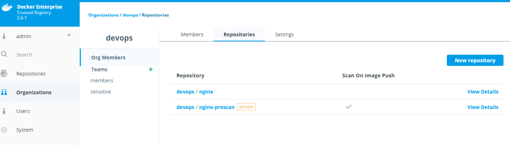
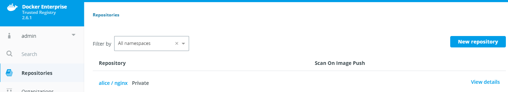
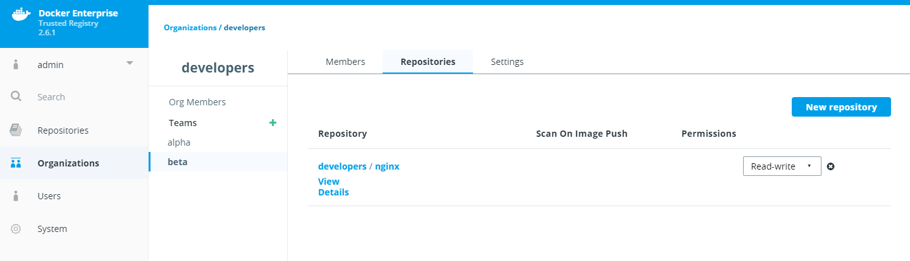
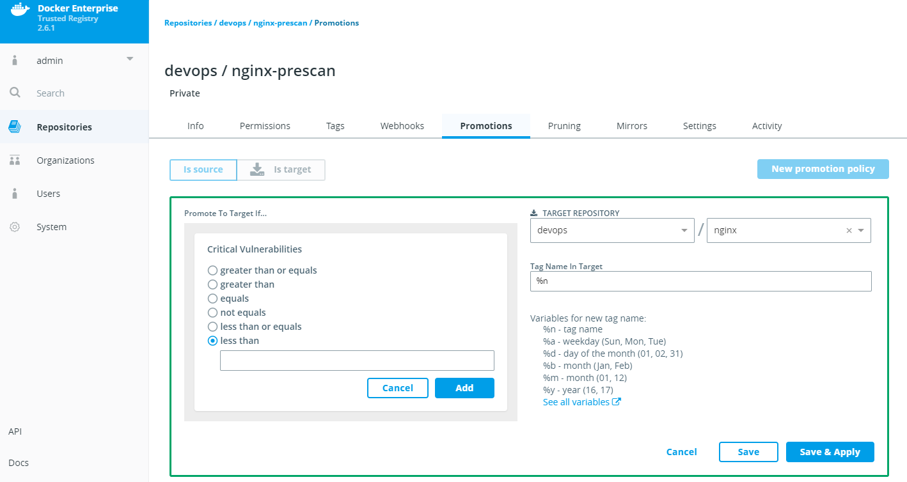
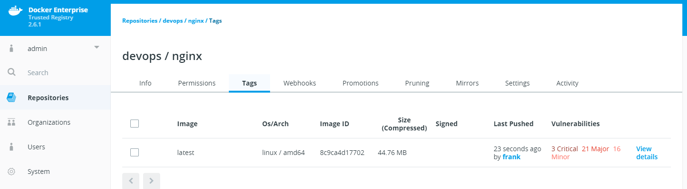

# Create a repository with RBAC model

By the end of this exercise, you should be able to:

 - Create Repositories under organzations, teams and users
 - Understand the usage of private repositories
 - Connect an RBAC model to repositories
 - Understand the promotion feature of DTR
 

## Part 1 - Pre-Requisits

Since we need Organizations, Teams and Users, it is highly recommended you follow the exercise https://github.com/stefantrimborn/workshop-pe/blob/master/exercises/part02-ucp-rbac-structure.md first. 

By finishing this exercise you will have a complete RBAC structure in place. You should also finish the exercise https://github.com/stefantrimborn/workshop-pe/blob/master/exercises/part02-dtr-security-scanning.md for DTR Security Scanning to be enabled. 

Also make sure your SSL certificates are valid to be able to use Docker pull/push. Follow this exercise for further instructions https://github.com/stefantrimborn/workshop-pe/blob/master/exercises/part02-general-ssl-certificates.md

We will look at 3 users:
- Alice / Organization: Developers / Team: Alpha
- Chuck / Organization: Developers / Team: Beta
- Frank / Organization: DevOps / Team: members

The roles will be:
- DevOps will provide a public available nginx image, after they have been scanned with the DTR security feature. Scanned images should be promoted to a public repository automatically.
- Alice will provide a private repository with her own nginx:tag
- Team Beta will provide a public available repostiry with immutable image tags

## Part 2 - Create the repositories

You can decide if you want to create the repositories by each user or if you create them by your admin user. We will go ahead and user the admin user.

### DevOps

1. Log into DTR with your `admin user`

2. First we will create the DevOps repository. Click `Organizations` then `devops` and then select `Repositories`. Create a new one by clicking on `New Repository`

3. Name the repository `nginx-prescan`, keep it public and activate `Scan On Push`

4. Repeat step 2 and 3. Create a repository with the name `nginx` and leave the `Scan On Push deactivated.

/

5. Click `Organizations` then `devops` and then select `members`. Select `Repositories` and press `New Repository`.

6. Keep `Existing` and select as Repository Name `nginx-prescan` with `Read-Write` Permissions.

### Alice

1. Click `Repositories` then `New Repositories` and then select the user `alice`. Give the repository the name `nginx` and make it `Private`.

/
### Team Beta

1. Click `Organizations` then `developers` and then select Team `beta`. Go to `Repositories` and create a new one by clicking on `New Repository`

2. Select `New` and create the repository `nginx` with Permissions `Read-Write` and enable `Immutability On` in the Advanced settings

/


## Part 2 Configure the promotion policy

We want only scanned images to be provided by the DevOps team, therefor we will first scan the Image in an private repository and then promote it to a public one.

1. Click `Repositories` and select `devops / nginx-prescan`.

2. Click `Promotions`and create a new policy by pressing `New promotion policy`

3. Select `Critical Vulnerabilites` and select `less than` with the value of `5`. Select the Target Repository `devops/nginx`. Click `Save`

/


## Part 3 Make use of your repositories

### DevOps
1. We will provide the nginx:latest image to our nginx-prescan repository by running the following commands:

```
docker image pull nginx:latest

docker image tag nginx:latest YOURDTRURL/devops/nginx-prescan:latest

docker login -u frank YOURDTRURL 

docker image push YOURDTRURL/devops/nginx-prescan:latest
```

2. The image will be scanned by DTR. This may take a couple of minutes. After the scan we should be able to see a promoted nginx image in our `devops/nginx` Repository.

/

We now have an approved nginx image we can use to work with for the other teams.

### Alice

1. As Alice, we will now pull the approved image and upload it to our private repository:

```
docker login -u alice YOURDTRURL

docker image pull YOURDTRURL/devops/nginx:latest

docker image tag YOURDTRURL/devops/nginx:latest YOURDTRURL/alice/nginx:latest

docker image push YOURDTRURL/alice/nginx:latest
```

2. We will switch to Chuck from the Beta Team now and try to pull and push against Alice private repository:
```
docker login -u chuck YOURDTRURL

docker image pull YOURDTRURL/alice/nginx:latest

docker image push YOURDTRURL/alice/nginx:latest
```

As a result we will be unable to access Alice Repository.

### Team Beta

1. As Team Beta we want to make sure that always a new TAG is supplied. Therefor we set up the Repo with the Immutability. We will pull try to overwrite a tag in our repository:
```
docker login -u chuck YOURDTRURL

docker image tag YOURDTRURL/devops/nginx:latest YOURDTRURL/developers/nginx:latest

docker image push YOURDTRURL/developers/nginx:latest

docker image pull nginx:1.14.2-alpine

docker image tag nginx:1.14.2-alpine YOURDTRURL/developers/nginx:latest

docker image push YOURDTRURL/developers/nginx:latest
```

We try to overwrite our `latest` with a different image. This will result in the following error `unknown: tag=latest cannot be overwritten because developers/nginx is an immutable repository`

## Conclusion

DTRs Security Scan provides you with a potent and easy to use vulnerability scanner. The scans can be combined with other DTR features, which will have a closer look in other Exercises.

