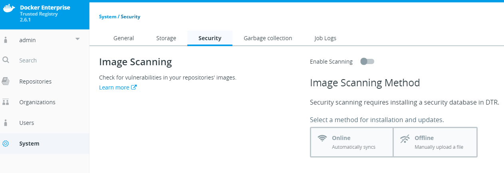
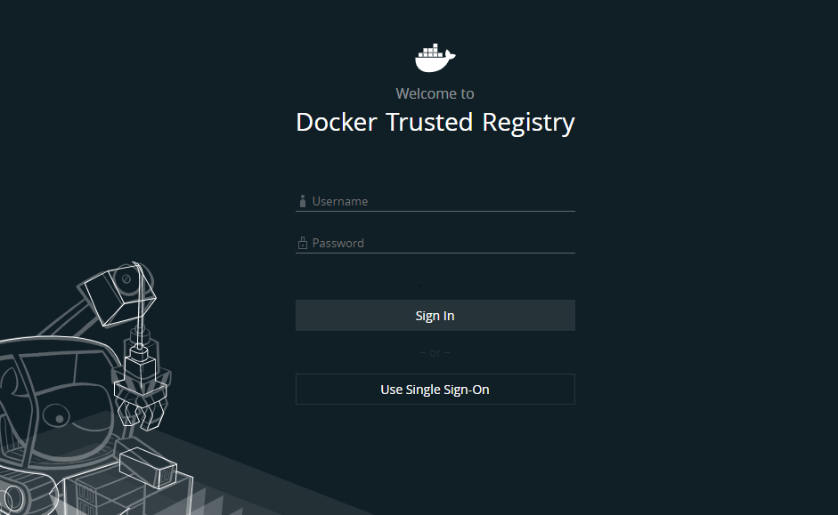

# Enable and test security scanning

By the end of this exercise, you should be able to:

 - Enable security scanning
 - Understand how to update CVE pattern
 - Be able to configure Security Scanning with your images
 

## Part 1 - Change the SSO settings

Security Scans for current exploits is a very important feature within DTR. You can make sure your images are up to date and create triggers and action based on security scan results.

1. Browse to you `DTR url` and log in by using an admin user, e.g. `admin`. 

/

2. In DTR, click on `System`and select `Security`. 

/

3. Switch the Option `Enable Scanning` on and leave the Installation Method set to `Online`. Click the new Button `Enable Online Syncing` to enable the feautre. Please be aware that the pattern download and installation can take up to a couple of minutes.

## Part 2 - Configure a Repository to use security scanning on push

1. Wait for the Logout to complete, now you should see a DTR login screen.

/

As you may notice, the Single Sign-On Feature is still available. But now you can choose between directly `Sign In` or `Use Single Sign-On`

## Conclusion

The SSO Feature by DTR is very convinient for login procedures. However there might be situations, where you want to change this default behavior, e.g. when non-admins are not supposed to access or even see UCP within their network.

Further reading: 

- https://docs.docker.com/ee/dtr/admin/configure/enable-single-sign-on/

