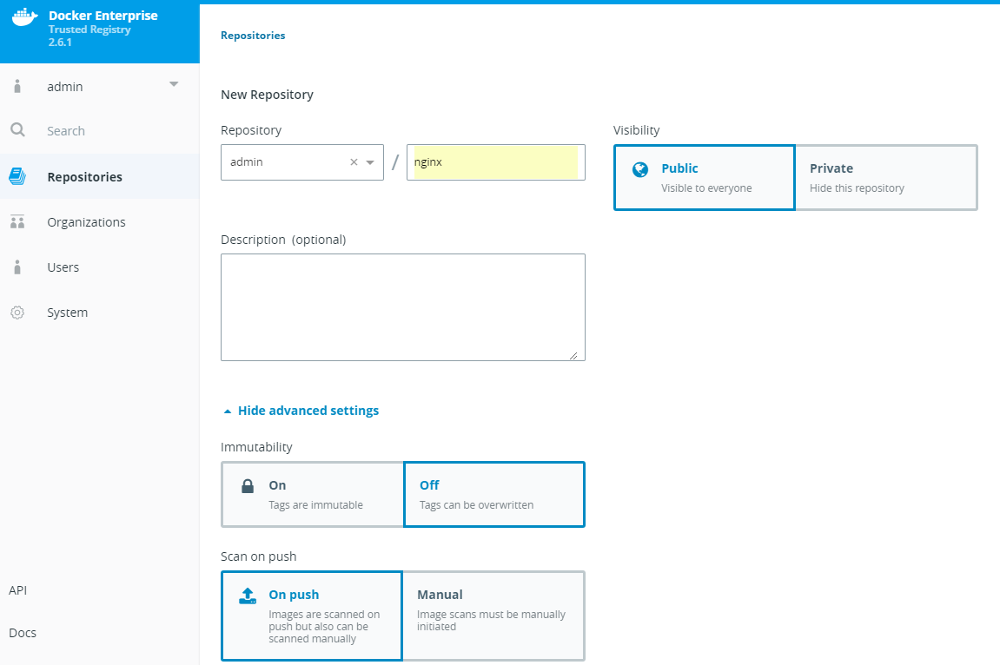
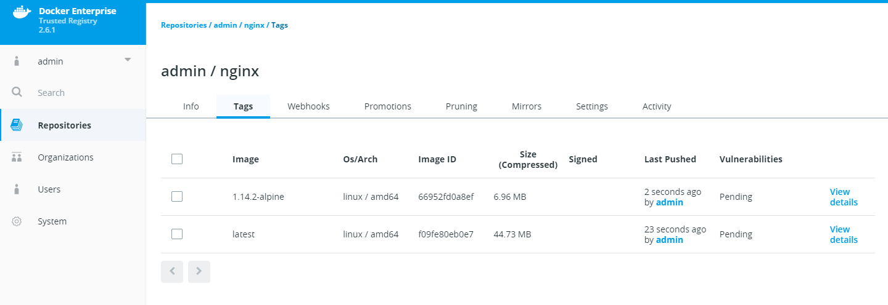
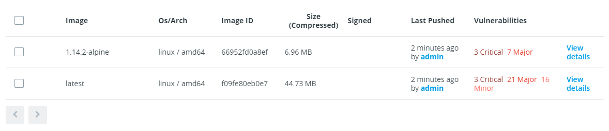

# Enable and test security scanning

By the end of this exercise, you should be able to:

 - Enable security scanning
 - Understand how to update CVE pattern
 - Be able to configure Security Scanning with your images
 

## Part 1 - Change the SSO settings

Security Scans for current exploits is a very important feature within DTR. You can make sure your images are up to date and create triggers and action based on security scan results.

1. Browse to you `DTR url` and log in by using an admin user, e.g. `admin`. 

/

2. In DTR, click on `System`and select `Security`. 

/

3. Switch the Option `Enable Scanning` on and leave the Installation Method set to `Online`. Click the new Button `Enable Online Syncing` to enable the feautre. Please be aware that the pattern download and installation can take up to a couple of minutes.

## Part 2 - Configure a Repository to use security scanning on push

1. After the pattern download has been succsessful, switch to `Repositories`.

2. Create a new Repository by clicking `New repository`

3. Provide a repository name and unhide the advanced settings. Select `Scan on push` and click `Create`.

/

You can change the `Scan on push` function at any time by selecting the `settings` tab within your repository.

## Part 3 - Push an image to check out the security feature

Before you begin, please make sure you have completed the following trainings:
https://github.com/stefantrimborn/workshop-pe/blob/master/exercises/part02-ucp-clientbundle.md
https://github.com/stefantrimborn/workshop-pe/blob/master/exercises/part02-general-ssl-certificates.md

1. Please make sure you are currently **not** using the UCP client bundle. Otherwise the Docker CLI will initiate a pull on all your worker nodes.

2. On a docker ready host, run the following command:

```
docker image pull nginx:1.14.2-alpine
docker image pull nginx:latest

docker image tag nginx:1.14.2-alpine YOURDTRURL/admin/nginx:1.14.2-alpine
docker image tag nginx:latest YOURDTRURL/admin/nginx:latest

docker image push YOURDTRURL/admin/nginx:1.14.2-alpine
docker image push YOURDTRURL/admin/nginx:latest
```

3. When done correctly, you should be able to see your new tags within the Repository `Tags` tab. Please note the `Vulnerabilites` are currently on *Pending* The security scan will take some time.

/

4. You can refresh the page to see if the status has been change. The result may look something like this:

/

5. Click on `View Details` next to the Vulrnerabilities results. You will be able to check in which `Layers` or `Components` your vulnerabilites lie. 


## Conclusion

DTRs Security Scan provides you with a potent and easy to use vulnerability scanner. The scans can be combined with other DTR features, which will have a closer look in other Exercises.

Further reading: 

- https://docs.docker.com/ee/dtr/admin/configure/set-up-vulnerability-scans/


