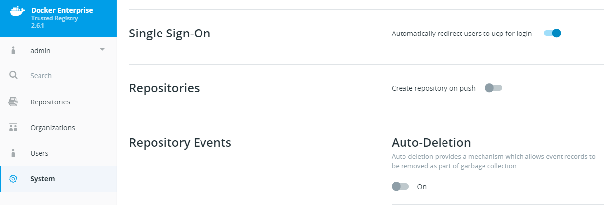

# Configure to use Single Sign-On in DTR

By the end of this exercise, you should be able to:

 - How to configure SSO in DTR
 - How it affects your DTR login
 

## Part 1 - Change the SSO settings

The first time you browse to your `DTR url`, you might notice, that you will be redirected to the `UCP url`. This is the by default set up SSO procedure of DTR. This can be changed however.

1. Browse to you `DTR url` and log in by using an admin user, e.g. `admin`. You will currently see the UCP login page

/

2. In DTR, click on `System`and scroll down to the option point `Single Sign-On`. 

/

3. Switch the Option `automatically redirect users to ucp for login` off and log your user out. To log out select your `username` on the right and select `Logout`

## Part 2 - Notice the difference

1. Wait for the Logout to complete, now you should see a DTR login screen.

/

As you may notice, the Single Sign-On Feature is still available. But now you can choose between directly `Sign In` or `Use Single Sign-On`

## Conclusion

The SSO Feature by DTR is very convenient for login procedures. However there might be situations, where you want to change this default behavior, e.g. when non-admins are not supposed to access or even see UCP within their network.

Further reading: 

- https://docs.docker.com/ee/dtr/admin/configure/enable-single-sign-on/

