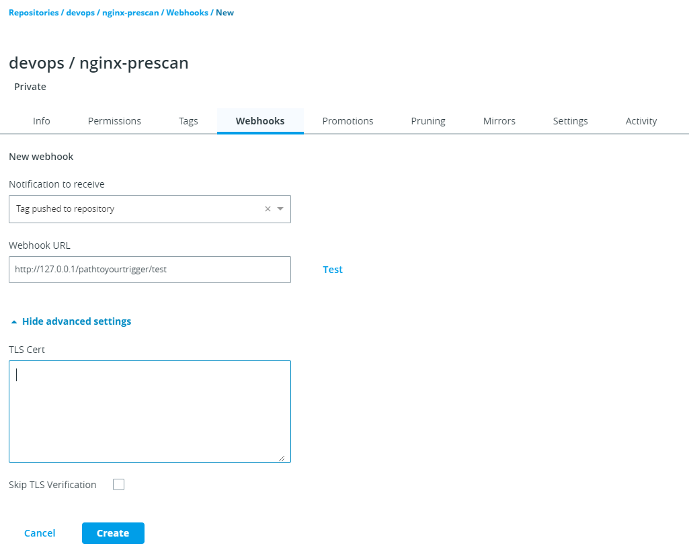

# Configure DTR Repositories with Webhooks

By the end of this exercise, you should be able to:

 - How to configure Webhooks for Repositories in DTR
  

## Part 1 - Create a Webhook

Make sure you have run through the following exercise first:

https://github.com/stefantrimborn/workshop-pe/blob/master/exercises/part02-ucp-rbac-structure.md

When using CI/CD pipelines, it might be mandetory to provide webhooks so certain CI/CD pipelines can be triggered. DTR provides such a feature.

1. Browse to you `DTR url` and log in by using an admin user, e.g. `admin`. You will currently see the UCP login page

/

2. In DTR, click on `Repositories`and select `devops/nginx-prescan`. 

3. Select `Webhooks` and press the `New Webhook` button.

4. If you have a destination server in place, you select one of the `Notification to receive` and the `Webhook URL`. The Webhook is being created by pressing `Create`

/

## Conclusion

DTR Webhooks are a perfect addition for your CI/CD pipeline and simple to configure.

Further reading: 

- https://docs.docker.com/ee/dtr/user/create-and-manage-webhooks/

