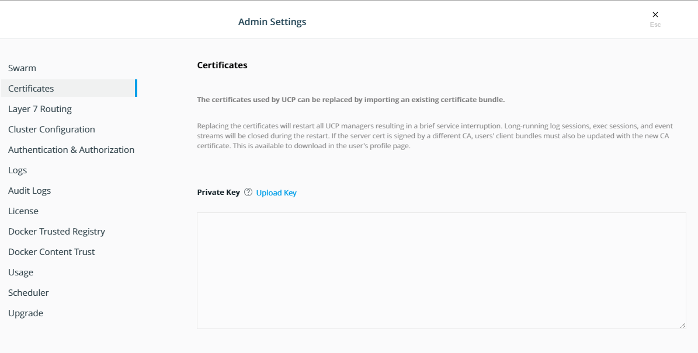

# Update UCP and DTR to use self provided SSL certificates

By the end of this exercise, you should be able to:

 - Exchange SSL certificates on UCP
 - Exchange SSL certificates on DTR
 - Understand the importance of proper SSL hygine on your client machines

## Part 1 - Exchange SSL certificates

UCP as well as DTR both use SSL certificates to communicate with each other and allow external secured access. During a default installation UCP and DTR will provide self-signed certificates. For testing, those certificates can be used. In real-life scenarios you should make sure you exchange the certificates with tursted SSL certificates.

### UCP

1. Log into UCP as `administrative user` and navigate to `User Menu` and `Admin Settings`. Here you navigate to `Certificates`.

/

2. Upload your certificates. You will at least need the host certificate, private key and CA certificate. 

3. After uploading, please make sure to refresh or re-login into UCP for the new certificates to be in use.

### DTR

1. Log into DTR as `administrative user` and navigate to `System`. Scroll down to `Domain & Proxies` and select the `Show TLS settings` link.

/

2. Provide your `TLS private key`, your `TLS certificate chanin` and `TLS root CA` and click save.

3. After uploading, please make sure to refresh or re-login into DTR for the new certificates to be in use.


## Part 2 - Using UCP and DTR provided self-signed certificates for training.

You might not want to provide properly generated certificates during a test period. This can be easly realized by optaining the self-signed CA certificates from your UCP and DTR installation. You have to place those CA certificates in your local certificate trust store so you can log in with `docker login` properly. Otherwise, the login will be declared unsafe and you will be unable to push images to your DTR.

To receive the CA Certificate from UCP use:
```
curl -k https://UCP.YOURDOMAIN.COM/ca 3 > ucp-ca.pem
```

To receive the CA Certificate from DTR use:
```
curl -k https://DTR.YOURDOMAIN.COM/ca 3 > dtr-ca.pem
```

The CA installation on your local host differs according to your current OS. Please refer to your OS support manual on how to install CA certificates.


## Part 3 - Important CLI commands to interact with certificate related tasks.

There are some useful CLI commands to use for interacting with certificate related tasks.

### UCP

To receive currently installed certificate information you can run:
```
docker container run --rm \
    --name ucp \
    -v /var/run/docker.sock:/var/run/docker.sock \
    docker/ucp \
    dump-certs --ca --cluster
```

### DTR

You can provide DTR with the SSL certificates during the installation. To do so you can run:
```
docker container run -it --rm docker/dtr:$DTR_VERIONS install --dtr-ca "$(cat ca.pem)" --dtr-cert "$(cat cert.pem)" --dtr-key "$(cat private.key)" --dtr-external-url $LB_URL --ucp-url $UCP_URL --ucp-username $UCP_USERNAME --ucp-password $UCP_PASSWORD --ucp-node $NODEIP --ucp-insecure-tls
```

You can also reconfigure the certificate after the installation withour Web UI access:
```
docker container run -it docker/dtr:$DTR_VERIONS reconfigure --dtr-ca "$(cat ca.pem)" --dtr-key "$(cat key.pem)" --dtr-cert "$(cat cert.pem)" --ucp-insecure-tls
```

## Conclusion

Proper SSL Certificate installations and client side SSL hygine are **mandetory** for DEE to function properly. Please make sure you either provide proper certificates or inhouse CA provisioned certificates.

Further Reading:
https://docs.docker.com/reference/ucp/3.1/cli/dump-certs/
https://docs.docker.com/reference/dtr/2.6/cli/install/
https://docs.docker.com/reference/dtr/2.6/cli/reconfigure/


