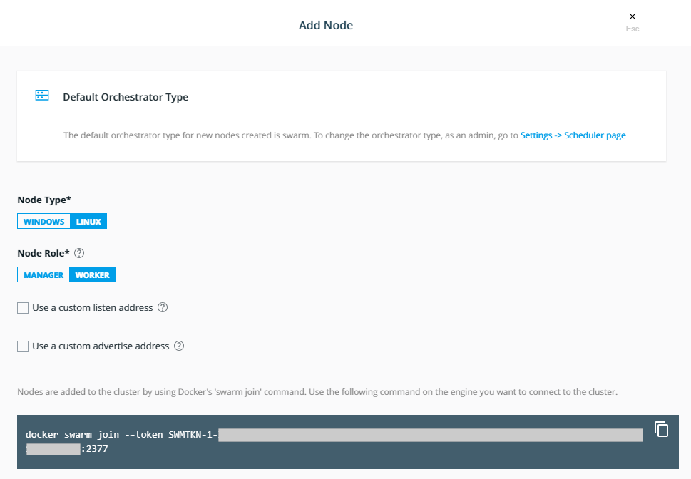
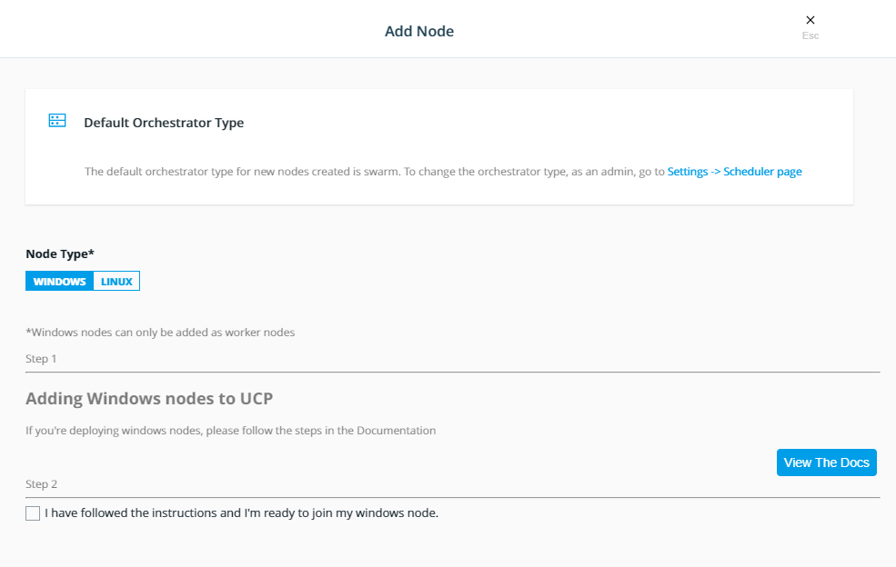

# Join worker nodes to UCP

By the end of this exercise, you should be able to:

 - Join a Linux worker node
 - Join a Windows worker node
 
## Part 1 - Receive your UCP worker token

This exercise will run you through the worker join process. For Linux workers the worker join process is straight forward, while windows workers will need a little bit of extra work.

1.  Log into your UCP installation with an admin account.
/

2.  Select `Shared Resources` and go to `Nodes`

3.  Click the `Add Node` button on the upper right site. You will be able to see your token within the box of the bottom of the page.

## Part 3 - Join a Linux node

/

1.  Make sure Node Type is set to `Linux` and the Node Role is set to `Worker`.

2.  Copy the `docker swarm join` command of the box.

3.  Log into your Linux worker node and issue the previously copied command.

4.  Back in UCP, check the Node overview for your new node. It should be preparing.

5.  On the joining node, you can check if the UCP agent container is up and running with `docker container ls | grep ucp`

This is an example output:

```
    f3f9c9f0ebf3        docker/ucp-agent:3.1.4                          "/bin/ucp-agent agent"   2 days ago          Up 2 days             2376/tcp                                                                    ucp-agent.r3k8l5tdfkua8qjbpbrf9en74.l2p8zylxr6g82905uzphn0cd6
    a75a0d880ceb        docker/ucp-calico-cni                           "/install-cni.sh"        7 days ago          Up 7 days                                                                                         k8s_install-cni_calico-node-n9s8t_kube-system_d0865ff7-4570-11e9-85f8-0242ac110009_0
    febab1c62987        docker/ucp-calico-node                          "start_runit"            7 days ago          Up 7 days                                                                                         k8s_calico-node_calico-node-n9s8t_kube-system_d0865ff7-4570-11e9-85f8-0242ac110009_0
    af4e25c04b73        docker/ucp-pause:3.1.4                          "/pause"                 7 days ago          Up 7 days                                                                                         k8s_POD_calico-node-n9s8t_kube-system_d0865ff7-4570-11e9-85f8-0242ac110009_0
    251d514ee602        docker/ucp-hyperkube:3.1.4                      "/bin/kubelet_entryp…"   7 days ago          Up 7 days                                                                                         ucp-kubelet
    89dcab9a78c4        docker/ucp-hyperkube:3.1.4                      "kube-proxy --cluste…"   7 days ago          Up 7 days                                                                                         ucp-kube-proxy
    23933a1b9c99        docker/ucp-agent:3.1.4                          "/bin/ucp-agent prox…"   7 days ago          Up 7 days (healthy)   0.0.0.0:6444->6444/tcp, 0.0.0.0:12378->12378/tcp, 0.0.0.0:12376->2376/tcp   ucp-proxy
    af4ead2c5859        docker/ucp-pause:3.1.3                          "/pause"                 7 days ago          Up 7 days                                                                                         k8s_POD_prometheus-operator-prometheus-node-exporter-tj6lk_monitoring_107b9b41-3480-11e9-a7fc-0242ac110003_2
  ```

## Part 4 - Join a Windows node

1.  Make sure Node Type is set to `Windows` and the Node Role is set to `Worker`.

2.  You will notice that the page will change, as Windows workers need extra steps to be prepared to be part of the UCP cluster.

/

3.  Log into your Windows worker and make sure you have container support and Docker installed. You can do this by running the following commands within a Windows Powershell:

    ```
    Install-Module DockerMsftProvider -Force
    Install-Package Docker -ProviderName DockerMsftProvider -Force
  ```

You will need to reboot your node by running `Restart-Computer`

4.  After the Reboot, open `C:\ProgramData\docker\config\daemon.json` with  notepad and add the following entry:

    ```
    {
      "labels": ["os=windows"]
    }
    ```

Restart the Docker service by the `Restart-Service docker` ps-command.

5.  Pull the *latest* UCP agent and dsinfo images onto your windows worker:

    ```
    docker image pull docker/ucp-agent-win:3.1.4
    docker image pull docker/ucp-dsinfo-win:3.1.4
  ```

6.  Invoke the following PS-script so your Windows node will be fully prepared for joining your UCP cluster:

    ```
    $script = [ScriptBlock]::Create((docker run --rm docker/ucp-agent-win:3.1.4 windows-script | Out-String))
    Invoke-Command $script
    ```

7.  Go back to your UCP browser window and tick the box next to `I have followed the instructions and I'm ready to join my windows node.`

8.  Copy the `docker swarm join` command of the box.

9.  Log into your Windows worker node and issue the previously copied command.

10.   Back in UCP, check the Node overview for your new node. It should be preparing.

11.  On the joining node, you can check if the UCP agent container is up and running with `docker container ls | Select-String -Pattern ucp`

## Conclusion

Windows and Linux are working differently. Therefor it is important to understand the difference right from the beginning. Take caution in preparing your Windows Worker Nodes when joining them to a UCP cluster.

Further reading: 

- https://success.docker.com/article/docker-universal-control-plane-windows-nodes
- https://docs.docker.com/ee/ucp/admin/configure/join-nodes/join-windows-nodes-to-cluster/