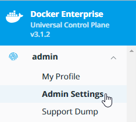
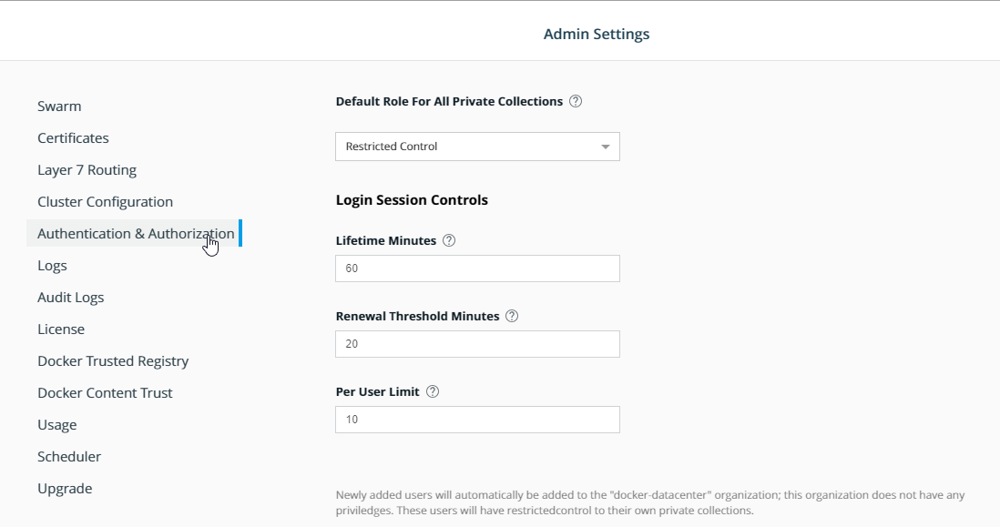
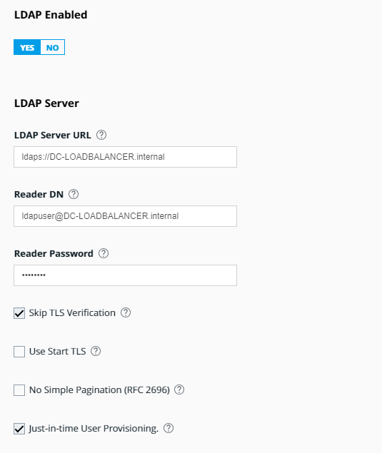

# Connect UCP to an external LDAP server

By the end of this exercise, you should be able to:

 - Set up an external LDAP connection to synchronize LDAP/AD users

 **If you have no running LDAP server, you can consider this exercise as optional**

 **Optional:** To get a simple docker based OpenLDAP server running, use:

 ```
docker container run --env LDAP_ORGANISATION="My Company" --env LDAP_DOMAIN="my-company.com" \
--env LDAP_ADMIN_PASSWORD="Password01" \
-p 389:389 -p 636:636 --name my-openldap-container \
--detach osixia/openldap:1.2.4
```
You can find a guide here to start an OpenLdap server here: https://github.com/osixia/docker-openldap
The tool *LDAP Admin* can be used to remotly configure additional users: http://www.ldapadmin.org/


## Part 1 - Enable LDAP

In each part we will create one piece of the RBAC structure. We will start with **Organizations**

1. Log into your UCP installation with an admin user, e.g. `admin`

/


2. Open the Users Menu by clicking your admin user name and select `Admin Settings`

/


3. Select the `Authentication & Authorization`

/

4. We want to make sure, LDAP users can only interact with their private collections, so keep select `Restricted Control` at `Default Role for All Private Collections`

5. Switch `LDAP Enabled` to yes which will reveal a new set of options:

/


## Part 2 - Configure LDAP Server and Domains

If you have a test LDAP server, you will need to provide the following settings:

- LDAP Server URL e.g. `ldaps://DC-LOADBALANCER.internal`
- READER DN e.g. `ldapuser@DC-LOADBALANCER.internal`
- READER Password - **IMPORTANT** make sure this field is ALWAYS filled with the correct password, even during config changes and config tests. Otherwise you will receive an error.
- Options: 
  - `Skipt TLS Verification` this is needed for self-signed TLS certificates used by your LDAP server
  - `Use Start TLS` enables StartTLS usage, is ignored when ldaps:// is provided in the LDAP Server URL
  - `No Simple Pagination` can be switched on/off
  - `Just-in-time User Provisioning`- **IMPORTANT** - the administrator can decide if the complete LDAP catalog will be synced at once or only when a user actually logs into the cluster. It is highly recommended to keep this option enabled if your LDAP Server hosts multiple hundreds of users.

- LDAP Additional Domains - If your company hosts multiple LDAP domains. e.g. seperated by country, you can provide the additional domain here.

## Part 3 - Configure LDAP User Search Configurations

The following image will show a minimal `User Search Configurations`
/

- Options: 
  - `Search subtree instead of just one level` might used for more complex LDAP object structures
  - `Match Group Members` enables the matching feature. You will need to provide Group details in the following fields. This can be very useful to restrict assigned users.
  - `Iterate through group members` this allows UCP to query single users instead of groups. The Group details must be also supplied.


## Part 4 - LDAP Sync & Testing

With the next step we will finalize our LDAP setup.
/

You can provide a user name and password which is within the configured LDAP User Search configuration. By clicking `Test`you will receive either an LDAP error or a simple `Test successful` message.

You should set up a sync interval in hours as well to make sure your LDAP credentials are up to date.

When enabled, you can use the option `Enable sync of admin users` and provide MATCH patterns.
/

When you sync UCP with your provided LDAP settings, a successful sync might look like this:

```
{"level":"info","msg":"connecting to db ...","time":"2019-02-27T11:00:00Z"}

{"go.version":"go1.10.6","level":"info","msg":"beginning sync of all user accounts","time":"2019-02-27T11:00:00Z"}

{"go.version":"go1.10.6","level":"info","msg":"creating set of current users","time":"2019-02-27T11:00:00Z"}

{"go.version":"go1.10.6","level":"info","msg":"not searching for new users because jit provisioning is enabled","time":"2019-02-27T11:00:00Z"}

{"go.version":"go1.10.6","level":"info","msg":"beginning sync of all memberships","time":"2019-02-27T11:00:00Z"}

{"go.version":"go1.10.6","level":"info","msg":"beginning sync of system admin users","time":"2019-02-27T11:00:00Z"}

{"go.version":"go1.10.6","level":"info","msg":"number of current system admin users synced with LDAP: 1","time":"2019-02-27T11:00:00Z"}

{"go.version":"go1.10.6","level":"info","msg":"Searching group: cn=ee-admins,ou=group,ou=container,ou=test,dc=docker,dc=com for attr: member","time":"2019-02-27T11:00:00Z"}

{"go.version":"go1.10.6","level":"info","msg":"number of system admin users found via LDAP search: 2","time":"2019-02-27T11:00:00Z"}

{"go.version":"go1.10.6","level":"info","msg":"system admin users added: 0","time":"2019-02-27T11:00:00Z"}

{"go.version":"go1.10.6","level":"info","msg":"system admin users removed: 0","time":"2019-02-27T11:00:00Z"}

{"go.version":"go1.10.6","level":"info","msg":"system admin users unchanged: 1","time":"2019-02-27T11:00:00Z"}

{"go.version":"go1.10.6","level":"info","msg":"system admin users not synced: 1","time":"2019-02-27T11:00:00Z"}

{"go.version":"go1.10.6","level":"info","msg":"beginning sync of team members","org":"developers","time":"2019-02-27T11:00:00Z"}

{"go.version":"go1.10.6","level":"info","msg":"found 2 teams to sync","org":"developers","time":"2019-02-27T11:00:00Z"}

{"go.version":"go1.10.6","level":"info","msg":"beginning sync of team members","org":"developers","team":"alpha","time":"2019-02-27T11:00:00Z"}

{"go.version":"go1.10.6","level":"info","msg":"number of current team members: 0","org":"developers","team":"alpha","time":"2019-02-27T11:00:00Z"}

{"go.version":"go1.10.6","level":"info","msg":"Searching group: cn=developers-alpha,ou=group,ou=container,ou=test,dc=docker,dc=com for attr: member","time":"2019-02-27T11:00:00Z"}

{"go.version":"go1.10.6","level":"info","msg":"number of team members found via LDAP search: 1","org":"developers","team":"alpha","time":"2019-02-27T11:00:00Z"}

{"go.version":"go1.10.6","level":"info","msg":"team members added: 0","org":"developers","team":"alpha","time":"2019-02-27T11:00:00Z"}

{"go.version":"go1.10.6","level":"info","msg":"team members removed: 0","org":"developers","team":"alpha","time":"2019-02-27T11:00:00Z"}

{"go.version":"go1.10.6","level":"info","msg":"team members unchanged: 0","org":"developers","team":"alpha","time":"2019-02-27T11:00:00Z"}

{"go.version":"go1.10.6","level":"info","msg":"team members not synced: 1","org":"developers","team":"alpha","time":"2019-02-27T11:00:00Z"}

{"go.version":"go1.10.6","level":"info","msg":"beginning sync of team members","org":"developers","team":"beta","time":"2019-02-27T11:00:00Z"}

{"go.version":"go1.10.6","level":"info","msg":"number of current team members: 0","org":"developers","team":"beta","time":"2019-02-27T11:00:00Z"}

{"go.version":"go1.10.6","level":"info","msg":"Searching group: cn=developers-beta,ou=group,ou=container,ou=test,dc=docker,dc=com for attr: member","time":"2019-02-27T11:00:00Z"}

{"go.version":"go1.10.6","level":"info","msg":"number of team members found via LDAP search: 1","org":"developers","team":"beta","time":"2019-02-27T11:00:00Z"}

{"go.version":"go1.10.6","level":"info","msg":"team members added: 0","org":"developers","team":"beta","time":"2019-02-27T11:00:00Z"}

{"go.version":"go1.10.6","level":"info","msg":"team members removed: 0","org":"developers","team":"beta","time":"2019-02-27T11:00:00Z"}

{"go.version":"go1.10.6","level":"info","msg":"team members unchanged: 0","org":"developers","team":"beta","time":"2019-02-27T11:00:00Z"}

{"go.version":"go1.10.6","level":"info","msg":"team members not synced: 1","org":"developers","team":"beta","time":"2019-02-27T11:00:00Z"}

{"go.version":"go1.10.6","level":"info","msg":"beginning sync of team members","org":"docker-datacenter","time":"2019-02-27T11:00:00Z"}

{"go.version":"go1.10.6","level":"info","msg":"found 0 teams to sync","org":"docker-datacenter","time":"2019-02-27T11:00:00Z"}

{"go.version":"go1.10.6","level":"info","msg":"beginning sync of team members","org":"docker","time":"2019-02-27T11:00:00Z"}

{"go.version":"go1.10.6","level":"info","msg":"found 1 teams to sync","org":"docker","time":"2019-02-27T11:00:00Z"}

{"go.version":"go1.10.6","level":"info","msg":"beginning sync of team members","org":"docker","team":"dev","time":"2019-02-27T11:00:00Z"}

{"go.version":"go1.10.6","level":"info","msg":"number of current team members: 1","org":"docker","team":"dev","time":"2019-02-27T11:00:00Z"}

{"go.version":"go1.10.6","level":"info","msg":"Searching group: cn=dev,ou=group,ou=container,ou=test,dc=docker,dc=com for attr: member","time":"2019-02-27T11:00:00Z"}

{"go.version":"go1.10.6","level":"info","msg":"number of team members found via LDAP search: 1","org":"docker","team":"dev","time":"2019-02-27T11:00:00Z"}

{"go.version":"go1.10.6","level":"info","msg":"team members added: 0","org":"docker","team":"dev","time":"2019-02-27T11:00:00Z"}

{"go.version":"go1.10.6","level":"info","msg":"team members removed: 0","org":"docker","team":"dev","time":"2019-02-27T11:00:00Z"}

{"go.version":"go1.10.6","level":"info","msg":"team members unchanged: 1","org":"docker","team":"dev","time":"2019-02-27T11:00:00Z"}

{"go.version":"go1.10.6","level":"info","msg":"team members not synced: 0","org":"docker","team":"dev","time":"2019-02-27T11:00:00Z"}
```

You can now use LDAP credentials to log into your UCP and DTR installation. Logged in LDAP users will be shown in `Access & Control` under `Users` the same way internal users are shown.

## Conclusion

With the LDAP connection you can mirror your existing user structures to UCP. This allows you to keep current structures and makes user management easier.

Further reading: https://docs.docker.com/ee/ucp/admin/configure/external-auth/
