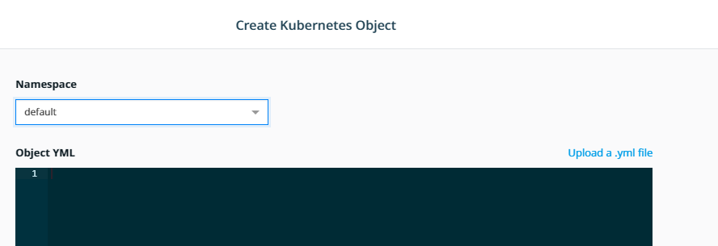
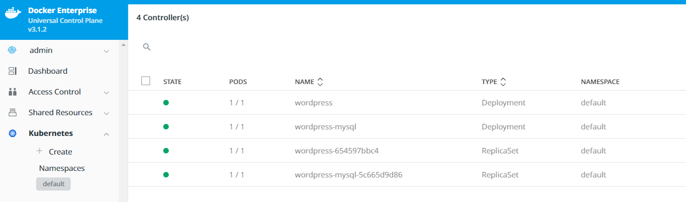
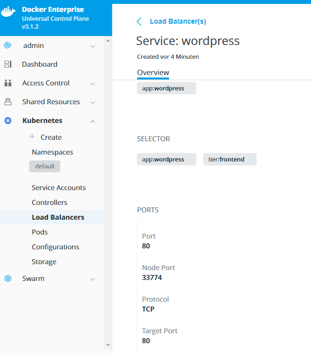

# Deploy a multi-service app with UCP

By the end of this exercise, you should be able to:

 - Use UCP Web UI to deploy kubernetes objects
 - Change service and object attributes after a service has been deployed


## Part 1 - Login

Our multi-service app will use a WORDPRESS Frontend and MYSQL Database as backend. We will start by providing the MYSQL database

1. Log into your UCP installation with an admin user, e.g. `admin`

/


## Part 2 - Create your deployment with a YML file

Instead of running a YML file through the CLI, we will create our Service by using the Web UI Wizard. We will supply the YML by the end of this exercise.

1. Select `Kubernetes` and select `+ Create`.

/

2. Select `Namespace` **default** and paste in the following YML file:

```
apiVersion: v1
kind: Service
metadata:
  name: wordpress-mysql
  labels:
    app: wordpress
spec:
  ports:
    - port: 3306
  selector:
    app: wordpress
    tier: mysql
  clusterIP: None
---
kind: PersistentVolume
apiVersion: v1
metadata:
  name: mysql-pv-volume
  labels:
    type: local
spec:
  storageClassName: manual
  capacity:
    storage: 20Gi
  accessModes:
    - ReadWriteOnce
  hostPath:
    path: "/mnt/data"
---
apiVersion: v1
kind: PersistentVolumeClaim
metadata:
  name: mysql-pv-claim
  labels:
    app: wordpress
spec:
  storageClassName: manual
  accessModes:
    - ReadWriteOnce
  resources:
    requests:
      storage: 2Gi
---
apiVersion: apps/v1 # for versions before 1.9.0 use apps/v1beta2
kind: Deployment
metadata:
  name: wordpress-mysql
  labels:
    app: wordpress
spec:
  selector:
    matchLabels:
      app: wordpress
      tier: mysql
  strategy:
    type: Recreate
  template:
    metadata:
      labels:
        app: wordpress
        tier: mysql
    spec:
      containers:
      - image: mysql:5.6
        name: mysql
        env:
        - name: MYSQL_ROOT_PASSWORD
          value: ThisIsAlsoSecret
        ports:
        - containerPort: 3306
          name: mysql
        volumeMounts:
        - name: mysql-persistent-storage
          mountPath: /var/lib/mysql
      volumes:
      - name: mysql-persistent-storage
        persistentVolumeClaim:
          claimName: mysql-pv-claim
---
apiVersion: v1
kind: Service
metadata:
  name: wordpress
  labels:
    app: wordpress
spec:
  ports:
    - port: 80
  selector:
    app: wordpress
    tier: frontend
  type: NodePort
---
apiVersion: v1
kind: PersistentVolume
metadata:
  name: wp-pv-volume
  labels:
    type: local
spec:
  storageClassName: manual
  capacity:
    storage: 20Gi
  accessModes:
    - ReadWriteOnce
  hostPath:
    path: "/mnt/data"
---
apiVersion: v1
kind: PersistentVolumeClaim
metadata:
  name: wp-pv-claim
  labels:
    app: wordpress
spec:
  storageClassName: manual
  accessModes:
    - ReadWriteOnce
  resources:
    requests:
      storage: 2Gi
---
apiVersion: apps/v1 # for versions before 1.9.0 use apps/v1beta2
kind: Deployment
metadata:
  name: wordpress
  labels:
    app: wordpress
spec:
  selector:
    matchLabels:
      app: wordpress
      tier: frontend
  strategy:
    type: Recreate
  template:
    metadata:
      labels:
        app: wordpress
        tier: frontend
    spec:
      containers:
      - image: wordpress:4.8-apache
        name: wordpress
        env:
        - name: WORDPRESS_DB_HOST
          value: wordpress-mysql
        - name: WORDPRESS_DB_PASSWORD
          value: ThisIsAlsoSecret         
        ports:
        - containerPort: 80
          name: wordpress
        volumeMounts:
        - name: wordpress-persistent-storage
          mountPath: /var/www/html
      volumes:
      - name: wordpress-persistent-storage
        persistentVolumeClaim:
          claimName: wp-pv-claim
```

This YML will create:
- Deployments
- Replica Sets
- Service Cluster-IP
- Service NodePort (for Wordpress)
- Persistent Volumes
- Persistent Volume Claims

/

## Part 3 - Access to WORDPRESS

With the deployments wordpress and wordpress-mysql you should be either able to access your service via http://workernode-ip:NODEPORT or your configured LoadBalancer. Please note, that the NODEPORT is randomized in this exercise. You might need to open an extra Port to access the service, when deployed with Kubernetes.

/

## Part 4 - Deploy the service via Client Bundle and CLI

1. Follow this instruction to use UCP Client Bundles: https://github.com/stefantrimborn/workshop-pe/blob/master/exercises/part01-clientbundle.md 

2. Additionally you will have to set up `kubectl` for your environment. Please follow these instructions: https://docs.docker.com/ee/ucp/user-access/kubectl/ 

3. You can save the stated YML file to your management client and run the following command.

```
kubectl create -f k8s-deployment.yaml
```

## Conclusion

UCP allows you the comfort of creating any kind of KUBERNETES orchestration object by simply logging into the Web UI. If prefered you can use the Client Bundle in combintation with kubectl to manage your cluster as well, without restrictions.

Further reading: 

- https://docs.docker.com/ee/ucp/kubernetes/kube-resources/
- https://docs.docker.com/ee/ucp/kubernetes/
- https://docs.docker.com/ee/ucp/kubernetes/deploy-with-compose/


