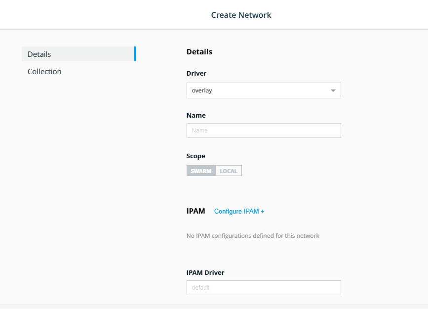
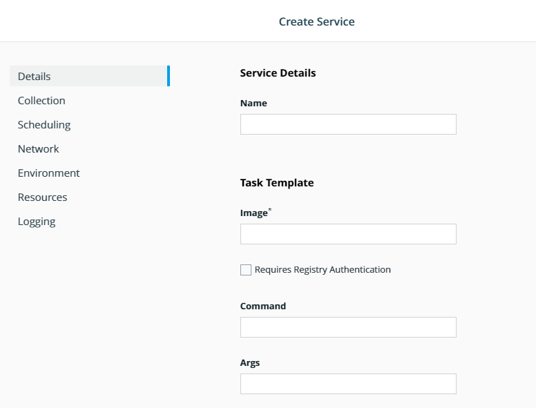
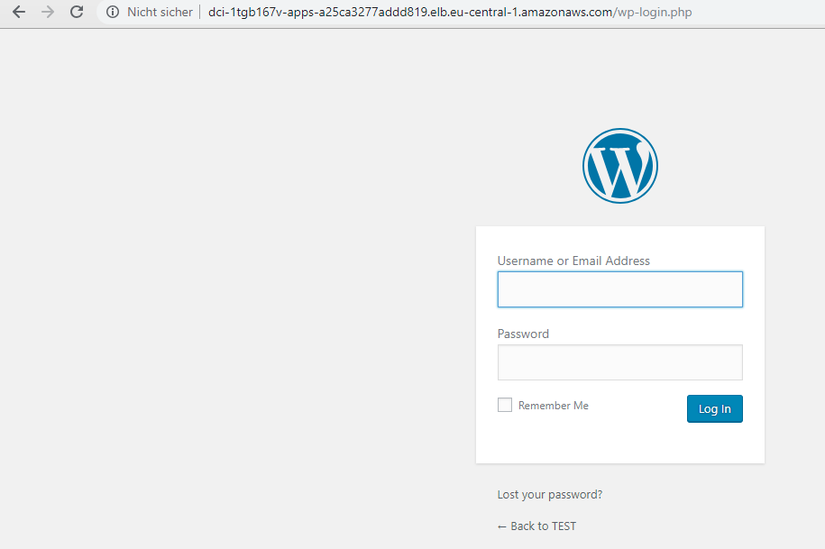
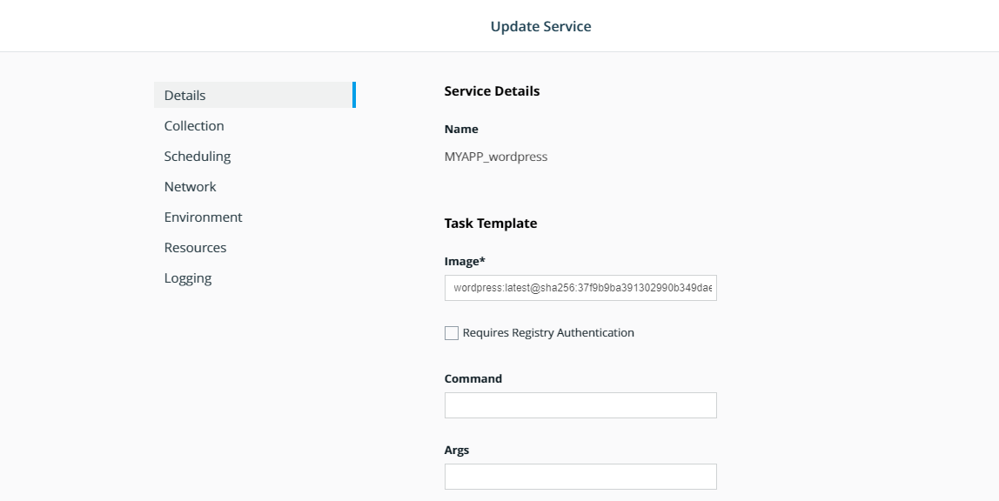
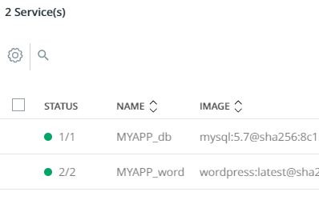

# Deploy a multi-service app with UCP

By the end of this exercise, you should be able to:

 - Use UCP Web UI to deploy services
 - Change service and object attributes after a service has been deployed


## Part 1 - Login

Our multi-service app will use a WORDPRESS frontend and MYSQL Database as backend. We will start by providing the MYSQL database

1. Log into your UCP installation with an admin user, e.g. `admin`

/


## Part 2 - Preparations - Create a network

1. Select `Swarm` and select `Networks`. Click the `Create` button on the upper right side.

2. Fill in the following information:

/

Details:
- Driver: overlay
- Name: backend

3. Repeat 2. with the following informations:

Details:
- Driver: overlay
- Name: frontend


## Part 3 - Service creation - MYSQL

Instead of running a YML file through the CLI, we will create our Service by using the Web UI Wizard. We will supply the YML by the end of this exercise.

1. Select `Swarm` and select `Service`. Click the `Create` button on the upper right side.

/

2. Within the Wizard fill in the following informations:

/

Details
- Name: mysql01
- Image mysql:5.7

Collection
- No changes/defaults

Scheduling
- No changes/defaults

Network
- Mode: DNS RR
- Networks: backend

Environment:
- Environment Variable:
    - MYSQL_ROOT_PASSWORD=ThisIsSecret
    - MYSQL_DATABASE=wordpress
    - MYSQL_USER=wordpress
    - MYSQL_PASSWORD=ThisIsAlsoSecret

Resources
- Add Volume: 
    - New
    - Source: db_data
    - Target: /var/lib/mysql
    - Volume CONFIRM

Logging
- No changes/defaults

When done click `Create`. Your mysql01 Service should be available in a few seconds.

/


## Part 4 - Service creation - WORDPRESS

1. Repeat step 1. and 2. of the MYSQL service creation and replace the values as following:

Details
- Name: wordpress01
- Image wordpress:latest 

Collection
- No changes/defaults

Scheduling
- No changes/defaults

Network
- Mode: VIP
- Add PORT
- Target Port: 80
- Published Port 8000 
- Port CONFIRM
- Networks: backend, frontend

Environment:
- Environment Variable:
    - WORDPRESS_DB_HOST=mysql01:3306
    - WORDPRESS_DB_USER=wordpress
    - WORDPRESS_DB_NAME=wordpress
    - WORDPRESS_DB_PASSWORD=ThisIsAlsoSecret

Resources
- Add Volume: 
    - New
    - Source: web_data
    - Target: /var/www/html
    - Volume CONFIRM

Logging
- No changes/defaults

## Part 5 - Access to WORDPRESS

With the services MYSQL01 and WORDPRESS01 you should be either able to access your service via http://workernode-ip:8000 or your configured LoadBalancer which is part of the DCI deployment training.

/

## Part 6 - Deploy the service via Client Bundle and CLI

1. Follow this instruction to use UCP Client Bundles: https://github.com/stefantrimborn/workshop-pe/blob/master/exercises/part01-clientbundle.md 

2. Run the following `docker service create commands`:

```
docker network create backend
docker network create frontend

docker service create --name mysql01 --network backend -e MYSQL_ROOT_PASSWORD=ThisIsSecret -e MYSQL_DATABASE=wordpress -e MYSQL_USER=wordpress -e MYSQL_PASSWORD=ThisIsAlsoSecret --mount type=volume,source=db_data,destination=/var/lib/mysql mysql:5.7

docker service create --name wordpress01 --publish mode=ingress,target=80,published=8000 --network backend --network frontend -e WORDPRESS_DB_HOST=mysql01:3306 -e WORDPRESS_DB_USER=wordpress -e WORDPRESS_DB_NAME=wordpress -e WORDPRESS_DB_PASSWORD=ThisIsAlsoSecret --mount type=volume,source=db_data,destination=/var/www/html wordpress:latest
```

## Part 7 - Deploy the service as STACK via UCP Web UI

1. Make sure the previous created services have been deleted.

2. Select `Shared Resources` and select `Stacks`. Click the `Create Stack` button on the upper right side.

3. Provide an `Application Name`, select Orchestrator Mode `Swarm`and choose the `Application File Mode - Compose File` and click `Next`

4. Copy and paste the following COMPOSE-FILE:
```
version: '3.3'

services:
   db:
     image: mysql:5.7
     volumes:
       - db_data:/var/lib/mysql
     networks:
       - backend
     restart: always
     environment:
       MYSQL_ROOT_PASSWORD: ThisIsSecret
       MYSQL_DATABASE: wordpress
       MYSQL_USER: wordpress
       MYSQL_PASSWORD: ThisIsAlsoSecret

   wordpress:
     depends_on:
       - db
     image: wordpress:latest   
     volumes:
       - web_data:/var/www/html
     networks:
       - backend
       - frontend
     ports:
       - "8000:80"
     restart: always
     environment:
       WORDPRESS_DB_HOST: db:3306
       WORDPRESS_DB_USER: wordpress
       WORDPRESS_DB_NAME: wordpress
       WORDPRESS_DB_PASSWORD: ThisIsAlsoSecret

networks:
  backend:
  frontend:

volumes:
  db_data: 
  web_data: 
```

Click `Create` and `Done`

5. Again your Wordpress should be available as in the previous step

## Part 8 - Scale your WORDPRESS container

Regardless if you followed the manual, stack or CLI procedure, you might want to change your services. This can be done during runtime within the Web UI.

1. Select `Swarm` and select `Service`. 

2. Select the WORDPRESS Service you deployed and select the cog wheel in the upper right corner.

/

3. Within the `Update Service` Options, select `Scheduling`

4. Update `Scale` to 2 and click `Save`

5. Your service will scale to the 2 in the service overview

/

## Conclusion

UCP allows you the comfort of creating any kind of SWARM orchestration object by simply logging into the Web UI. If preferred you can use the Client Bundle to manage your cluster as well, without restrictions.

Further reading: 

- https://docs.docker.com/ee/ucp/swarm/
- https://docs.docker.com/ee/ucp/swarm/deploy-multi-service-app/
- https://docs.docker.com/ee/ucp/swarm/deploy-to-collection/


