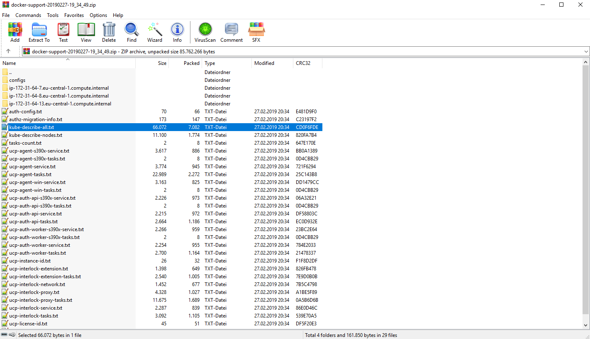

# Create and analyse an UCP Support Dump

By the end of this exercise, you should be able to:

 - Create an UCP Support Dump
 - Know the content of a support dump
 

## Part 1 - Create the support dump

You might need to provide Docker Support further information in case of errors. You can do so by downloading an UCP support dump.

1. Log into your UCP installation with an admin user, e.g. `admin`

/

2. Click on your admin user name and select `Support Dump`. A package will be created and the download will start immediately.

## Part 2 - Support Dump content

1. Open the newly downloaded ZIP file.

/

2. You will see different logs and configurations. Most of the content can be described as `docker inspect` or `kubectl describe` content in json format.

## Conclusion

It is very easy to receive a support dump to analyses your cluster and provide it to the Docker Support.

Further reading: 

- https://docs.docker.com/ee/get-support/

