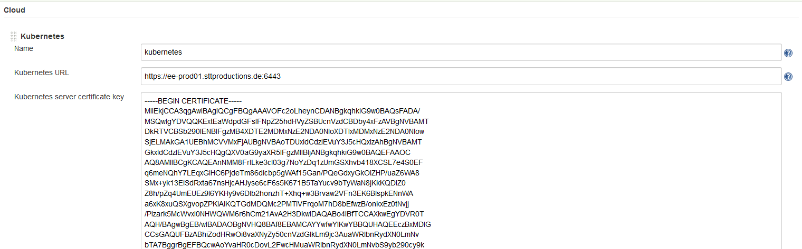
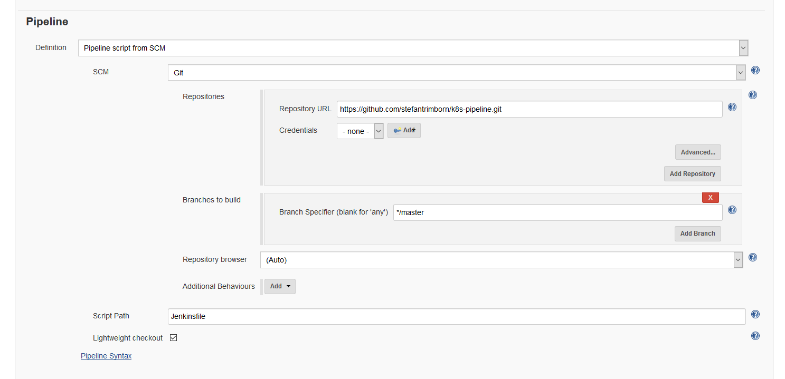

# Deploying Jenkins within a Kubernetes Cluster

By the end of this exercise, you should be able to:

 - Deploy a basic Jenkins Server within Kubernetes
 - Configure the Jenkins Kubernetes Plug-In
 - Combine GitHub, Jenkins and Kubernetes to build a Maven Tomcat-Webapp


## Introduction

This exercise is not build on best practices. There are many different ways to realize a Jenkins Deployment environment. This following example is a working solution but lacks a lot of security related configurations. Our setup will include not the latest versions of different images, does not provide secured or save authentication. It is a basic demo to show the integration with Jenkins in Kubernetes, based on an old Maven example.

Before you begin this exercise you should:
- Be able to use GitHub and provide a GitHub account.
- Have an UCP/DTR installation in place
- Know how to use and where to find a UCP Client Bundle
- Have a fully working repository based on DTR in place

## Part 1 - Building a Jenkins Server Image

We will build our own Jenkins Server Image which we will deploy in our Kubernetes Cluster

1. On a docker host create a `Dockerfile` with the following content:

```
FROM jenkins/jenkins:2.138.4

# Distributed Builds plugins
RUN /usr/local/bin/install-plugins.sh ssh-slaves

# install Notifications and Publishing plugins
RUN /usr/local/bin/install-plugins.sh email-ext
RUN /usr/local/bin/install-plugins.sh mailer
RUN /usr/local/bin/install-plugins.sh slack

# Artifacts
RUN /usr/local/bin/install-plugins.sh htmlpublisher

# UI
RUN /usr/local/bin/install-plugins.sh greenballs
RUN /usr/local/bin/install-plugins.sh simple-theme-plugin

# Scaling
RUN /usr/local/bin/install-plugins.sh kubernetes

# GitHub
RUN /usr/local/bin/install-plugins.sh github


# install Maven
USER root
RUN apt-get update && apt-get install -y maven
USER jenkins
```

Build and Push commands:
```
docker image build -t YOURDTRURL/REPOSITORY/jenkins-server:v1

docker image push YOURDTRURL/REPOSITORY/jenkins-server:v1
```

2. Make sure your client bundle is activated and create a namespace for our deployment:
```
kubectl create namespace jenkins-k8s
```

3. Copy the following YML files and apply them to your namespace `jenkins-k8s`:

**jenkins-k8s-deployment.yml**
```
apiVersion: extensions/v1beta1
kind: Deployment
metadata:
  name: jenkins
  namespace: jenkins-k8s
spec:
  replicas: 1
  template:
    metadata:
      labels:
        app: jenkins
    spec:
      containers:
        - name: jenkins
          image: ee-dtr.sttproductions.de/sttproductions/jenkins-master-k8s:v1
          env:
            - name: JAVA_OPTS
              value: -Djenkins.install.runSetupWizard=false
          ports:
            - name: http-port
              containerPort: 8080
            - name: jnlp-port
              containerPort: 50000
          volumeMounts:
            - name: jenkins-home
              mountPath: /var/jenkins_home
      volumes:
        - name: jenkins-home
          emptyDir: {}
---
apiVersion: v1
kind: Service
metadata:
  name: jenkins
  namespace: jenkins-k8s
spec:
  type: NodePort
  ports:
    - port: 8080
      targetPort: 8080
      nodePort: 35500
      name: http-port
    - port: 50000
      targetPort: 50000
      nodePort: 35501
      name: jnlp-port

  selector:
    app: jenkins
```

**jenkins-k8s-serviceaccount.yml**
```
apiVersion: rbac.authorization.k8s.io/v1beta1
kind: ClusterRoleBinding
metadata:
  name: Jenkins-rbac
subjects:
  - kind: ServiceAccount
    # Reference to upper's `metadata.name`
    name: default
    # Reference to upper's `metadata.namespace`
    namespace: jenkins-k8s
roleRef:
  kind: ClusterRole
  name: cluster-admin
  apiGroup: rbac.authorization.k8s.io
```

Creating our objects:
```
kubectl create -f jenkins-k8s-deployment.yml
kubectl create -f jenkins-k8s-serviceaccount.yml
```

The first file will create the Jenkins Server deployment with an NodePort `35500`. The second file will grant the default jenkins-k8s user a cluster-admin Role.

4. After your deployment is up and running you should be able to access your Jenkins Server by `http://WORKERNODE-URL:35500` - Make sure your Firewall or cloud access allows you to access this NodePort. The NodePort will not change.

/

## Part 2 - Jenkins Plugin Installation and Configuration

You may notice a couple of warning messages, as this is only a test setup, you can ignore or dismiss those messages. We will continue to configure Jenkins with it's plugins first.

1. Select `Manage Jenkins` and select `Manage Plugins`

2. Under `Available` select `Pipelines` and click `Install without restart`

Make sure the Plugins `Pipeline`, `Kubernetes` and `GitHub` are installed correctly.

3. Return to `Manage Jenkins` and select `Global Tool Configuration`

4. Scroll to `Maven` click `Add Maven` and type as name `MVN`. Select version `3.5.4` at the Version drop down. Click `Save`

5. Return to `Manage Jenkins` and select `Nodes`

6. Click on the cock wheel next to the Master Node.

7. Switch `Usage` to `Only build jobs with label expressions matching this node`

8. Click `Save`

## Part 3 - Jenkins Cloud (Kubernetes) Configuration

Next we will configure the Jenkins Kubernetes Plugin, which will integrate in our cluster.

1. Select `Manage Jenkins` and select `Configure System`

2. Scroll down until `Cloud` and click `Add a new Cloud` and select `Kubernetes`

3. Provide the following information:

- Name: Kubernetes
- Kubernetes URL: https://UCPCLUSTERNODE:6443 **NOTE:** This can be either your LoadBalancer or a single UCP Management Node.
- Kubernetes server certificate key: Within your client bundle you will find a CA.pem file. Copy and paste the content of the file in here.

/

- Disable https certificate check: Enabled
- Kubernetes Namespace: jenkins-k8s
- Jenkins URL: http://jenkins.jenkins-k8s.svc:8080 **NOTE:**Instead of the service DNS, which is highly recommended, you can also supply the Jenkins-Master POD-IP. The IP can be found via: `kubectl -n jenkins-k8s describe pod JENKINSPODNAME* 

/

You should be able to connect to you Cluster by pressing `Test Connection`

4. Next we will create our worker Pods, please click `Add Pod Template`, select `Kubernetes Pod Template` and provide the following information:

- Name: jenkins-slave
- Namespace: jenkins-k8s
- Labels: jenkins-slave
- Usage Use this node as much as possible

/

Click `Add Container` and provide the following information:

- Name: jenkins-slave
- Docker image: jenkins/jnlp-slave:3.26-1 **Note:** If the Slave *jnlp-slave:3.26-1* is not working for you, please replase it with`jenkins/jnlp-slave:alpine`
- *Leave the rest at their default value* 

/

Click `Add Container` again and provide the following information:

- Name: docker
- Docker image: docker
- *Leave the rest at their default value* 
- Click `Add Volume` and select `Host Path Volume`
 - Add */var/run/docker.sock* for `Host Path` and `Mount Path`

/

Click `Save` to save the changes.


## Part 4 - Creating a Pipeline to build a Maven-Project

For the Pipeline to work. Please clone the following Git: https://github.com/stefantrimborn/k8s-pipeline
You will need to make changes to the following files:
 - Jenkinsfile
 - /webapp/src/main/webapp/index.jsp

1. Within the `Jenkinsfile` make sure your replace all values for your own DTR and provide a `DTR username` and `DTR password` in the Docker step.

2. In Jenkins, select `New Item`, provide an `item name` and select `Pipeline`

3. Select `Advanced Project Options`, select `Pipeline script from SCM`, select `Git` for SCM and provide your Repository URL. Click `Save`.

/

4. In the Pipeline Item press `Build now`

Jenkins will deploy `jenkins-slave-RANDOM-ID` pods to provide as basis for the build steps. A successful build will look like this:

```
Started by user unknown or anonymous
Obtained Jenkinsfile from git https://github.com/stefantrimborn/k8s-pipeline.git
Running in Durability level: MAX_SURVIVABILITY
[Pipeline] Start of Pipeline
[Pipeline] node
Still waiting to schedule task
Waiting for next available executor
Agent jenkins-slave-nv1pr is provisioned from template Kubernetes Pod Template
Agent specification [Kubernetes Pod Template] (jenkins-slave): 
* [jenkins-slave] jenkinsci/jnlp-slave:3.26-1
* [docker] docker

Running on jenkins-slave-nv1pr in /home/jenkins/workspace/First_Pipeline
[Pipeline] {
[Pipeline] stage
[Pipeline] { (Declarative: Checkout SCM)
[Pipeline] checkout
No credentials specified
Cloning the remote Git repository
Cloning repository https://github.com/stefantrimborn/k8s-pipeline.git
 > git init /home/jenkins/workspace/First_Pipeline # timeout=10
Fetching upstream changes from https://github.com/stefantrimborn/k8s-pipeline.git
 > git --version # timeout=10
 > git fetch --tags --progress https://github.com/stefantrimborn/k8s-pipeline.git +refs/heads/*:refs/remotes/origin/*
Checking out Revision cddf3b9d6929571b804c02db1ed5fadb63bc4ba6 (refs/remotes/origin/master)
 > git config remote.origin.url https://github.com/stefantrimborn/k8s-pipeline.git # timeout=10
 > git config --add remote.origin.fetch +refs/heads/*:refs/remotes/origin/* # timeout=10
 > git config remote.origin.url https://github.com/stefantrimborn/k8s-pipeline.git # timeout=10
Fetching upstream changes from https://github.com/stefantrimborn/k8s-pipeline.git
 > git fetch --tags --progress https://github.com/stefantrimborn/k8s-pipeline.git +refs/heads/*:refs/remotes/origin/*
 > git rev-parse refs/remotes/origin/master^{commit} # timeout=10
 > git rev-parse refs/remotes/origin/origin/master^{commit} # timeout=10
 > git config core.sparsecheckout # timeout=10
 > git checkout -f cddf3b9d6929571b804c02db1ed5fadb63bc4ba6
Commit message: "fixes"
[Pipeline] }
 > git rev-list --no-walk 48a57811be41f004d873aa32502c74c9b6ea6d52 # timeout=10
[Pipeline] // stage
[Pipeline] withEnv
[Pipeline] {
[Pipeline] stage
[Pipeline] { (Declarative: Tool Install)
[Pipeline] tool
Unpacking https://repo.maven.apache.org/maven2/org/apache/maven/apache-maven/3.5.4/apache-maven-3.5.4-bin.zip to /home/jenkins/tools/hudson.tasks.Maven_MavenInstallation/MVN on jenkins-slave-nv1pr
[Pipeline] envVarsForTool
[Pipeline] }
[Pipeline] // stage
[Pipeline] withEnv
[Pipeline] {
[Pipeline] stage
[Pipeline] { (Maven Build)
[Pipeline] tool
[Pipeline] envVarsForTool
[Pipeline] withEnv
[Pipeline] {
[Pipeline] container
[Pipeline] {
[Pipeline] sh
+ mvn clean package
[INFO] Scanning for projects...
[WARNING] 
[WARNING] Some problems were encountered while building the effective model for com.example.maven-project:server:jar:1.0-SNAPSHOT
[WARNING] Reporting configuration should be done in <reporting> section, not in maven-site-plugin <configuration> as reportPlugins parameter.
[WARNING] 
[WARNING] Some problems were encountered while building the effective model for com.example.maven-project:webapp:war:1.0-SNAPSHOT
[WARNING] Reporting configuration should be done in <reporting> section, not in maven-site-plugin <configuration> as reportPlugins parameter.
[WARNING] 
[WARNING] Some problems were encountered while building the effective model for com.example.maven-project:maven-project:pom:1.0-SNAPSHOT
[WARNING] Reporting configuration should be done in <reporting> section, not in maven-site-plugin <configuration> as reportPlugins parameter. @ line 51, column 24
[WARNING] 
[WARNING] It is highly recommended to fix these problems because they threaten the stability of your build.
[WARNING] 
[WARNING] For this reason, future Maven versions might no longer support building such malformed projects.
[WARNING] 
[WARNING] The project com.example.maven-project:maven-project:pom:1.0-SNAPSHOT uses prerequisites which is only intended for maven-plugin projects but not for non maven-plugin projects. For such purposes you should use the maven-enforcer-plugin. See https://maven.apache.org/enforcer/enforcer-rules/requireMavenVersion.html
[INFO] ------------------------------------------------------------------------
[INFO] Reactor Build Order:
[INFO] 
[INFO] Maven Project                                                      [pom]
[INFO] Server                                                             [jar]
[INFO] Webapp                                                             [war]
[INFO] 
[INFO] --------------< com.example.maven-project:maven-project >---------------
[INFO] Building Maven Project 1.0-SNAPSHOT                                [1/3]
[INFO] --------------------------------[ pom ]---------------------------------
Downloading from central: https://repo.maven.apache.org/maven2/org/apache/maven/plugins/maven-clean-plugin/2.5/maven-clean-plugin-2.5.pom
Progress (1): 2.2/3.9 kB
Progress (1): 3.9 kB    
                    
Downloaded from central: https://repo.maven.apache.org/maven2/org/apache/maven/plugins/maven-clean-plugin/2.5/maven-clean-plugin-2.5.pom (3.9 kB at 11 kB/s)
Downloading from central: https://repo.maven.apache.org/maven2/org/apache/maven/plugins/maven-plugins/22/maven-plugins-22.pom
Progress (1): 2.2/13 kB
...
Progress (1): 13 kB   
                   
Downloaded from central: https://repo.maven.apache.org/maven2/org/apache/maven/plugins/maven-plugins/22/maven-plugins-22.pom (13 kB at 407 kB/s)
Downloading from central: https://repo.maven.apache.org/maven2/org/apache/maven/maven-parent/21/maven-parent-21.pom
Progress (1): 2.8/26 kB
...
Progress (1): 26 kB   
                   
Downloaded from central: https://repo.maven.apache.org/maven2/org/apache/maven/maven-parent/21/maven-parent-21.pom (26 kB at 586 kB/s)
Downloading from central: https://repo.maven.apache.org/maven2/org/apache/apache/10/apache-10.pom
Progress (1): 2.8/15 kB
...
Progress (1): 15 kB   
                   
Downloaded from central: https://repo.maven.apache.org/maven2/org/apache/apache/10/apache-10.pom (15 kB at 379 kB/s)
Downloading from central: https://repo.maven.apache.org/maven2/org/apache/maven/plugins/maven-clean-plugin/2.5/maven-clean-plugin-2.5.jar
Progress (1): 2.2/25 kB
...
Progress (1): 25 kB   
                   
Downloaded from central: https://repo.maven.apache.org/maven2/org/apache/maven/plugins/maven-clean-plugin/2.5/maven-clean-plugin-2.5.jar (25 kB at 746 kB/s)
[INFO] 
[INFO] --- maven-clean-plugin:2.5:clean (default-clean) @ maven-project ---
Downloading from central: https://repo.maven.apache.org/maven2/org/apache/maven/maven-plugin-api/2.0.6/maven-plugin-api-2.0.6.pom
Progress (1): 1.5 kB
                    
Downloaded from central: https://repo.maven.apache.org/maven2/org/apache/maven/maven-plugin-api/2.0.6/maven-plugin-api-2.0.6.pom (1.5 kB at 54 kB/s)
Downloading from central: https://repo.maven.apache.org/maven2/org/apache/maven/maven/2.0.6/maven-2.0.6.pom
Progress (1): 2.2/9.0 kB
Progress (1): 5.0/9.0 kB
Progress (1): 7.8/9.0 kB
Progress (1): 9.0 kB    
                    
Downloaded from central: https://repo.maven.apache.org/maven2/org/apache/maven/maven/2.0.6/maven-2.0.6.pom (9.0 kB at 292 kB/s)
Downloading from central: https://repo.maven.apache.org/maven2/org/apache/maven/maven-parent/5/maven-parent-5.pom
Progress (1): 2.8/15 kB
...
Progress (1): 15 kB   
                   
Downloaded from central: https://repo.maven.apache.org/maven2/org/apache/maven/maven-parent/5/maven-parent-5.pom (15 kB at 435 kB/s)
Downloading from central: https://repo.maven.apache.org/maven2/org/apache/apache/3/apache-3.pom
Progress (1): 2.8/3.4 kB
Progress (1): 3.4 kB    
                    
Downloaded from central: https://repo.maven.apache.org/maven2/org/apache/apache/3/apache-3.pom (3.4 kB at 107 kB/s)
Downloading from central: https://repo.maven.apache.org/maven2/org/codehaus/plexus/plexus-utils/3.0/plexus-utils-3.0.pom
Progress (1): 2.2/4.1 kB
Progress (1): 4.1 kB    
                    
Downloaded from central: https://repo.maven.apache.org/maven2/org/codehaus/plexus/plexus-utils/3.0/plexus-utils-3.0.pom (4.1 kB at 123 kB/s)
Downloading from central: https://repo.maven.apache.org/maven2/org/sonatype/spice/spice-parent/16/spice-parent-16.pom
Progress (1): 2.2/8.4 kB
Progress (1): 5.0/8.4 kB
Progress (1): 7.7/8.4 kB
Progress (1): 8.4 kB    
                    
Downloaded from central: https://repo.maven.apache.org/maven2/org/sonatype/spice/spice-parent/16/spice-parent-16.pom (8.4 kB at 204 kB/s)
Downloading from central: https://repo.maven.apache.org/maven2/org/sonatype/forge/forge-parent/5/forge-parent-5.pom
Progress (1): 2.8/8.4 kB
..
Progress (1): 8.4 kB    
                    
Downloaded from central: https://repo.maven.apache.org/maven2/org/sonatype/forge/forge-parent/5/forge-parent-5.pom (8.4 kB at 214 kB/s)
Downloading from central: https://repo.maven.apache.org/maven2/org/codehaus/plexus/plexus-utils/3.0/plexus-utils-3.0.jar
Downloading from central: https://repo.maven.apache.org/maven2/org/apache/maven/maven-plugin-api/2.0.6/maven-plugin-api-2.0.6.jar
Progress (1): 2.2/13 kB
..
Progress (1): 10/13 kB 
Progress (1): 13 kB   
                   
Downloaded from central: https://repo.maven.apache.org/maven2/org/apache/maven/maven-plugin-api/2.0.6/maven-plugin-api-2.0.6.jar (13 kB at 306 kB/s)
Progress (1): 2.8/226 kB
...
Progress (1): 226 kB    
                    
Downloaded from central: https://repo.maven.apache.org/maven2/org/codehaus/plexus/plexus-utils/3.0/plexus-utils-3.0.jar (226 kB at 930 kB/s)
[INFO] 
[INFO] ------------------< com.example.maven-project:server >------------------
[INFO] Building Server 1.0-SNAPSHOT                                       [2/3]
[INFO] --------------------------------[ jar ]---------------------------------
Downloading from central: https://repo.maven.apache.org/maven2/org/apache/maven/plugins/maven-resources-plugin/2.5/maven-resources-plugin-2.5.pom
Progress (1): 4.1/7.1 kB
Progress (1): 7.1 kB    
                    
Downloaded from central: https://repo.maven.apache.org/maven2/org/apache/maven/plugins/maven-resources-plugin/2.5/maven-resources-plugin-2.5.pom (7.1 kB at 229 kB/s)
Downloading from central: https://repo.maven.apache.org/maven2/org/apache/maven/plugins/maven-plugins/19/maven-plugins-19.pom
Progress (1): 2.2/11 kB
...
Progress (1): 11 kB   
                   
Downloaded from central: https://repo.maven.apache.org/maven2/org/apache/maven/plugins/maven-plugins/19/maven-plugins-19.pom (11 kB at 355 kB/s)
Downloading from central: https://repo.maven.apache.org/maven2/org/apache/maven/maven-parent/19/maven-parent-19.pom
Progress (1): 2.8/25 kB
...
Progress (1): 25 kB   
                   
Downloaded from central: https://repo.maven.apache.org/maven2/org/apache/maven/maven-parent/19/maven-parent-19.pom (25 kB at 781 kB/s)
Downloading from central: https://repo.maven.apache.org/maven2/org/apache/apache/9/apache-9.pom
Progress (1): 2.2/15 kB
...
Progress (1): 15 kB   
                   
Downloaded from central: https://repo.maven.apache.org/maven2/org/apache/apache/9/apache-9.pom (15 kB at 474 kB/s)
Downloading from central: https://repo.maven.apache.org/maven2/org/apache/maven/plugins/maven-resources-plugin/2.5/maven-resources-plugin-2.5.jar
Progress (1): 2.2/26 kB
...
Progress (1): 26 kB   
                   
Downloaded from central: https://repo.maven.apache.org/maven2/org/apache/maven/plugins/maven-resources-plugin/2.5/maven-resources-plugin-2.5.jar (26 kB at 671 kB/s)
Downloading from central: https://repo.maven.apache.org/maven2/org/apache/maven/plugins/maven-compiler-plugin/2.3.2/maven-compiler-plugin-2.3.2.pom
Progress (1): 2.8/7.3 kB
Progress (1): 5.5/7.3 kB
Progress (1): 7.3 kB    
                    
Downloaded from central: https://repo.maven.apache.org/maven2/org/apache/maven/plugins/maven-compiler-plugin/2.3.2/maven-compiler-plugin-2.3.2.pom (7.3 kB at 209 kB/s)
Downloading from central: https://repo.maven.apache.org/maven2/org/apache/maven/plugins/maven-plugins/18/maven-plugins-18.pom
Progress (1): 2.8/13 kB
...
Progress (1): 13 kB   
                   
Downloaded from central: https://repo.maven.apache.org/maven2/org/apache/maven/plugins/maven-plugins/18/maven-plugins-18.pom (13 kB at 382 kB/s)
Downloading from central: https://repo.maven.apache.org/maven2/org/apache/maven/maven-parent/16/maven-parent-16.pom
Progress (1): 2.8/23 kB
...
Progress (1): 23 kB   
                   
Downloaded from central: https://repo.maven.apache.org/maven2/org/apache/maven/maven-parent/16/maven-parent-16.pom (23 kB at 582 kB/s)
Downloading from central: https://repo.maven.apache.org/maven2/org/apache/apache/7/apache-7.pom
Progress (1): 2.2/14 kB
...
Progress (1): 14 kB   
                   
Downloaded from central: https://repo.maven.apache.org/maven2/org/apache/apache/7/apache-7.pom (14 kB at 481 kB/s)
Downloading from central: https://repo.maven.apache.org/maven2/org/apache/maven/plugins/maven-compiler-plugin/2.3.2/maven-compiler-plugin-2.3.2.jar
Progress (1): 2.2/29 kB
...
Progress (1): 29 kB   
                   
Downloaded from central: https://repo.maven.apache.org/maven2/org/apache/maven/plugins/maven-compiler-plugin/2.3.2/maven-compiler-plugin-2.3.2.jar (29 kB at 695 kB/s)
Downloading from central: https://repo.maven.apache.org/maven2/org/apache/maven/plugins/maven-surefire-plugin/2.11/maven-surefire-plugin-2.11.pom
Progress (1): 2.2/11 kB
...
Progress (1): 11 kB   
                   
Downloaded from central: https://repo.maven.apache.org/maven2/org/apache/maven/plugins/maven-surefire-plugin/2.11/maven-surefire-plugin-2.11.pom (11 kB at 359 kB/s)
Downloading from central: https://repo.maven.apache.org/maven2/org/apache/maven/surefire/surefire/2.11/surefire-2.11.pom
Progress (1): 2.2/12 kB
...
Progress (1): 12 kB   
                   
Downloaded from central: https://repo.maven.apache.org/maven2/org/apache/maven/surefire/surefire/2.11/surefire-2.11.pom (12 kB at 352 kB/s)
Downloading from central: https://repo.maven.apache.org/maven2/org/apache/maven/maven-parent/20/maven-parent-20.pom
Progress (1): 2.8/25 kB
...
Progress (1): 25 kB   
                   
Downloaded from central: https://repo.maven.apache.org/maven2/org/apache/maven/maven-parent/20/maven-parent-20.pom (25 kB at 684 kB/s)
Downloading from central: https://repo.maven.apache.org/maven2/org/apache/maven/plugins/maven-surefire-plugin/2.11/maven-surefire-plugin-2.11.jar
Progress (1): 2.2/31 kB
...
Progress (1): 31 kB   
                   
Downloaded from central: https://repo.maven.apache.org/maven2/org/apache/maven/plugins/maven-surefire-plugin/2.11/maven-surefire-plugin-2.11.jar (31 kB at 505 kB/s)
Downloading from central: https://repo.maven.apache.org/maven2/org/apache/maven/plugins/maven-jar-plugin/2.4/maven-jar-plugin-2.4.pom
Progress (1): 2.8/5.8 kB
Progress (1): 5.5/5.8 kB
Progress (1): 5.8 kB    
                    
Downloaded from central: https://repo.maven.apache.org/maven2/org/apache/maven/plugins/maven-jar-plugin/2.4/maven-jar-plugin-2.4.pom (5.8 kB at 201 kB/s)
Downloading from central: https://repo.maven.apache.org/maven2/org/apache/maven/plugins/maven-jar-plugin/2.4/maven-jar-plugin-2.4.jar
...
Progress (1): 34 kB   
                   
Downloaded from central: https://repo.maven.apache.org/maven2/org/apache/maven/plugins/maven-jar-plugin/2.4/maven-jar-plugin-2.4.jar (34 kB at 872 kB/s)
Downloading from central: https://repo.maven.apache.org/maven2/junit/junit-dep/4.10/junit-dep-4.10.pom
Progress (1): 2.2/2.3 kB
Progress (1): 2.3 kB    
                    
Downloaded from central: https://repo.maven.apache.org/maven2/junit/junit-dep/4.10/junit-dep-4.10.pom (2.3 kB at 48 kB/s)
Downloading from central: https://repo.maven.apache.org/maven2/org/hamcrest/hamcrest-core/1.2.1/hamcrest-core-1.2.1.pom
Progress (1): 2.2/5.3 kB
Progress (1): 5.0/5.3 kB
Progress (1): 5.3 kB    
                    
Downloaded from central: https://repo.maven.apache.org/maven2/org/hamcrest/hamcrest-core/1.2.1/hamcrest-core-1.2.1.pom (5.3 kB at 177 kB/s)
Downloading from central: https://repo.maven.apache.org/maven2/org/hamcrest/hamcrest-library/1.2.1/hamcrest-library-1.2.1.pom
Progress (1): 2.2/5.5 kB
Progress (1): 5.0/5.5 kB
Progress (1): 5.5 kB    
                    
Downloaded from central: https://repo.maven.apache.org/maven2/org/hamcrest/hamcrest-library/1.2.1/hamcrest-library-1.2.1.pom (5.5 kB at 104 kB/s)
Downloading from central: https://repo.maven.apache.org/maven2/org/mockito/mockito-core/1.8.5/mockito-core-1.8.5.pom
Progress (1): 1.3 kB
                    
Downloaded from central: https://repo.maven.apache.org/maven2/org/mockito/mockito-core/1.8.5/mockito-core-1.8.5.pom (1.3 kB at 36 kB/s)
Downloading from central: https://repo.maven.apache.org/maven2/org/objenesis/objenesis/1.0/objenesis-1.0.pom
Progress (1): 853 B
                   
Downloaded from central: https://repo.maven.apache.org/maven2/org/objenesis/objenesis/1.0/objenesis-1.0.pom (853 B at 25 kB/s)
Downloading from central: https://repo.maven.apache.org/maven2/junit/junit-dep/4.10/junit-dep-4.10.jar
Downloading from central: https://repo.maven.apache.org/maven2/org/hamcrest/hamcrest-core/1.2.1/hamcrest-core-1.2.1.jar
Downloading from central: https://repo.maven.apache.org/maven2/org/hamcrest/hamcrest-library/1.2.1/hamcrest-library-1.2.1.jar
Downloading from central: https://repo.maven.apache.org/maven2/org/mockito/mockito-core/1.8.5/mockito-core-1.8.5.jar
Downloading from central: https://repo.maven.apache.org/maven2/org/objenesis/objenesis/1.0/objenesis-1.0.jar
Progress (1): 2.2/234 kB
...
Progress (5): 159/234 kB | 0.2/1.3 MB | 50 kB | 42 kB | 29 kB
                                                             
Downloaded from central: https://repo.maven.apache.org/maven2/org/hamcrest/hamcrest-library/1.2.1/hamcrest-library-1.2.1.jar (50 kB at 471 kB/s)
Progress (4): 159/234 kB | 0.2/1.3 MB | 42 kB | 29 kB
...
Progress (4): 163/234 kB | 0.2/1.3 MB | 42 kB | 29 kB
                                                     
Downloaded from central: https://repo.maven.apache.org/maven2/org/hamcrest/hamcrest-core/1.2.1/hamcrest-core-1.2.1.jar (42 kB at 355 kB/s)
Progress (3): 163/234 kB | 0.2/1.3 MB | 29 kB
...
Progress (3): 212/234 kB | 0.3/1.3 MB | 29 kB
                                             
Downloaded from central: https://repo.maven.apache.org/maven2/org/objenesis/objenesis/1.0/objenesis-1.0.jar (29 kB at 244 kB/s)
Progress (2): 217/234 kB | 0.3/1.3 MB
...
Progress (2): 234 kB | 0.4/1.3 MB
                                 
Downloaded from central: https://repo.maven.apache.org/maven2/junit/junit-dep/4.10/junit-dep-4.10.jar (234 kB at 1.3 MB/s)
Progress (1): 0.4/1.3 MB
...
Progress (1): 1.3 MB    
                    
Downloaded from central: https://repo.maven.apache.org/maven2/org/mockito/mockito-core/1.8.5/mockito-core-1.8.5.jar (1.3 MB at 5.0 MB/s)
[INFO] 
[INFO] --- maven-clean-plugin:2.5:clean (default-clean) @ server ---
[INFO] Deleting /home/jenkins/workspace/First_Pipeline/server/target
[INFO] 
[INFO] --- maven-resources-plugin:2.5:resources (default-resources) @ server ---
Downloading from central: https://repo.maven.apache.org/maven2/org/apache/maven/maven-project/2.0.6/maven-project-2.0.6.pom
Progress (1): 2.6 kB
                    
Downloaded from central: https://repo.maven.apache.org/maven2/org/apache/maven/maven-project/2.0.6/maven-project-2.0.6.pom (2.6 kB at 75 kB/s)
Downloading from central: https://repo.maven.apache.org/maven2/org/apache/maven/maven-settings/2.0.6/maven-settings-2.0.6.pom
Progress (1): 2.0 kB
                    
Downloaded from central: https://repo.maven.apache.org/maven2/org/apache/maven/maven-settings/2.0.6/maven-settings-2.0.6.pom (2.0 kB at 74 kB/s)
Downloading from central: https://repo.maven.apache.org/maven2/org/apache/maven/maven-model/2.0.6/maven-model-2.0.6.pom
Progress (1): 0/3.0 kB
Progress (1): 2.8/3.0 kB
Progress (1): 3.0 kB    
                    
Downloaded from central: https://repo.maven.apache.org/maven2/org/apache/maven/maven-model/2.0.6/maven-model-2.0.6.pom (3.0 kB at 92 kB/s)
Downloading from central: https://repo.maven.apache.org/maven2/org/codehaus/plexus/plexus-utils/1.4.1/plexus-utils-1.4.1.pom
Progress (1): 0.9/1.9 kB
Progress (1): 1.9 kB    
                    
Downloaded from central: https://repo.maven.apache.org/maven2/org/codehaus/plexus/plexus-utils/1.4.1/plexus-utils-1.4.1.pom (1.9 kB at 64 kB/s)
Downloading from central: https://repo.maven.apache.org/maven2/org/codehaus/plexus/plexus/1.0.11/plexus-1.0.11.pom
Progress (1): 2.2/9.0 kB
Progress (1): 5.0/9.0 kB
Progress (1): 7.8/9.0 kB
Progress (1): 9.0 kB    
                    
Downloaded from central: https://repo.maven.apache.org/maven2/org/codehaus/plexus/plexus/1.0.11/plexus-1.0.11.pom (9.0 kB at 320 kB/s)
Downloading from central: https://repo.maven.apache.org/maven2/org/codehaus/plexus/plexus-container-default/1.0-alpha-9-stable-1/plexus-container-default-1.0-alpha-9-stable-1.pom
Progress (1): 2.2/3.9 kB
Progress (1): 3.9 kB    
                    
Downloaded from central: https://repo.maven.apache.org/maven2/org/codehaus/plexus/plexus-container-default/1.0-alpha-9-stable-1/plexus-container-default-1.0-alpha-9-stable-1.pom (3.9 kB at 165 kB/s)
Downloading from central: https://repo.maven.apache.org/maven2/org/codehaus/plexus/plexus-containers/1.0.3/plexus-containers-1.0.3.pom
Progress (1): 492 B
                   
Downloaded from central: https://repo.maven.apache.org/maven2/org/codehaus/plexus/plexus-containers/1.0.3/plexus-containers-1.0.3.pom (492 B at 18 kB/s)
Downloading from central: https://repo.maven.apache.org/maven2/org/codehaus/plexus/plexus/1.0.4/plexus-1.0.4.pom
Progress (1): 2.2/5.7 kB
Progress (1): 5.0/5.7 kB
Progress (1): 5.7 kB    
                    
Downloaded from central: https://repo.maven.apache.org/maven2/org/codehaus/plexus/plexus/1.0.4/plexus-1.0.4.pom (5.7 kB at 221 kB/s)
Downloading from central: https://repo.maven.apache.org/maven2/junit/junit/3.8.1/junit-3.8.1.pom
Progress (1): 998 B
                   
Downloaded from central: https://repo.maven.apache.org/maven2/junit/junit/3.8.1/junit-3.8.1.pom (998 B at 43 kB/s)
Downloading from central: https://repo.maven.apache.org/maven2/org/codehaus/plexus/plexus-utils/1.0.4/plexus-utils-1.0.4.pom
Progress (1): 2.2/6.9 kB
Progress (1): 4.2/6.9 kB
Progress (1): 6.9 kB    
                    
Downloaded from central: https://repo.maven.apache.org/maven2/org/codehaus/plexus/plexus-utils/1.0.4/plexus-utils-1.0.4.pom (6.9 kB at 264 kB/s)
Downloading from central: https://repo.maven.apache.org/maven2/classworlds/classworlds/1.1-alpha-2/classworlds-1.1-alpha-2.pom
Progress (1): 2.2/3.1 kB
Progress (1): 3.1 kB    
                    
Downloaded from central: https://repo.maven.apache.org/maven2/classworlds/classworlds/1.1-alpha-2/classworlds-1.1-alpha-2.pom (3.1 kB at 120 kB/s)
Downloading from central: https://repo.maven.apache.org/maven2/org/apache/maven/maven-profile/2.0.6/maven-profile-2.0.6.pom
Progress (1): 2.0 kB
                    
Downloaded from central: https://repo.maven.apache.org/maven2/org/apache/maven/maven-profile/2.0.6/maven-profile-2.0.6.pom (2.0 kB at 54 kB/s)
Downloading from central: https://repo.maven.apache.org/maven2/org/apache/maven/maven-artifact-manager/2.0.6/maven-artifact-manager-2.0.6.pom
Progress (1): 2.2/2.6 kB
Progress (1): 2.6 kB    
                    
Downloaded from central: https://repo.maven.apache.org/maven2/org/apache/maven/maven-artifact-manager/2.0.6/maven-artifact-manager-2.0.6.pom (2.6 kB at 90 kB/s)
Downloading from central: https://repo.maven.apache.org/maven2/org/apache/maven/maven-repository-metadata/2.0.6/maven-repository-metadata-2.0.6.pom
Progress (1): 1.9 kB
                    
Downloaded from central: https://repo.maven.apache.org/maven2/org/apache/maven/maven-repository-metadata/2.0.6/maven-repository-metadata-2.0.6.pom (1.9 kB at 71 kB/s)
Downloading from central: https://repo.maven.apache.org/maven2/org/apache/maven/maven-artifact/2.0.6/maven-artifact-2.0.6.pom
Progress (1): 1.6 kB
                    
Downloaded from central: https://repo.maven.apache.org/maven2/org/apache/maven/maven-artifact/2.0.6/maven-artifact-2.0.6.pom (1.6 kB at 61 kB/s)
Downloading from central: https://repo.maven.apache.org/maven2/org/apache/maven/maven-plugin-registry/2.0.6/maven-plugin-registry-2.0.6.pom
Progress (1): 1.9 kB
                    
Downloaded from central: https://repo.maven.apache.org/maven2/org/apache/maven/maven-plugin-registry/2.0.6/maven-plugin-registry-2.0.6.pom (1.9 kB at 63 kB/s)
Downloading from central: https://repo.maven.apache.org/maven2/org/apache/maven/maven-core/2.0.6/maven-core-2.0.6.pom
Progress (1): 2.8/6.7 kB
Progress (1): 5.5/6.7 kB
Progress (1): 6.7 kB    
                    
Downloaded from central: https://repo.maven.apache.org/maven2/org/apache/maven/maven-core/2.0.6/maven-core-2.0.6.pom (6.7 kB at 231 kB/s)
Downloading from central: https://repo.maven.apache.org/maven2/org/apache/maven/maven-plugin-parameter-documenter/2.0.6/maven-plugin-parameter-documenter-2.0.6.pom
Progress (1): 1.9 kB
                    
Downloaded from central: https://repo.maven.apache.org/maven2/org/apache/maven/maven-plugin-parameter-documenter/2.0.6/maven-plugin-parameter-documenter-2.0.6.pom (1.9 kB at 64 kB/s)
Downloading from central: https://repo.maven.apache.org/maven2/org/apache/maven/reporting/maven-reporting-api/2.0.6/maven-reporting-api-2.0.6.pom
Progress (1): 1.8 kB
                    
Downloaded from central: https://repo.maven.apache.org/maven2/org/apache/maven/reporting/maven-reporting-api/2.0.6/maven-reporting-api-2.0.6.pom (1.8 kB at 67 kB/s)
Downloading from central: https://repo.maven.apache.org/maven2/org/apache/maven/reporting/maven-reporting/2.0.6/maven-reporting-2.0.6.pom
Progress (1): 1.4 kB
                    
Downloaded from central: https://repo.maven.apache.org/maven2/org/apache/maven/reporting/maven-reporting/2.0.6/maven-reporting-2.0.6.pom (1.4 kB at 44 kB/s)
Downloading from central: https://repo.maven.apache.org/maven2/org/apache/maven/doxia/doxia-sink-api/1.0-alpha-7/doxia-sink-api-1.0-alpha-7.pom
Progress (1): 424 B
                   
Downloaded from central: https://repo.maven.apache.org/maven2/org/apache/maven/doxia/doxia-sink-api/1.0-alpha-7/doxia-sink-api-1.0-alpha-7.pom (424 B at 16 kB/s)
Downloading from central: https://repo.maven.apache.org/maven2/org/apache/maven/doxia/doxia/1.0-alpha-7/doxia-1.0-alpha-7.pom
Progress (1): 2.2/3.9 kB
Progress (1): 3.9 kB    
                    
Downloaded from central: https://repo.maven.apache.org/maven2/org/apache/maven/doxia/doxia/1.0-alpha-7/doxia-1.0-alpha-7.pom (3.9 kB at 122 kB/s)
Downloading from central: https://repo.maven.apache.org/maven2/org/apache/maven/maven-error-diagnostics/2.0.6/maven-error-diagnostics-2.0.6.pom
Progress (1): 1.7 kB
                    
Downloaded from central: https://repo.maven.apache.org/maven2/org/apache/maven/maven-error-diagnostics/2.0.6/maven-error-diagnostics-2.0.6.pom (1.7 kB at 44 kB/s)
Downloading from central: https://repo.maven.apache.org/maven2/commons-cli/commons-cli/1.0/commons-cli-1.0.pom
Progress (1): 2.1 kB
                    
Downloaded from central: https://repo.maven.apache.org/maven2/commons-cli/commons-cli/1.0/commons-cli-1.0.pom (2.1 kB at 73 kB/s)
Downloading from central: https://repo.maven.apache.org/maven2/org/apache/maven/maven-plugin-descriptor/2.0.6/maven-plugin-descriptor-2.0.6.pom
Progress (1): 2.0 kB
                    
Downloaded from central: https://repo.maven.apache.org/maven2/org/apache/maven/maven-plugin-descriptor/2.0.6/maven-plugin-descriptor-2.0.6.pom (2.0 kB at 70 kB/s)
Downloading from central: https://repo.maven.apache.org/maven2/org/codehaus/plexus/plexus-interactivity-api/1.0-alpha-4/plexus-interactivity-api-1.0-alpha-4.pom
Progress (1): 2.2/7.1 kB
Progress (1): 5.0/7.1 kB
Progress (1): 7.1 kB    
                    
Downloaded from central: https://repo.maven.apache.org/maven2/org/codehaus/plexus/plexus-interactivity-api/1.0-alpha-4/plexus-interactivity-api-1.0-alpha-4.pom (7.1 kB at 158 kB/s)
Downloading from central: https://repo.maven.apache.org/maven2/org/apache/maven/maven-monitor/2.0.6/maven-monitor-2.0.6.pom
Progress (1): 1.3 kB
                    
Downloaded from central: https://repo.maven.apache.org/maven2/org/apache/maven/maven-monitor/2.0.6/maven-monitor-2.0.6.pom (1.3 kB at 63 kB/s)
Downloading from central: https://repo.maven.apache.org/maven2/classworlds/classworlds/1.1/classworlds-1.1.pom
Progress (1): 2.2/3.3 kB
Progress (1): 3.3 kB    
                    
Downloaded from central: https://repo.maven.apache.org/maven2/classworlds/classworlds/1.1/classworlds-1.1.pom (3.3 kB at 119 kB/s)
Downloading from central: https://repo.maven.apache.org/maven2/org/codehaus/plexus/plexus-utils/2.0.5/plexus-utils-2.0.5.pom
Progress (1): 2.2/3.3 kB
Progress (1): 3.3 kB    
                    
Downloaded from central: https://repo.maven.apache.org/maven2/org/codehaus/plexus/plexus-utils/2.0.5/plexus-utils-2.0.5.pom (3.3 kB at 111 kB/s)
Downloading from central: https://repo.maven.apache.org/maven2/org/codehaus/plexus/plexus/2.0.6/plexus-2.0.6.pom
Progress (1): 2.2/17 kB
...
Progress (1): 17 kB   
                   
Downloaded from central: https://repo.maven.apache.org/maven2/org/codehaus/plexus/plexus/2.0.6/plexus-2.0.6.pom (17 kB at 645 kB/s)
Downloading from central: https://repo.maven.apache.org/maven2/org/apache/maven/shared/maven-filtering/1.0/maven-filtering-1.0.pom
Progress (1): 2.0/5.8 kB
Progress (1): 4.8/5.8 kB
Progress (1): 5.8 kB    
                    
Downloaded from central: https://repo.maven.apache.org/maven2/org/apache/maven/shared/maven-filtering/1.0/maven-filtering-1.0.pom (5.8 kB at 192 kB/s)
Downloading from central: https://repo.maven.apache.org/maven2/org/apache/maven/shared/maven-shared-components/16/maven-shared-components-16.pom
Progress (1): 2.8/9.2 kB
Progress (1): 5.5/9.2 kB
Progress (1): 8.3/9.2 kB
Progress (1): 9.2 kB    
                    
Downloaded from central: https://repo.maven.apache.org/maven2/org/apache/maven/shared/maven-shared-components/16/maven-shared-components-16.pom (9.2 kB at 305 kB/s)
Downloading from central: https://repo.maven.apache.org/maven2/org/codehaus/plexus/plexus-utils/1.5.15/plexus-utils-1.5.15.pom
Progress (1): 2.2/6.8 kB
Progress (1): 5.0/6.8 kB
Progress (1): 6.8 kB    
                    
Downloaded from central: https://repo.maven.apache.org/maven2/org/codehaus/plexus/plexus-utils/1.5.15/plexus-utils-1.5.15.pom (6.8 kB at 274 kB/s)
Downloading from central: https://repo.maven.apache.org/maven2/org/codehaus/plexus/plexus/2.0.2/plexus-2.0.2.pom
Progress (1): 2.8/12 kB
Progress (1): 5.5/12 kB
Progress (1): 8.3/12 kB
Progress (1): 11/12 kB 
Progress (1): 12 kB   
                   
Downloaded from central: https://repo.maven.apache.org/maven2/org/codehaus/plexus/plexus/2.0.2/plexus-2.0.2.pom (12 kB at 447 kB/s)
Downloading from central: https://repo.maven.apache.org/maven2/org/codehaus/plexus/plexus-interpolation/1.12/plexus-interpolation-1.12.pom
Progress (1): 889 B
                   
Downloaded from central: https://repo.maven.apache.org/maven2/org/codehaus/plexus/plexus-interpolation/1.12/plexus-interpolation-1.12.pom (889 B at 36 kB/s)
Downloading from central: https://repo.maven.apache.org/maven2/org/codehaus/plexus/plexus-components/1.1.14/plexus-components-1.1.14.pom
Progress (1): 2.2/5.8 kB
Progress (1): 5.0/5.8 kB
Progress (1): 5.8 kB    
                    
Downloaded from central: https://repo.maven.apache.org/maven2/org/codehaus/plexus/plexus-components/1.1.14/plexus-components-1.1.14.pom (5.8 kB at 216 kB/s)
Downloading from central: https://repo.maven.apache.org/maven2/org/sonatype/plexus/plexus-build-api/0.0.4/plexus-build-api-0.0.4.pom
Progress (1): 2.2/2.9 kB
Progress (1): 2.9 kB    
                    
Downloaded from central: https://repo.maven.apache.org/maven2/org/sonatype/plexus/plexus-build-api/0.0.4/plexus-build-api-0.0.4.pom (2.9 kB at 82 kB/s)
Downloading from central: https://repo.maven.apache.org/maven2/org/sonatype/spice/spice-parent/10/spice-parent-10.pom
Progress (1): 2.8/3.0 kB
Progress (1): 3.0 kB    
                    
Downloaded from central: https://repo.maven.apache.org/maven2/org/sonatype/spice/spice-parent/10/spice-parent-10.pom (3.0 kB at 86 kB/s)
Downloading from central: https://repo.maven.apache.org/maven2/org/sonatype/forge/forge-parent/3/forge-parent-3.pom
Progress (1): 2.8/5.0 kB
Progress (1): 5.0 kB    
                    
Downloaded from central: https://repo.maven.apache.org/maven2/org/sonatype/forge/forge-parent/3/forge-parent-3.pom (5.0 kB at 129 kB/s)
Downloading from central: https://repo.maven.apache.org/maven2/org/codehaus/plexus/plexus-utils/1.5.8/plexus-utils-1.5.8.pom
Progress (1): 2.2/8.1 kB
...
Progress (1): 8.1 kB    
                    
Downloaded from central: https://repo.maven.apache.org/maven2/org/codehaus/plexus/plexus-utils/1.5.8/plexus-utils-1.5.8.pom (8.1 kB at 197 kB/s)
Downloading from central: https://repo.maven.apache.org/maven2/org/codehaus/plexus/plexus-interpolation/1.13/plexus-interpolation-1.13.pom
Progress (1): 890 B
                   
Downloaded from central: https://repo.maven.apache.org/maven2/org/codehaus/plexus/plexus-interpolation/1.13/plexus-interpolation-1.13.pom (890 B at 21 kB/s)
Downloading from central: https://repo.maven.apache.org/maven2/org/codehaus/plexus/plexus-components/1.1.15/plexus-components-1.1.15.pom
Progress (1): 2.2/2.8 kB
Progress (1): 2.8 kB    
                    
Downloaded from central: https://repo.maven.apache.org/maven2/org/codehaus/plexus/plexus-components/1.1.15/plexus-components-1.1.15.pom (2.8 kB at 92 kB/s)
Downloading from central: https://repo.maven.apache.org/maven2/org/codehaus/plexus/plexus/2.0.3/plexus-2.0.3.pom
...
Progress (1): 15 kB   
                   
Downloaded from central: https://repo.maven.apache.org/maven2/org/codehaus/plexus/plexus/2.0.3/plexus-2.0.3.pom (15 kB at 418 kB/s)
Downloading from central: https://repo.maven.apache.org/maven2/org/apache/maven/maven-project/2.0.6/maven-project-2.0.6.jar
Downloading from central: https://repo.maven.apache.org/maven2/org/apache/maven/maven-profile/2.0.6/maven-profile-2.0.6.jar
Downloading from central: https://repo.maven.apache.org/maven2/org/apache/maven/maven-plugin-registry/2.0.6/maven-plugin-registry-2.0.6.jar
Downloading from central: https://repo.maven.apache.org/maven2/org/apache/maven/maven-artifact-manager/2.0.6/maven-artifact-manager-2.0.6.jar
Downloading from central: https://repo.maven.apache.org/maven2/org/apache/maven/maven-core/2.0.6/maven-core-2.0.6.jar
Progress (1): 2.2/116 kB
...
Progress (5): 21/116 kB | 35 kB | 19/57 kB | 5.0/152 kB | 21/29 kB
                                                                  
Downloaded from central: https://repo.maven.apache.org/maven2/org/apache/maven/maven-profile/2.0.6/maven-profile-2.0.6.jar (35 kB at 323 kB/s)
Downloading from central: https://repo.maven.apache.org/maven2/org/apache/maven/maven-plugin-parameter-documenter/2.0.6/maven-plugin-parameter-documenter-2.0.6.jar
Progress (4): 21/116 kB | 22/57 kB | 5.0/152 kB | 21/29 kB
...
Progress (5): 53/116 kB | 41/57 kB | 13/152 kB | 29 kB | 13/21 kB
                                                                 
Downloaded from central: https://repo.maven.apache.org/maven2/org/apache/maven/maven-plugin-registry/2.0.6/maven-plugin-registry-2.0.6.jar (29 kB at 226 kB/s)
Progress (4): 57/116 kB | 41/57 kB | 13/152 kB | 13/21 kB
...
Progress (4): 57/116 kB | 49/57 kB | 16/152 kB | 13/21 kB
                                                         
Downloading from central: https://repo.maven.apache.org/maven2/org/apache/maven/reporting/maven-reporting-api/2.0.6/maven-reporting-api-2.0.6.jar
Progress (4): 61/116 kB | 49/57 kB | 16/152 kB | 13/21 kB
...
Progress (5): 116 kB | 57 kB | 98/152 kB | 21 kB | 9.9 kB    
                                                         
Downloaded from central: https://repo.maven.apache.org/maven2/org/apache/maven/maven-artifact-manager/2.0.6/maven-artifact-manager-2.0.6.jar (57 kB at 330 kB/s)
Progress (4): 116 kB | 102/152 kB | 21 kB | 9.9 kB
                                                  
Downloading from central: https://repo.maven.apache.org/maven2/org/apache/maven/doxia/doxia-sink-api/1.0-alpha-7/doxia-sink-api-1.0-alpha-7.jar
Downloaded from central: https://repo.maven.apache.org/maven2/org/apache/maven/maven-plugin-parameter-documenter/2.0.6/maven-plugin-parameter-documenter-2.0.6.jar (21 kB at 124 kB/s)
Downloading from central: https://repo.maven.apache.org/maven2/org/apache/maven/maven-repository-metadata/2.0.6/maven-repository-metadata-2.0.6.jar
Progress (3): 116 kB | 106/152 kB | 9.9 kB
... 
Progress (4): 116 kB | 152 kB | 9.9 kB | 2.2/24 kB
                                                  
Downloaded from central: https://repo.maven.apache.org/maven2/org/apache/maven/maven-project/2.0.6/maven-project-2.0.6.jar (116 kB at 551 kB/s)
Downloading from central: https://repo.maven.apache.org/maven2/org/apache/maven/maven-error-diagnostics/2.0.6/maven-error-diagnostics-2.0.6.jar
Downloaded from central: https://repo.maven.apache.org/maven2/org/apache/maven/reporting/maven-reporting-api/2.0.6/maven-reporting-api-2.0.6.jar (9.9 kB at 51 kB/s)
Downloading from central: https://repo.maven.apache.org/maven2/commons-cli/commons-cli/1.0/commons-cli-1.0.jar
Progress (2): 152 kB | 5.0/24 kB
...
Progress (2): 152 kB | 21/24 kB
                               
Downloaded from central: https://repo.maven.apache.org/maven2/org/apache/maven/maven-core/2.0.6/maven-core-2.0.6.jar (152 kB at 736 kB/s)
Progress (2): 21/24 kB | 4.1/5.9 kB
                                   
Downloading from central: https://repo.maven.apache.org/maven2/org/apache/maven/maven-plugin-descriptor/2.0.6/maven-plugin-descriptor-2.0.6.jar
Progress (2): 24/24 kB | 4.1/5.9 kB
... 
Progress (5): 24 kB | 5.9 kB | 30 kB | 14 kB | 2.2/37 kB
                                                        
Downloaded from central: https://repo.maven.apache.org/maven2/org/apache/maven/doxia/doxia-sink-api/1.0-alpha-7/doxia-sink-api-1.0-alpha-7.jar (5.9 kB at 26 kB/s)
Downloading from central: https://repo.maven.apache.org/maven2/org/codehaus/plexus/plexus-interactivity-api/1.0-alpha-4/plexus-interactivity-api-1.0-alpha-4.jar
Downloaded from central: https://repo.maven.apache.org/maven2/org/apache/maven/maven-repository-metadata/2.0.6/maven-repository-metadata-2.0.6.jar (24 kB at 105 kB/s)
Progress (3): 30 kB | 14 kB | 5.0/37 kB
Progress (3): 30 kB | 14 kB | 7.7/37 kB
                                       
Downloading from central: https://repo.maven.apache.org/maven2/classworlds/classworlds/1.1/classworlds-1.1.jar
Progress (3): 30 kB | 14 kB | 10/37 kB
...
Progress (3): 30 kB | 14 kB | 19/37 kB
                                      
Downloaded from central: https://repo.maven.apache.org/maven2/org/apache/maven/maven-error-diagnostics/2.0.6/maven-error-diagnostics-2.0.6.jar (14 kB at 57 kB/s)
Downloading from central: https://repo.maven.apache.org/maven2/org/apache/maven/maven-artifact/2.0.6/maven-artifact-2.0.6.jar
Downloaded from central: https://repo.maven.apache.org/maven2/commons-cli/commons-cli/1.0/commons-cli-1.0.jar (30 kB at 124 kB/s)
Downloading from central: https://repo.maven.apache.org/maven2/org/apache/maven/maven-settings/2.0.6/maven-settings-2.0.6.jar
Progress (2): 19/37 kB | 2.2/38 kB
...  
Progress (4): 37 kB | 38 kB | 13 kB | 7.7/87 kB
                                               
Downloaded from central: https://repo.maven.apache.org/maven2/org/apache/maven/maven-plugin-descriptor/2.0.6/maven-plugin-descriptor-2.0.6.jar (37 kB at 137 kB/s)
Progress (3): 38 kB | 13 kB | 10/87 kB
Progress (4): 38 kB | 13 kB | 10/87 kB | 2.2/49 kB
                                                  
Downloaded from central: https://repo.maven.apache.org/maven2/org/codehaus/plexus/plexus-interactivity-api/1.0-alpha-4/plexus-interactivity-api-1.0-alpha-4.jar (13 kB at 50 kB/s)
Downloading from central: https://repo.maven.apache.org/maven2/org/apache/maven/maven-monitor/2.0.6/maven-monitor-2.0.6.jar
Downloading from central: https://repo.maven.apache.org/maven2/org/apache/maven/maven-model/2.0.6/maven-model-2.0.6.jar
Progress (3): 38 kB | 10/87 kB | 5.0/49 kB
...
Progress (3): 38 kB | 13/87 kB | 16/49 kB
                                         
Downloaded from central: https://repo.maven.apache.org/maven2/classworlds/classworlds/1.1/classworlds-1.1.jar (38 kB at 134 kB/s)
Progress (2): 13/87 kB | 19/49 kB
...
Progress (4): 24/87 kB | 24/49 kB | 10 kB | 41/86 kB
                                                    
Downloading from central: https://repo.maven.apache.org/maven2/org/codehaus/plexus/plexus-container-default/1.0-alpha-9-stable-1/plexus-container-default-1.0-alpha-9-stable-1.jar
Progress (4): 24/87 kB | 24/49 kB | 10 kB | 45/86 kB
Progress (4): 24/87 kB | 27/49 kB | 10 kB | 45/86 kB
                                                    
Downloaded from central: https://repo.maven.apache.org/maven2/org/apache/maven/maven-monitor/2.0.6/maven-monitor-2.0.6.jar (10 kB at 34 kB/s)
Progress (3): 27/87 kB | 27/49 kB | 45/86 kB
                                            
Downloading from central: https://repo.maven.apache.org/maven2/junit/junit/3.8.1/junit-3.8.1.jar
Progress (3): 27/87 kB | 27/49 kB | 49/86 kB
...
Progress (4): 87 kB | 49 kB | 53/86 kB | 70/194 kB
                                                  
Downloaded from central: https://repo.maven.apache.org/maven2/org/apache/maven/maven-settings/2.0.6/maven-settings-2.0.6.jar (49 kB at 151 kB/s)
Downloading from central: https://repo.maven.apache.org/maven2/org/codehaus/plexus/plexus-utils/2.0.5/plexus-utils-2.0.5.jar
Progress (3): 87 kB | 57/86 kB | 70/194 kB
...
Progress (4): 87 kB | 86 kB | 70/194 kB | 2.2/121 kB
                                                    
Downloaded from central: https://repo.maven.apache.org/maven2/org/apache/maven/maven-artifact/2.0.6/maven-artifact-2.0.6.jar (87 kB at 258 kB/s)
Downloading from central: https://repo.maven.apache.org/maven2/org/apache/maven/shared/maven-filtering/1.0/maven-filtering-1.0.jar
Progress (3): 86 kB | 74/194 kB | 2.2/121 kB
...
Progress (5): 86 kB | 106/194 kB | 19/121 kB | 98/223 kB | 2.8/43 kB
                                                                    
Downloaded from central: https://repo.maven.apache.org/maven2/org/apache/maven/maven-model/2.0.6/maven-model-2.0.6.jar (86 kB at 232 kB/s)
Progress (4): 111/194 kB | 19/121 kB | 98/223 kB | 2.8/43 kB
...
Progress (4): 115/194 kB | 21/121 kB | 106/223 kB | 8.3/43 kB
                                                             
Downloading from central: https://repo.maven.apache.org/maven2/org/sonatype/plexus/plexus-build-api/0.0.4/plexus-build-api-0.0.4.jar
Progress (4): 119/194 kB | 21/121 kB | 106/223 kB | 8.3/43 kB
...
Progress (5): 139/194 kB | 49/121 kB | 147/223 kB | 43 kB | 6.8 kB
                                                                  
Downloaded from central: https://repo.maven.apache.org/maven2/org/sonatype/plexus/plexus-build-api/0.0.4/plexus-build-api-0.0.4.jar (6.8 kB at 17 kB/s)
Progress (4): 143/194 kB | 49/121 kB | 147/223 kB | 43 kB
...
Progress (4): 147/194 kB | 49/121 kB | 151/223 kB | 43 kB
                                                         
Downloading from central: https://repo.maven.apache.org/maven2/org/codehaus/plexus/plexus-interpolation/1.13/plexus-interpolation-1.13.jar
Progress (4): 152/194 kB | 49/121 kB | 151/223 kB | 43 kB
...
Progress (4): 194 kB | 85/121 kB | 180/223 kB | 43 kB    
                                                     
Downloaded from central: https://repo.maven.apache.org/maven2/org/apache/maven/shared/maven-filtering/1.0/maven-filtering-1.0.jar (43 kB at 100 kB/s)
Progress (3): 194 kB | 90/121 kB | 180/223 kB
...
Progress (4): 194 kB | 118/121 kB | 192/223 kB | 19/61 kB
                                                         
Downloaded from central: https://repo.maven.apache.org/maven2/org/codehaus/plexus/plexus-container-default/1.0-alpha-9-stable-1/plexus-container-default-1.0-alpha-9-stable-1.jar (194 kB at 435 kB/s)
Progress (3): 121 kB | 192/223 kB | 19/61 kB
...
Progress (3): 121 kB | 223 kB | 45/61 kB
                                        
Downloaded from central: https://repo.maven.apache.org/maven2/junit/junit/3.8.1/junit-3.8.1.jar (121 kB at 264 kB/s)
Progress (2): 223 kB | 49/61 kB
Progress (2): 223 kB | 53/61 kB
Progress (2): 223 kB | 57/61 kB
Progress (2): 223 kB | 61 kB   
                            
Downloaded from central: https://repo.maven.apache.org/maven2/org/codehaus/plexus/plexus-utils/2.0.5/plexus-utils-2.0.5.jar (223 kB at 477 kB/s)
Downloaded from central: https://repo.maven.apache.org/maven2/org/codehaus/plexus/plexus-interpolation/1.13/plexus-interpolation-1.13.jar (61 kB at 130 kB/s)
[debug] execute contextualize
[INFO] Using 'utf-8' encoding to copy filtered resources.
[INFO] skip non existing resourceDirectory /home/jenkins/workspace/First_Pipeline/server/src/main/resources
[INFO] 
[INFO] --- maven-compiler-plugin:2.3.2:compile (default-compile) @ server ---
Downloading from central: https://repo.maven.apache.org/maven2/org/apache/maven/maven-toolchain/1.0/maven-toolchain-1.0.pom
Progress (1): 2.8/3.4 kB
Progress (1): 3.4 kB    
                    
Downloaded from central: https://repo.maven.apache.org/maven2/org/apache/maven/maven-toolchain/1.0/maven-toolchain-1.0.pom (3.4 kB at 78 kB/s)
Downloading from central: https://repo.maven.apache.org/maven2/org/codehaus/plexus/plexus-compiler-api/1.8.1/plexus-compiler-api-1.8.1.pom
Progress (1): 805 B
                   
Downloaded from central: https://repo.maven.apache.org/maven2/org/codehaus/plexus/plexus-compiler-api/1.8.1/plexus-compiler-api-1.8.1.pom (805 B at 28 kB/s)
Downloading from central: https://repo.maven.apache.org/maven2/org/codehaus/plexus/plexus-compiler/1.8.1/plexus-compiler-1.8.1.pom
Progress (1): 2.2/3.5 kB
Progress (1): 3.5 kB    
                    
Downloaded from central: https://repo.maven.apache.org/maven2/org/codehaus/plexus/plexus-compiler/1.8.1/plexus-compiler-1.8.1.pom (3.5 kB at 139 kB/s)
Downloading from central: https://repo.maven.apache.org/maven2/org/codehaus/plexus/plexus-components/1.1.18/plexus-components-1.1.18.pom
Progress (1): 2.2/5.4 kB
Progress (1): 5.0/5.4 kB
Progress (1): 5.4 kB    
                    
Downloaded from central: https://repo.maven.apache.org/maven2/org/codehaus/plexus/plexus-components/1.1.18/plexus-components-1.1.18.pom (5.4 kB at 185 kB/s)
Downloading from central: https://repo.maven.apache.org/maven2/org/codehaus/plexus/plexus/2.0.7/plexus-2.0.7.pom
Progress (1): 2.2/17 kB
...
Progress (1): 17 kB   
                   
Downloaded from central: https://repo.maven.apache.org/maven2/org/codehaus/plexus/plexus/2.0.7/plexus-2.0.7.pom (17 kB at 467 kB/s)
Downloading from central: https://repo.maven.apache.org/maven2/org/codehaus/plexus/plexus-utils/1.5.5/plexus-utils-1.5.5.pom
Progress (1): 2.8/5.1 kB
Progress (1): 5.1 kB    
                    
Downloaded from central: https://repo.maven.apache.org/maven2/org/codehaus/plexus/plexus-utils/1.5.5/plexus-utils-1.5.5.pom (5.1 kB at 198 kB/s)
Downloading from central: https://repo.maven.apache.org/maven2/org/codehaus/plexus/plexus-compiler-manager/1.8.1/plexus-compiler-manager-1.8.1.pom
Progress (1): 713 B
                   
Downloaded from central: https://repo.maven.apache.org/maven2/org/codehaus/plexus/plexus-compiler-manager/1.8.1/plexus-compiler-manager-1.8.1.pom (713 B at 26 kB/s)
Downloading from central: https://repo.maven.apache.org/maven2/org/codehaus/plexus/plexus-compiler-javac/1.8.1/plexus-compiler-javac-1.8.1.pom
Progress (1): 710 B
                   
Downloaded from central: https://repo.maven.apache.org/maven2/org/codehaus/plexus/plexus-compiler-javac/1.8.1/plexus-compiler-javac-1.8.1.pom (710 B at 25 kB/s)
Downloading from central: https://repo.maven.apache.org/maven2/org/codehaus/plexus/plexus-compilers/1.8.1/plexus-compilers-1.8.1.pom
Progress (1): 1.3 kB
                    
Downloaded from central: https://repo.maven.apache.org/maven2/org/codehaus/plexus/plexus-compilers/1.8.1/plexus-compilers-1.8.1.pom (1.3 kB at 46 kB/s)
Downloading from central: https://repo.maven.apache.org/maven2/org/apache/maven/maven-toolchain/1.0/maven-toolchain-1.0.jar
Downloading from central: https://repo.maven.apache.org/maven2/org/codehaus/plexus/plexus-compiler-api/1.8.1/plexus-compiler-api-1.8.1.jar
Downloading from central: https://repo.maven.apache.org/maven2/org/codehaus/plexus/plexus-compiler-manager/1.8.1/plexus-compiler-manager-1.8.1.jar
Downloading from central: https://repo.maven.apache.org/maven2/org/codehaus/plexus/plexus-compiler-javac/1.8.1/plexus-compiler-javac-1.8.1.jar
Progress (1): 2.8/33 kB
...
Progress (3): 33 kB | 20 kB | 5.3 kB    
                                    
Downloaded from central: https://repo.maven.apache.org/maven2/org/apache/maven/maven-toolchain/1.0/maven-toolchain-1.0.jar (33 kB at 997 kB/s)
Progress (3): 20 kB | 5.3 kB | 4.1/13 kB
Progress (3): 20 kB | 5.3 kB | 7.7/13 kB
Progress (3): 20 kB | 5.3 kB | 12/13 kB 
Progress (3): 20 kB | 5.3 kB | 13 kB   
                                    
Downloaded from central: https://repo.maven.apache.org/maven2/org/codehaus/plexus/plexus-compiler-api/1.8.1/plexus-compiler-api-1.8.1.jar (20 kB at 644 kB/s)
Downloaded from central: https://repo.maven.apache.org/maven2/org/codehaus/plexus/plexus-compiler-manager/1.8.1/plexus-compiler-manager-1.8.1.jar (5.3 kB at 157 kB/s)
Downloaded from central: https://repo.maven.apache.org/maven2/org/codehaus/plexus/plexus-compiler-javac/1.8.1/plexus-compiler-javac-1.8.1.jar (13 kB at 305 kB/s)
[INFO] Compiling 2 source files to /home/jenkins/workspace/First_Pipeline/server/target/classes
[INFO] 
[INFO] --- maven-resources-plugin:2.5:testResources (default-testResources) @ server ---
[debug] execute contextualize
[INFO] Using 'utf-8' encoding to copy filtered resources.
[INFO] skip non existing resourceDirectory /home/jenkins/workspace/First_Pipeline/server/src/test/resources
[INFO] 
[INFO] --- maven-compiler-plugin:2.3.2:testCompile (default-testCompile) @ server ---
[INFO] Compiling 1 source file to /home/jenkins/workspace/First_Pipeline/server/target/test-classes
[INFO] 
[INFO] --- maven-surefire-plugin:2.11:test (default-test) @ server ---
Downloading from central: https://repo.maven.apache.org/maven2/org/apache/maven/maven-plugin-api/2.0.9/maven-plugin-api-2.0.9.pom
Progress (1): 1.5 kB
                    
Downloaded from central: https://repo.maven.apache.org/maven2/org/apache/maven/maven-plugin-api/2.0.9/maven-plugin-api-2.0.9.pom (1.5 kB at 68 kB/s)
Downloading from central: https://repo.maven.apache.org/maven2/org/apache/maven/maven/2.0.9/maven-2.0.9.pom
Progress (1): 2.2/19 kB
...
Progress (1): 19 kB   
                   
Downloaded from central: https://repo.maven.apache.org/maven2/org/apache/maven/maven/2.0.9/maven-2.0.9.pom (19 kB at 540 kB/s)
Downloading from central: https://repo.maven.apache.org/maven2/org/apache/maven/maven-parent/8/maven-parent-8.pom
Progress (1): 2.2/24 kB
...
Progress (1): 24 kB   
                   
Downloaded from central: https://repo.maven.apache.org/maven2/org/apache/maven/maven-parent/8/maven-parent-8.pom (24 kB at 619 kB/s)
Downloading from central: https://repo.maven.apache.org/maven2/org/apache/apache/4/apache-4.pom
Progress (1): 2.8/4.5 kB
Progress (1): 4.5 kB    
                    
Downloaded from central: https://repo.maven.apache.org/maven2/org/apache/apache/4/apache-4.pom (4.5 kB at 173 kB/s)
Downloading from central: https://repo.maven.apache.org/maven2/org/apache/maven/surefire/surefire-booter/2.11/surefire-booter-2.11.pom
Progress (1): 2.2/3.0 kB
Progress (1): 3.0 kB    
                    
Downloaded from central: https://repo.maven.apache.org/maven2/org/apache/maven/surefire/surefire-booter/2.11/surefire-booter-2.11.pom (3.0 kB at 82 kB/s)
Downloading from central: https://repo.maven.apache.org/maven2/org/apache/maven/surefire/surefire-api/2.11/surefire-api-2.11.pom
Progress (1): 2.2/2.3 kB
Progress (1): 2.3 kB    
                    
Downloaded from central: https://repo.maven.apache.org/maven2/org/apache/maven/surefire/surefire-api/2.11/surefire-api-2.11.pom (2.3 kB at 59 kB/s)
Downloading from central: https://repo.maven.apache.org/maven2/org/apache/maven/surefire/maven-surefire-common/2.11/maven-surefire-common-2.11.pom
Progress (1): 2.2/4.0 kB
Progress (1): 4.0 kB    
                    
Downloaded from central: https://repo.maven.apache.org/maven2/org/apache/maven/surefire/maven-surefire-common/2.11/maven-surefire-common-2.11.pom (4.0 kB at 167 kB/s)
Downloading from central: https://repo.maven.apache.org/maven2/org/codehaus/plexus/plexus-utils/2.1/plexus-utils-2.1.pom
Progress (1): 2.2/4.0 kB
Progress (1): 4.0 kB    
                    
Downloaded from central: https://repo.maven.apache.org/maven2/org/codehaus/plexus/plexus-utils/2.1/plexus-utils-2.1.pom (4.0 kB at 161 kB/s)
Downloading from central: https://repo.maven.apache.org/maven2/org/apache/maven/maven-artifact/2.0.9/maven-artifact-2.0.9.pom
Progress (1): 1.6 kB
                    
Downloaded from central: https://repo.maven.apache.org/maven2/org/apache/maven/maven-artifact/2.0.9/maven-artifact-2.0.9.pom (1.6 kB at 54 kB/s)
Downloading from central: https://repo.maven.apache.org/maven2/org/apache/maven/maven-project/2.0.9/maven-project-2.0.9.pom
Progress (1): 2.2/2.7 kB
Progress (1): 2.7 kB    
                    
Downloaded from central: https://repo.maven.apache.org/maven2/org/apache/maven/maven-project/2.0.9/maven-project-2.0.9.pom (2.7 kB at 97 kB/s)
Downloading from central: https://repo.maven.apache.org/maven2/org/apache/maven/maven-settings/2.0.9/maven-settings-2.0.9.pom
Progress (1): 2.1 kB
                    
Downloaded from central: https://repo.maven.apache.org/maven2/org/apache/maven/maven-settings/2.0.9/maven-settings-2.0.9.pom (2.1 kB at 51 kB/s)
Downloading from central: https://repo.maven.apache.org/maven2/org/apache/maven/maven-model/2.0.9/maven-model-2.0.9.pom
Progress (1): 2.2/3.1 kB
Progress (1): 3.1 kB    
                    
Downloaded from central: https://repo.maven.apache.org/maven2/org/apache/maven/maven-model/2.0.9/maven-model-2.0.9.pom (3.1 kB at 112 kB/s)
Downloading from central: https://repo.maven.apache.org/maven2/org/apache/maven/maven-profile/2.0.9/maven-profile-2.0.9.pom
Progress (1): 2.0 kB
                    
Downloaded from central: https://repo.maven.apache.org/maven2/org/apache/maven/maven-profile/2.0.9/maven-profile-2.0.9.pom (2.0 kB at 82 kB/s)
Downloading from central: https://repo.maven.apache.org/maven2/org/apache/maven/maven-artifact-manager/2.0.9/maven-artifact-manager-2.0.9.pom
Progress (1): 2.2/2.7 kB
Progress (1): 2.7 kB    
                    
Downloaded from central: https://repo.maven.apache.org/maven2/org/apache/maven/maven-artifact-manager/2.0.9/maven-artifact-manager-2.0.9.pom (2.7 kB at 59 kB/s)
Downloading from central: https://repo.maven.apache.org/maven2/org/apache/maven/maven-repository-metadata/2.0.9/maven-repository-metadata-2.0.9.pom
Progress (1): 1.9 kB
                    
Downloaded from central: https://repo.maven.apache.org/maven2/org/apache/maven/maven-repository-metadata/2.0.9/maven-repository-metadata-2.0.9.pom (1.9 kB at 59 kB/s)
Downloading from central: https://repo.maven.apache.org/maven2/org/apache/maven/maven-plugin-registry/2.0.9/maven-plugin-registry-2.0.9.pom
Progress (1): 2.0 kB
                    
Downloaded from central: https://repo.maven.apache.org/maven2/org/apache/maven/maven-plugin-registry/2.0.9/maven-plugin-registry-2.0.9.pom (2.0 kB at 82 kB/s)
Downloading from central: https://repo.maven.apache.org/maven2/org/apache/maven/maven-core/2.0.9/maven-core-2.0.9.pom
Progress (1): 2.8/7.8 kB
Progress (1): 5.5/7.8 kB
Progress (1): 7.8 kB    
                    
Downloaded from central: https://repo.maven.apache.org/maven2/org/apache/maven/maven-core/2.0.9/maven-core-2.0.9.pom (7.8 kB at 278 kB/s)
Downloading from central: https://repo.maven.apache.org/maven2/org/apache/maven/maven-plugin-parameter-documenter/2.0.9/maven-plugin-parameter-documenter-2.0.9.pom
Progress (1): 2.0 kB
                    
Downloaded from central: https://repo.maven.apache.org/maven2/org/apache/maven/maven-plugin-parameter-documenter/2.0.9/maven-plugin-parameter-documenter-2.0.9.pom (2.0 kB at 82 kB/s)
Downloading from central: https://repo.maven.apache.org/maven2/org/apache/maven/reporting/maven-reporting-api/2.0.9/maven-reporting-api-2.0.9.pom
Progress (1): 1.8 kB
                    
Downloaded from central: https://repo.maven.apache.org/maven2/org/apache/maven/reporting/maven-reporting-api/2.0.9/maven-reporting-api-2.0.9.pom (1.8 kB at 72 kB/s)
Downloading from central: https://repo.maven.apache.org/maven2/org/apache/maven/reporting/maven-reporting/2.0.9/maven-reporting-2.0.9.pom
Progress (1): 1.5 kB
                    
Downloaded from central: https://repo.maven.apache.org/maven2/org/apache/maven/reporting/maven-reporting/2.0.9/maven-reporting-2.0.9.pom (1.5 kB at 59 kB/s)
Downloading from central: https://repo.maven.apache.org/maven2/org/apache/maven/maven-error-diagnostics/2.0.9/maven-error-diagnostics-2.0.9.pom
Progress (1): 1.7 kB
                    
Downloaded from central: https://repo.maven.apache.org/maven2/org/apache/maven/maven-error-diagnostics/2.0.9/maven-error-diagnostics-2.0.9.pom (1.7 kB at 62 kB/s)
Downloading from central: https://repo.maven.apache.org/maven2/org/apache/maven/maven-plugin-descriptor/2.0.9/maven-plugin-descriptor-2.0.9.pom
Progress (1): 2.1 kB
                    
Downloaded from central: https://repo.maven.apache.org/maven2/org/apache/maven/maven-plugin-descriptor/2.0.9/maven-plugin-descriptor-2.0.9.pom (2.1 kB at 69 kB/s)
Downloading from central: https://repo.maven.apache.org/maven2/org/apache/maven/maven-monitor/2.0.9/maven-monitor-2.0.9.pom
Progress (1): 1.3 kB
                    
Downloaded from central: https://repo.maven.apache.org/maven2/org/apache/maven/maven-monitor/2.0.9/maven-monitor-2.0.9.pom (1.3 kB at 51 kB/s)
Downloading from central: https://repo.maven.apache.org/maven2/org/apache/maven/maven-toolchain/2.0.9/maven-toolchain-2.0.9.pom
Progress (1): 2.2/3.5 kB
Progress (1): 3.5 kB    
                    
Downloaded from central: https://repo.maven.apache.org/maven2/org/apache/maven/maven-toolchain/2.0.9/maven-toolchain-2.0.9.pom (3.5 kB at 139 kB/s)
Downloading from central: https://repo.maven.apache.org/maven2/org/apache/maven/shared/maven-common-artifact-filters/1.3/maven-common-artifact-filters-1.3.pom
Progress (1): 2.8/3.7 kB
Progress (1): 3.7 kB    
                    
Downloaded from central: https://repo.maven.apache.org/maven2/org/apache/maven/shared/maven-common-artifact-filters/1.3/maven-common-artifact-filters-1.3.pom (3.7 kB at 161 kB/s)
Downloading from central: https://repo.maven.apache.org/maven2/org/apache/maven/shared/maven-shared-components/12/maven-shared-components-12.pom
Progress (1): 2.2/9.3 kB
...
Progress (1): 9.3 kB    
                    
Downloaded from central: https://repo.maven.apache.org/maven2/org/apache/maven/shared/maven-shared-components/12/maven-shared-components-12.pom (9.3 kB at 346 kB/s)
Downloading from central: https://repo.maven.apache.org/maven2/org/apache/maven/maven-parent/13/maven-parent-13.pom
Progress (1): 2.2/23 kB
...
Progress (1): 23 kB   
                   
Downloaded from central: https://repo.maven.apache.org/maven2/org/apache/maven/maven-parent/13/maven-parent-13.pom (23 kB at 984 kB/s)
Downloading from central: https://repo.maven.apache.org/maven2/org/apache/apache/6/apache-6.pom
Progress (1): 2.2/13 kB
...
Progress (1): 13 kB   
                   
Downloaded from central: https://repo.maven.apache.org/maven2/org/apache/apache/6/apache-6.pom (13 kB at 376 kB/s)
Downloading from central: https://repo.maven.apache.org/maven2/org/codehaus/plexus/plexus-container-default/1.0-alpha-9/plexus-container-default-1.0-alpha-9.pom
Progress (1): 1.2 kB
                    
Downloaded from central: https://repo.maven.apache.org/maven2/org/codehaus/plexus/plexus-container-default/1.0-alpha-9/plexus-container-default-1.0-alpha-9.pom (1.2 kB at 49 kB/s)
Downloading from central: https://repo.maven.apache.org/maven2/org/apache/maven/maven-plugin-api/2.0.9/maven-plugin-api-2.0.9.jar
Downloading from central: https://repo.maven.apache.org/maven2/org/apache/maven/surefire/surefire-api/2.11/surefire-api-2.11.jar
Downloading from central: https://repo.maven.apache.org/maven2/org/apache/maven/surefire/surefire-booter/2.11/surefire-booter-2.11.jar
Downloading from central: https://repo.maven.apache.org/maven2/org/apache/maven/surefire/maven-surefire-common/2.11/maven-surefire-common-2.11.jar
Downloading from central: https://repo.maven.apache.org/maven2/org/apache/maven/shared/maven-common-artifact-filters/1.3/maven-common-artifact-filters-1.3.jar
Progress (1): 2.8/13 kB
...
Progress (5): 13 kB | 110/160 kB | 33 kB | 31 kB | 40/84 kB
                                                           
Downloaded from central: https://repo.maven.apache.org/maven2/org/apache/maven/maven-plugin-api/2.0.9/maven-plugin-api-2.0.9.jar (13 kB at 293 kB/s)
Downloading from central: https://repo.maven.apache.org/maven2/org/codehaus/plexus/plexus-utils/2.1/plexus-utils-2.1.jar
Progress (4): 114/160 kB | 33 kB | 31 kB | 40/84 kB
...
Progress (4): 143/160 kB | 33 kB | 31 kB | 65/84 kB
                                                   
Downloaded from central: https://repo.maven.apache.org/maven2/org/apache/maven/shared/maven-common-artifact-filters/1.3/maven-common-artifact-filters-1.3.jar (31 kB at 675 kB/s)
Downloading from central: https://repo.maven.apache.org/maven2/org/apache/maven/maven-artifact/2.0.9/maven-artifact-2.0.9.jar
Progress (3): 147/160 kB | 33 kB | 65/84 kB
...
Progress (3): 147/160 kB | 33 kB | 81/84 kB
                                           
Downloaded from central: https://repo.maven.apache.org/maven2/org/apache/maven/surefire/surefire-booter/2.11/surefire-booter-2.11.jar (33 kB at 656 kB/s)
Progress (2): 147/160 kB | 84 kB
                                
Downloading from central: https://repo.maven.apache.org/maven2/org/apache/maven/maven-project/2.0.9/maven-project-2.0.9.jar
Progress (2): 151/160 kB | 84 kB
...
Progress (4): 160 kB | 84 kB | 118/225 kB | 2.2/89 kB
                                                     
Downloaded from central: https://repo.maven.apache.org/maven2/org/apache/maven/surefire/surefire-api/2.11/surefire-api-2.11.jar (160 kB at 1.8 MB/s)
...
Progress (4): 84 kB | 122/225 kB | 10/89 kB | 7.7/122 kB
                                                        
Downloaded from central: https://repo.maven.apache.org/maven2/org/apache/maven/surefire/maven-surefire-common/2.11/maven-surefire-common-2.11.jar (84 kB at 934 kB/s)
Downloading from central: https://repo.maven.apache.org/maven2/org/apache/maven/maven-settings/2.0.9/maven-settings-2.0.9.jar
Progress (3): 122/225 kB | 10/89 kB | 10/122 kB
...
Progress (3): 122/225 kB | 10/89 kB | 81/122 kB
                                               
Downloading from central: https://repo.maven.apache.org/maven2/org/apache/maven/maven-profile/2.0.9/maven-profile-2.0.9.jar
Progress (3): 126/225 kB | 10/89 kB | 81/122 kB
...
Progress (5): 204/225 kB | 89 kB | 122 kB | 40/49 kB | 35 kB
                                                            
Downloaded from central: https://repo.maven.apache.org/maven2/org/apache/maven/maven-artifact/2.0.9/maven-artifact-2.0.9.jar (89 kB at 674 kB/s)
Downloading from central: https://repo.maven.apache.org/maven2/org/apache/maven/maven-model/2.0.9/maven-model-2.0.9.jar
Downloaded from central: https://repo.maven.apache.org/maven2/org/apache/maven/maven-project/2.0.9/maven-project-2.0.9.jar (122 kB at 923 kB/s)
Downloading from central: https://repo.maven.apache.org/maven2/org/apache/maven/maven-artifact-manager/2.0.9/maven-artifact-manager-2.0.9.jar
Progress (3): 204/225 kB | 45/49 kB | 35 kB
...
Progress (3): 225 kB | 49 kB | 35 kB    
                                    
Downloaded from central: https://repo.maven.apache.org/maven2/org/apache/maven/maven-profile/2.0.9/maven-profile-2.0.9.jar (35 kB at 260 kB/s)
Downloading from central: https://repo.maven.apache.org/maven2/org/apache/maven/maven-plugin-registry/2.0.9/maven-plugin-registry-2.0.9.jar
Progress (3): 225 kB | 49 kB | 2.8/87 kB
...
Progress (4): 225 kB | 49 kB | 11/87 kB | 58 kB   
                                               
Downloaded from central: https://repo.maven.apache.org/maven2/org/codehaus/plexus/plexus-utils/2.1/plexus-utils-2.1.jar (225 kB at 1.4 MB/s)
Downloading from central: https://repo.maven.apache.org/maven2/org/apache/maven/maven-core/2.0.9/maven-core-2.0.9.jar
Progress (3): 49 kB | 14/87 kB | 58 kB
                                      
Downloaded from central: https://repo.maven.apache.org/maven2/org/apache/maven/maven-settings/2.0.9/maven-settings-2.0.9.jar (49 kB at 307 kB/s)
Progress (3): 14/87 kB | 58 kB | 4.1/29 kB
                                          
Downloading from central: https://repo.maven.apache.org/maven2/org/apache/maven/maven-plugin-parameter-documenter/2.0.9/maven-plugin-parameter-documenter-2.0.9.jar
Progress (3): 16/87 kB | 58 kB | 4.1/29 kB
...
Progress (3): 49/87 kB | 58 kB | 29 kB
                                      
Downloaded from central: https://repo.maven.apache.org/maven2/org/apache/maven/maven-artifact-manager/2.0.9/maven-artifact-manager-2.0.9.jar (58 kB at 342 kB/s)
Downloading from central: https://repo.maven.apache.org/maven2/org/apache/maven/reporting/maven-reporting-api/2.0.9/maven-reporting-api-2.0.9.jar
Progress (2): 53/87 kB | 29 kB
...
Progress (4): 66/87 kB | 29 kB | 16/160 kB | 2.2/21 kB
                                                      
Downloaded from central: https://repo.maven.apache.org/maven2/org/apache/maven/maven-plugin-registry/2.0.9/maven-plugin-registry-2.0.9.jar (29 kB at 162 kB/s)
Downloading from central: https://repo.maven.apache.org/maven2/org/apache/maven/maven-repository-metadata/2.0.9/maven-repository-metadata-2.0.9.jar
...
Progress (4): 87 kB | 66/160 kB | 21 kB | 10 kB
                                               
Downloaded from central: https://repo.maven.apache.org/maven2/org/apache/maven/maven-plugin-parameter-documenter/2.0.9/maven-plugin-parameter-documenter-2.0.9.jar (21 kB at 105 kB/s)
Progress (3): 87 kB | 70/160 kB | 10 kB
Progress (4): 87 kB | 70/160 kB | 10 kB | 4.1/25 kB
Progress (4): 87 kB | 74/160 kB | 10 kB | 4.1/25 kB
                                                   
Downloading from central: https://repo.maven.apache.org/maven2/org/apache/maven/maven-error-diagnostics/2.0.9/maven-error-diagnostics-2.0.9.jar
Progress (4): 87 kB | 78/160 kB | 10 kB | 4.1/25 kB
...
Progress (4): 87 kB | 82/160 kB | 10 kB | 25 kB   
                                               
Downloaded from central: https://repo.maven.apache.org/maven2/org/apache/maven/maven-model/2.0.9/maven-model-2.0.9.jar (87 kB at 420 kB/s)
Downloading from central: https://repo.maven.apache.org/maven2/org/apache/maven/maven-plugin-descriptor/2.0.9/maven-plugin-descriptor-2.0.9.jar
Progress (3): 86/160 kB | 10 kB | 25 kB
...  
Progress (4): 160 kB | 10 kB | 25 kB | 14 kB   
                                            
Downloaded from central: https://repo.maven.apache.org/maven2/org/apache/maven/reporting/maven-reporting-api/2.0.9/maven-reporting-api-2.0.9.jar (10 kB at 46 kB/s)
Downloading from central: https://repo.maven.apache.org/maven2/org/apache/maven/maven-monitor/2.0.9/maven-monitor-2.0.9.jar
Progress (4): 160 kB | 25 kB | 14 kB | 4.1/37 kB
                                                
Downloaded from central: https://repo.maven.apache.org/maven2/org/apache/maven/maven-repository-metadata/2.0.9/maven-repository-metadata-2.0.9.jar (25 kB at 111 kB/s)
Progress (3): 160 kB | 14 kB | 7.7/37 kB
                                        
Downloading from central: https://repo.maven.apache.org/maven2/org/apache/maven/maven-toolchain/2.0.9/maven-toolchain-2.0.9.jar
Progress (3): 160 kB | 14 kB | 12/37 kB
...
Progress (3): 160 kB | 14 kB | 37 kB   
                                    
Downloaded from central: https://repo.maven.apache.org/maven2/org/apache/maven/maven-error-diagnostics/2.0.9/maven-error-diagnostics-2.0.9.jar (14 kB at 60 kB/s)
Progress (3): 160 kB | 37 kB | 4.1/10 kB
...
Progress (4): 160 kB | 37 kB | 10 kB | 38 kB   
                                            
Downloaded from central: https://repo.maven.apache.org/maven2/org/apache/maven/maven-plugin-descriptor/2.0.9/maven-plugin-descriptor-2.0.9.jar (37 kB at 153 kB/s)
Downloaded from central: https://repo.maven.apache.org/maven2/org/apache/maven/maven-core/2.0.9/maven-core-2.0.9.jar (160 kB at 654 kB/s)
Downloaded from central: https://repo.maven.apache.org/maven2/org/apache/maven/maven-monitor/2.0.9/maven-monitor-2.0.9.jar (10 kB at 42 kB/s)
Downloaded from central: https://repo.maven.apache.org/maven2/org/apache/maven/maven-toolchain/2.0.9/maven-toolchain-2.0.9.jar (38 kB at 148 kB/s)
[INFO] Surefire report directory: /home/jenkins/workspace/First_Pipeline/server/target/surefire-reports
Downloading from central: https://repo.maven.apache.org/maven2/org/apache/maven/surefire/surefire-junit4/2.11/surefire-junit4-2.11.pom
Progress (1): 2.2/2.6 kB
Progress (1): 2.6 kB    
                    
Downloaded from central: https://repo.maven.apache.org/maven2/org/apache/maven/surefire/surefire-junit4/2.11/surefire-junit4-2.11.pom (2.6 kB at 90 kB/s)
Downloading from central: https://repo.maven.apache.org/maven2/org/apache/maven/surefire/surefire-providers/2.11/surefire-providers-2.11.pom
Progress (1): 2.2/2.3 kB
Progress (1): 2.3 kB    
                    
Downloaded from central: https://repo.maven.apache.org/maven2/org/apache/maven/surefire/surefire-providers/2.11/surefire-providers-2.11.pom (2.3 kB at 85 kB/s)
Downloading from central: https://repo.maven.apache.org/maven2/org/apache/maven/surefire/surefire-junit4/2.11/surefire-junit4-2.11.jar
...
Progress (1): 33 kB   
                   
Downloaded from central: https://repo.maven.apache.org/maven2/org/apache/maven/surefire/surefire-junit4/2.11/surefire-junit4-2.11.jar (33 kB at 1.2 MB/s)

-------------------------------------------------------
 T E S T S
-------------------------------------------------------
Running com.example.TestGreeter
Tests run: 2, Failures: 0, Errors: 0, Skipped: 0, Time elapsed: 0.071 sec

Results :

Tests run: 2, Failures: 0, Errors: 0, Skipped: 0

[INFO] 
[INFO] --- maven-jar-plugin:2.4:jar (default-jar) @ server ---
Downloading from central: https://repo.maven.apache.org/maven2/org/apache/maven/maven-archiver/2.5/maven-archiver-2.5.pom
Progress (1): 2.8/4.5 kB
Progress (1): 4.5 kB    
                    
Downloaded from central: https://repo.maven.apache.org/maven2/org/apache/maven/maven-archiver/2.5/maven-archiver-2.5.pom (4.5 kB at 197 kB/s)
Downloading from central: https://repo.maven.apache.org/maven2/org/apache/maven/shared/maven-shared-components/17/maven-shared-components-17.pom
...
Progress (1): 8.7 kB    
                    
Downloaded from central: https://repo.maven.apache.org/maven2/org/apache/maven/shared/maven-shared-components/17/maven-shared-components-17.pom (8.7 kB at 335 kB/s)
Downloading from central: https://repo.maven.apache.org/maven2/org/codehaus/plexus/plexus-archiver/2.1/plexus-archiver-2.1.pom
Progress (1): 2.8/2.8 kB
Progress (1): 2.8 kB    
                    
Downloaded from central: https://repo.maven.apache.org/maven2/org/codehaus/plexus/plexus-archiver/2.1/plexus-archiver-2.1.pom (2.8 kB at 122 kB/s)
Downloading from central: https://repo.maven.apache.org/maven2/org/sonatype/spice/spice-parent/17/spice-parent-17.pom
...
Progress (1): 6.8 kB    
                    
Downloaded from central: https://repo.maven.apache.org/maven2/org/sonatype/spice/spice-parent/17/spice-parent-17.pom (6.8 kB at 270 kB/s)
Downloading from central: https://repo.maven.apache.org/maven2/org/sonatype/forge/forge-parent/10/forge-parent-10.pom
Progress (1): 2.2/14 kB
...
Progress (1): 14 kB   
                   
Downloaded from central: https://repo.maven.apache.org/maven2/org/sonatype/forge/forge-parent/10/forge-parent-10.pom (14 kB at 502 kB/s)
Downloading from central: https://repo.maven.apache.org/maven2/org/codehaus/plexus/plexus-io/2.0.2/plexus-io-2.0.2.pom
Progress (1): 1.7 kB
                    
Downloaded from central: https://repo.maven.apache.org/maven2/org/codehaus/plexus/plexus-io/2.0.2/plexus-io-2.0.2.pom (1.7 kB at 69 kB/s)
Downloading from central: https://repo.maven.apache.org/maven2/org/codehaus/plexus/plexus-components/1.1.19/plexus-components-1.1.19.pom
Progress (1): 2.2/2.7 kB
Progress (1): 2.7 kB    
                    
Downloaded from central: https://repo.maven.apache.org/maven2/org/codehaus/plexus/plexus-components/1.1.19/plexus-components-1.1.19.pom (2.7 kB at 104 kB/s)
Downloading from central: https://repo.maven.apache.org/maven2/org/codehaus/plexus/plexus/3.0.1/plexus-3.0.1.pom
Progress (1): 2.8/19 kB
...
Progress (1): 19 kB   
                   
Downloaded from central: https://repo.maven.apache.org/maven2/org/codehaus/plexus/plexus/3.0.1/plexus-3.0.1.pom (19 kB at 665 kB/s)
Downloading from central: https://repo.maven.apache.org/maven2/org/codehaus/plexus/plexus-interpolation/1.15/plexus-interpolation-1.15.pom
Progress (1): 1.0 kB
                    
Downloaded from central: https://repo.maven.apache.org/maven2/org/codehaus/plexus/plexus-interpolation/1.15/plexus-interpolation-1.15.pom (1.0 kB at 41 kB/s)
Downloading from central: https://repo.maven.apache.org/maven2/commons-lang/commons-lang/2.1/commons-lang-2.1.pom
Progress (1): 2.2/9.9 kB
Progress (1): 5.0/9.9 kB
Progress (1): 7.7/9.9 kB
Progress (1): 9.9 kB    
                    
Downloaded from central: https://repo.maven.apache.org/maven2/commons-lang/commons-lang/2.1/commons-lang-2.1.pom (9.9 kB at 382 kB/s)
Downloading from central: https://repo.maven.apache.org/maven2/org/apache/maven/maven-archiver/2.5/maven-archiver-2.5.jar
Downloading from central: https://repo.maven.apache.org/maven2/classworlds/classworlds/1.1-alpha-2/classworlds-1.1-alpha-2.jar
Downloading from central: https://repo.maven.apache.org/maven2/org/codehaus/plexus/plexus-interpolation/1.15/plexus-interpolation-1.15.jar
Downloading from central: https://repo.maven.apache.org/maven2/org/codehaus/plexus/plexus-io/2.0.2/plexus-io-2.0.2.jar
Downloading from central: https://repo.maven.apache.org/maven2/org/codehaus/plexus/plexus-archiver/2.1/plexus-archiver-2.1.jar
Progress (1): 2.8/22 kB
...
Progress (5): 22 kB | 38 kB | 58 kB | 45/60 kB | 53/184 kB
                                                          
Downloaded from central: https://repo.maven.apache.org/maven2/org/apache/maven/maven-archiver/2.5/maven-archiver-2.5.jar (22 kB at 519 kB/s)
Downloaded from central: https://repo.maven.apache.org/maven2/classworlds/classworlds/1.1-alpha-2/classworlds-1.1-alpha-2.jar (38 kB at 695 kB/s)
...
Progress (3): 58 kB | 60 kB | 57/184 kB
                                       
Downloading from central: https://repo.maven.apache.org/maven2/commons-lang/commons-lang/2.1/commons-lang-2.1.jar
Progress (3): 58 kB | 60 kB | 61/184 kB
...
Progress (3): 58 kB | 60 kB | 98/184 kB
                                       
Downloaded from central: https://repo.maven.apache.org/maven2/org/codehaus/plexus/plexus-io/2.0.2/plexus-io-2.0.2.jar (58 kB at 1.3 MB/s)
Progress (2): 60 kB | 102/184 kB
...
Progress (2): 60 kB | 147/184 kB
                                
Downloaded from central: https://repo.maven.apache.org/maven2/org/codehaus/plexus/plexus-interpolation/1.15/plexus-interpolation-1.15.jar (60 kB at 1.1 MB/s)
Progress (1): 151/184 kB
...
Progress (2): 184 kB | 180/208 kB
                                 
Downloaded from central: https://repo.maven.apache.org/maven2/org/codehaus/plexus/plexus-archiver/2.1/plexus-archiver-2.1.jar (184 kB at 2.1 MB/s)
Progress (1): 184/208 kB
...
Progress (1): 208 kB    
                    
Downloaded from central: https://repo.maven.apache.org/maven2/commons-lang/commons-lang/2.1/commons-lang-2.1.jar (208 kB at 2.0 MB/s)
[INFO] Building jar: /home/jenkins/workspace/First_Pipeline/server/target/server.jar
[INFO] 
[INFO] ------------------< com.example.maven-project:webapp >------------------
[INFO] Building Webapp 1.0-SNAPSHOT                                       [3/3]
[INFO] --------------------------------[ war ]---------------------------------
Downloading from central: https://repo.maven.apache.org/maven2/org/apache/maven/plugins/maven-war-plugin/2.2/maven-war-plugin-2.2.pom
Progress (1): 2.8/6.5 kB
...
Progress (1): 6.5 kB    
                    
Downloaded from central: https://repo.maven.apache.org/maven2/org/apache/maven/plugins/maven-war-plugin/2.2/maven-war-plugin-2.2.pom (6.5 kB at 231 kB/s)
Downloading from central: https://repo.maven.apache.org/maven2/org/apache/maven/plugins/maven-war-plugin/2.2/maven-war-plugin-2.2.jar
Progress (1): 2.8/79 kB
...
Progress (1): 79 kB   
                   
Downloaded from central: https://repo.maven.apache.org/maven2/org/apache/maven/plugins/maven-war-plugin/2.2/maven-war-plugin-2.2.jar (79 kB at 1.9 MB/s)
Downloading from central: https://repo.maven.apache.org/maven2/javax/servlet/servlet-api/2.5/servlet-api-2.5.pom
Progress (1): 157 B
                   
Downloaded from central: https://repo.maven.apache.org/maven2/javax/servlet/servlet-api/2.5/servlet-api-2.5.pom (157 B at 5.4 kB/s)
Downloading from central: https://repo.maven.apache.org/maven2/javax/servlet/jsp/jsp-api/2.2/jsp-api-2.2.pom
Progress (1): 2.2/5.3 kB
...
Progress (1): 5.3 kB    
                    
Downloaded from central: https://repo.maven.apache.org/maven2/javax/servlet/jsp/jsp-api/2.2/jsp-api-2.2.pom (5.3 kB at 184 kB/s)
Downloading from central: https://repo.maven.apache.org/maven2/org/glassfish/web/jsp/2.2/jsp-2.2.pom
Progress (1): 2.2/6.9 kB
...
Progress (1): 6.9 kB    
                    
Downloaded from central: https://repo.maven.apache.org/maven2/org/glassfish/web/jsp/2.2/jsp-2.2.pom (6.9 kB at 182 kB/s)
Downloading from central: https://repo.maven.apache.org/maven2/javax/servlet/servlet-api/2.5/servlet-api-2.5.jar
Downloading from central: https://repo.maven.apache.org/maven2/javax/servlet/jsp/jsp-api/2.2/jsp-api-2.2.jar
Progress (1): 2.2/50 kB
...
Progress (2): 50 kB | 105 kB    
                            
Downloaded from central: https://repo.maven.apache.org/maven2/javax/servlet/jsp/jsp-api/2.2/jsp-api-2.2.jar (50 kB at 1.3 MB/s)
Downloaded from central: https://repo.maven.apache.org/maven2/javax/servlet/servlet-api/2.5/servlet-api-2.5.jar (105 kB at 2.0 MB/s)
[INFO] 
[INFO] --- maven-clean-plugin:2.5:clean (default-clean) @ webapp ---
[INFO] 
[INFO] --- maven-resources-plugin:2.5:resources (default-resources) @ webapp ---
[debug] execute contextualize
[INFO] Using 'utf-8' encoding to copy filtered resources.
[INFO] skip non existing resourceDirectory /home/jenkins/workspace/First_Pipeline/webapp/src/main/resources
[INFO] 
[INFO] --- maven-compiler-plugin:2.3.2:compile (default-compile) @ webapp ---
[INFO] No sources to compile
[INFO] 
[INFO] --- maven-resources-plugin:2.5:testResources (default-testResources) @ webapp ---
[debug] execute contextualize
[INFO] Using 'utf-8' encoding to copy filtered resources.
[INFO] skip non existing resourceDirectory /home/jenkins/workspace/First_Pipeline/webapp/src/test/resources
[INFO] 
[INFO] --- maven-compiler-plugin:2.3.2:testCompile (default-testCompile) @ webapp ---
[INFO] No sources to compile
[INFO] 
[INFO] --- maven-surefire-plugin:2.11:test (default-test) @ webapp ---
[INFO] No tests to run.
[INFO] Surefire report directory: /home/jenkins/workspace/First_Pipeline/webapp/target/surefire-reports
Downloading from central: https://repo.maven.apache.org/maven2/org/apache/maven/surefire/surefire-junit3/2.11/surefire-junit3-2.11.pom
Progress (1): 1.7 kB
                    
Downloaded from central: https://repo.maven.apache.org/maven2/org/apache/maven/surefire/surefire-junit3/2.11/surefire-junit3-2.11.pom (1.7 kB at 57 kB/s)
Downloading from central: https://repo.maven.apache.org/maven2/org/apache/maven/surefire/surefire-junit3/2.11/surefire-junit3-2.11.jar
Progress (1): 2.2/26 kB
...
Progress (1): 26 kB   
                   
Downloaded from central: https://repo.maven.apache.org/maven2/org/apache/maven/surefire/surefire-junit3/2.11/surefire-junit3-2.11.jar (26 kB at 878 kB/s)

-------------------------------------------------------
 T E S T S
-------------------------------------------------------

Results :

Tests run: 0, Failures: 0, Errors: 0, Skipped: 0

[INFO] 
[INFO] --- maven-war-plugin:2.2:war (default-war) @ webapp ---
Downloading from central: https://repo.maven.apache.org/maven2/com/thoughtworks/xstream/xstream/1.3.1/xstream-1.3.1.pom
Progress (1): 2.2/11 kB
...
Progress (1): 11 kB   
                   
Downloaded from central: https://repo.maven.apache.org/maven2/com/thoughtworks/xstream/xstream/1.3.1/xstream-1.3.1.pom (11 kB at 369 kB/s)
Downloading from central: https://repo.maven.apache.org/maven2/com/thoughtworks/xstream/xstream-parent/1.3.1/xstream-parent-1.3.1.pom
Progress (1): 2.8/14 kB
...
Progress (1): 14 kB   
                   
Downloaded from central: https://repo.maven.apache.org/maven2/com/thoughtworks/xstream/xstream-parent/1.3.1/xstream-parent-1.3.1.pom (14 kB at 518 kB/s)
Downloading from central: https://repo.maven.apache.org/maven2/xpp3/xpp3_min/1.1.4c/xpp3_min-1.1.4c.pom
Progress (1): 1.6 kB
                    
Downloaded from central: https://repo.maven.apache.org/maven2/xpp3/xpp3_min/1.1.4c/xpp3_min-1.1.4c.pom (1.6 kB at 56 kB/s)
Downloading from central: https://repo.maven.apache.org/maven2/org/apache/maven/shared/maven-filtering/1.0-beta-2/maven-filtering-1.0-beta-2.pom
Progress (1): 2.8/4.0 kB
Progress (1): 4.0 kB    
                    
Downloaded from central: https://repo.maven.apache.org/maven2/org/apache/maven/shared/maven-filtering/1.0-beta-2/maven-filtering-1.0-beta-2.pom (4.0 kB at 168 kB/s)
Downloading from central: https://repo.maven.apache.org/maven2/org/apache/maven/shared/maven-shared-components/10/maven-shared-components-10.pom
Progress (1): 2.2/8.4 kB
...
Progress (1): 8.4 kB    
                    
Downloaded from central: https://repo.maven.apache.org/maven2/org/apache/maven/shared/maven-shared-components/10/maven-shared-components-10.pom (8.4 kB at 351 kB/s)
Downloading from central: https://repo.maven.apache.org/maven2/org/apache/maven/maven-parent/9/maven-parent-9.pom
Progress (1): 2.2/33 kB
P...
Progress (1): 33 kB   
                   
Downloaded from central: https://repo.maven.apache.org/maven2/org/apache/maven/maven-parent/9/maven-parent-9.pom (33 kB at 1.1 MB/s)
Downloading from central: https://repo.maven.apache.org/maven2/org/codehaus/plexus/plexus-utils/1.5.6/plexus-utils-1.5.6.pom
Progress (1): 2.2/5.3 kB
...
Progress (1): 5.3 kB    
                    
Downloaded from central: https://repo.maven.apache.org/maven2/org/codehaus/plexus/plexus-utils/1.5.6/plexus-utils-1.5.6.pom (5.3 kB at 252 kB/s)
Downloading from central: https://repo.maven.apache.org/maven2/org/codehaus/plexus/plexus/1.0.12/plexus-1.0.12.pom
Progress (1): 2.2/9.8 kB
...
Progress (1): 9.8 kB    
                    
Downloaded from central: https://repo.maven.apache.org/maven2/org/codehaus/plexus/plexus/1.0.12/plexus-1.0.12.pom (9.8 kB at 363 kB/s)
Downloading from central: https://repo.maven.apache.org/maven2/org/codehaus/plexus/plexus-interpolation/1.6/plexus-interpolation-1.6.pom
Progress (1): 1.4/2.9 kB
Progress (1): 2.9 kB    
                    
Downloaded from central: https://repo.maven.apache.org/maven2/org/codehaus/plexus/plexus-interpolation/1.6/plexus-interpolation-1.6.pom (2.9 kB at 126 kB/s)
Downloading from central: https://repo.maven.apache.org/maven2/com/thoughtworks/xstream/xstream/1.3.1/xstream-1.3.1.jar
Downloading from central: https://repo.maven.apache.org/maven2/xpp3/xpp3_min/1.1.4c/xpp3_min-1.1.4c.jar
Downloading from central: https://repo.maven.apache.org/maven2/org/apache/maven/shared/maven-filtering/1.0-beta-2/maven-filtering-1.0-beta-2.jar
Progress (1): 2.2/431 kB
...
Progress (3): 237/431 kB | 33 kB | 25 kB
                                        
Downloaded from central: https://repo.maven.apache.org/maven2/org/apache/maven/shared/maven-filtering/1.0-beta-2/maven-filtering-1.0-beta-2.jar (33 kB at 651 kB/s)
Progress (2): 241/431 kB | 25 kB
...
Progress (2): 368/431 kB | 25 kB
                                
Downloaded from central: https://repo.maven.apache.org/maven2/xpp3/xpp3_min/1.1.4c/xpp3_min-1.1.4c.jar (25 kB at 342 kB/s)
Progress (1): 372/431 kB
...
Progress (1): 431 kB    
                    
Downloaded from central: https://repo.maven.apache.org/maven2/com/thoughtworks/xstream/xstream/1.3.1/xstream-1.3.1.jar (431 kB at 4.1 MB/s)
[INFO] Packaging webapp
[INFO] Assembling webapp [webapp] in [/home/jenkins/workspace/First_Pipeline/webapp/target/webapp]
[INFO] Processing war project
[INFO] Copying webapp resources [/home/jenkins/workspace/First_Pipeline/webapp/src/main/webapp]
[INFO] Webapp assembled in [64 msecs]
[INFO] Building war: /home/jenkins/workspace/First_Pipeline/webapp/target/webapp.war
[INFO] WEB-INF/web.xml already added, skipping
[INFO] ------------------------------------------------------------------------
[INFO] Reactor Summary:
[INFO] 
[INFO] Maven Project 1.0-SNAPSHOT ......................... SUCCESS [  1.954 s]
[INFO] Server ............................................. SUCCESS [  7.890 s]
[INFO] Webapp 1.0-SNAPSHOT ................................ SUCCESS [  1.530 s]
[INFO] ------------------------------------------------------------------------
[INFO] BUILD SUCCESS
[INFO] ------------------------------------------------------------------------
[INFO] Total time: 11.592 s
[INFO] Finished at: 2019-03-01T14:00:42Z
[INFO] ------------------------------------------------------------------------
[Pipeline] }
[Pipeline] // container
[Pipeline] }
[Pipeline] // withEnv
[Pipeline] }
[Pipeline] // stage
[Pipeline] stage
[Pipeline] { (Docker Build)
[Pipeline] tool
[Pipeline] envVarsForTool
[Pipeline] withEnv
[Pipeline] {
[Pipeline] container
[Pipeline] {
[Pipeline] sh
+ docker build . -t ee-dtr.sttproductions.de/sttproductions/webapp:k8s-23
Sending build context to Docker daemon  247.8kB

Step 1/4 : FROM tomcat:9-jre11-slim
9-jre11-slim: Pulling from library/tomcat
6ae821421a7d: Already exists
187061ad2a29: Already exists
c3e07dee1e7e: Already exists
9703bd99cc4e: Already exists
9f0990bb7f89: Already exists
b8143d8fede8: Already exists
ff56d95f6403: Already exists
7d103fbb1b98: Already exists
96e2fb986c1f: Already exists
81c63a9573f9: Already exists
Digest: sha256:fa9bd738ec2cc4eead02a5f81c69788d53667f320299c7ff8e84749f668ee530
Status: Downloaded newer image for tomcat:9-jre11-slim
 ---> 04b6cfe4c5a2
Step 2/4 : ADD ./webapp/target/*.war /usr/local/tomcat/webapps/
 ---> ac31d3d3208a
Step 3/4 : EXPOSE 8080
 ---> Running in 0b6e6df8da84
Removing intermediate container 0b6e6df8da84
 ---> 901bcdffa3ba
Step 4/4 : CMD ["catalina.sh", "run"]
 ---> Running in 4116f019f7ca
Removing intermediate container 4116f019f7ca
 ---> f50f93fa0991
Successfully built f50f93fa0991
Successfully tagged ee-dtr.sttproductions.de/sttproductions/webapp:k8s-23
+ docker login -u devjenkins -p jenkins ee-dtr.sttproductions.de
WARNING! Using --password via the CLI is insecure. Use --password-stdin.
WARNING! Your password will be stored unencrypted in /home/jenkins/.docker/config.json.
Configure a credential helper to remove this warning. See
https://docs.docker.com/engine/reference/commandline/login/#credentials-store

Login Succeeded
+ docker image push ee-dtr.sttproductions.de/sttproductions/webapp:k8s-23
The push refers to repository [ee-dtr.sttproductions.de/sttproductions/webapp]
7668dd1b350a: Preparing
a1b563f52754: Preparing
873796cf443d: Preparing
e079ac34c798: Preparing
a49b7c884726: Preparing
8818ec36ec5d: Preparing
2d41ac9eef46: Preparing
d9bd08c96260: Preparing
a52e32680bb2: Preparing
85b294f018d5: Preparing
0a07e81f5da3: Preparing
2d41ac9eef46: Waiting
d9bd08c96260: Waiting
8818ec36ec5d: Waiting
85b294f018d5: Waiting
0a07e81f5da3: Waiting
a52e32680bb2: Waiting
a49b7c884726: Layer already exists
e079ac34c798: Layer already exists
873796cf443d: Layer already exists
a1b563f52754: Layer already exists
8818ec36ec5d: Layer already exists
2d41ac9eef46: Layer already exists
a52e32680bb2: Layer already exists
d9bd08c96260: Layer already exists
85b294f018d5: Layer already exists
0a07e81f5da3: Layer already exists
7668dd1b350a: Pushed
k8s-23: digest: sha256:cc1718b506956c39f4556dd983fe79b91d724fc9286edf57e60dba490255a18c size: 2617
[Pipeline] }
[Pipeline] // container
[Pipeline] }
[Pipeline] // withEnv
[Pipeline] }
[Pipeline] // stage
[Pipeline] }
[Pipeline] // withEnv
[Pipeline] }
[Pipeline] // withEnv
[Pipeline] }
[Pipeline] // node
[Pipeline] End of Pipeline
Finished: SUCCESS
```

## Part 5 - Check your image build

You should be able to run now `docker container run --rm -p 8080:8080 YOURDTRURL/REPO/webapp:k8s-BUILDNUMBER`

When browsing to your docker node URL `http://dockernodeurl:8080/webapp` you should be greeted by welcome message:

/

## Part 6 - Update your Jenkins Pipeline to create a complete CI/CD pipeline

We have now a pipeline which builds a JAR file, builds a Docker Tomcat image and uploads it into out DTR. Still we need to manually check our image. This can also be automated within Jenkins.

1. On a host with UCP client bundle or directly on a Docker Node, create a deployment with your Tomcat with this command:
`docker service create --name tomcat -p 8080:8080 YOURDTRURL/REPONAME/WEBAPP:JENKINSBUILDID`

Your TOMCAT Server should now be reachable with the forwarded Port 8080.

2. Add the following Stage to your Jenkins File:
``` 
stage('Docker Deploy') {
        steps {
            container('docker') {
                            sh """
                            docker service update --image YOURDTRURL/REPONAME-${env.BUILD_ID} tomcat
                            """
                            }
                }
        }
```

3. Change the file `index.jsp` to say something different.

4. Commit your `Jenkinsfile` and your new `index.jsp` to your GitHub. 

5. Initiate your Jenkins Job to Build again. When the Job has been executed successfully, you should be able to see the updated content in your deployed service.

## Conclusion

Kubernetes and Jenkins provide a powerful basis for a high scalable CI/CD platform. There are many different ways to realize a CI/CD Kubernetes based setup. In our example, Jenkins uses 2 different containers to build a maven based tomcat image. The first container will take care of the maven build, while the second container will take care of any Docker tasks. 

**The current setup is meant only for training purposes!**


