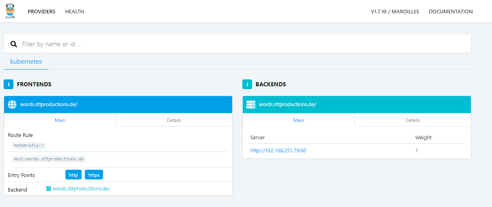
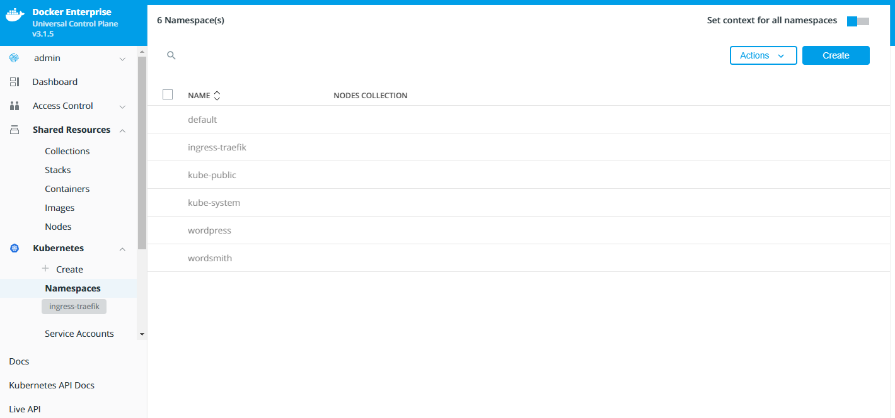
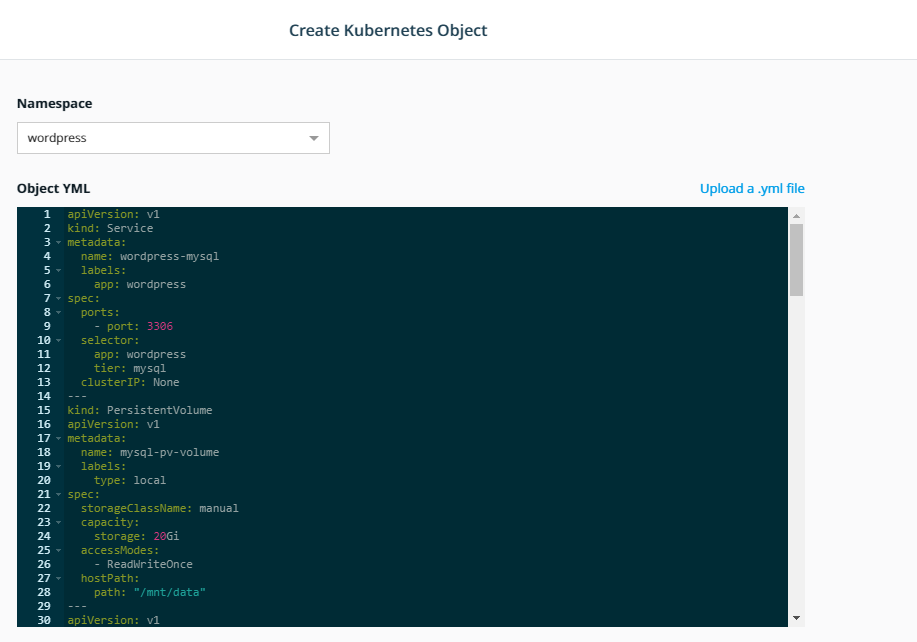
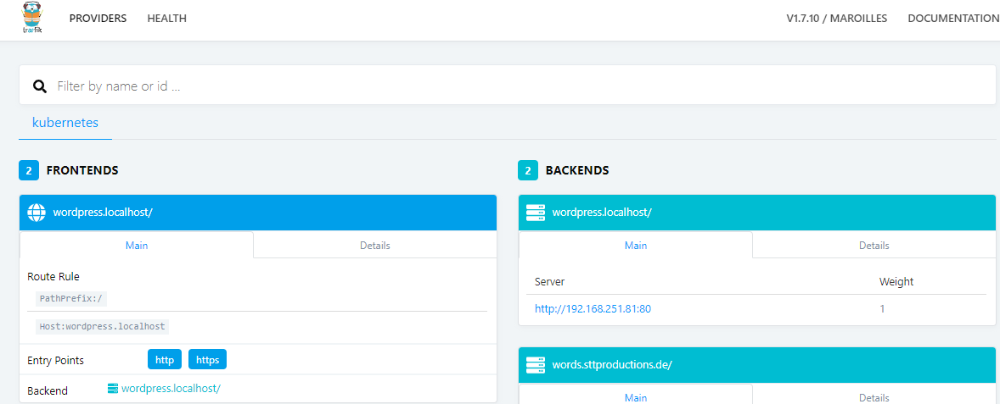
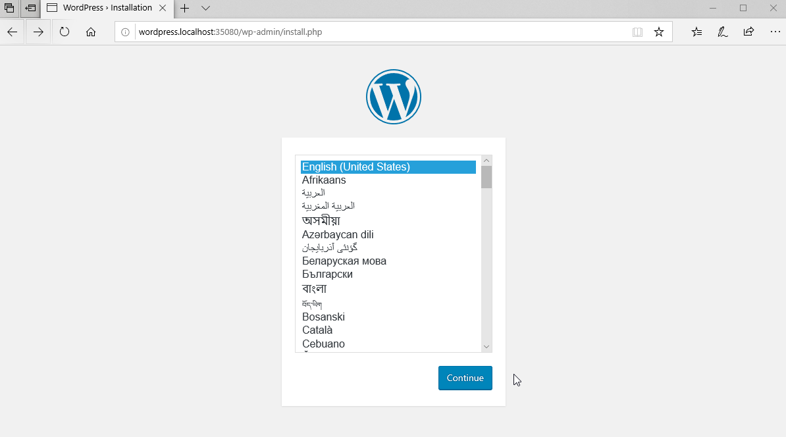

# Getting started with Kubernetes

By the end of this exercise, you should be able to:

 - Receive a basic translation from Docker to Kubernetes Orchestration
 - Get to know Pods, Services, Persistent Storage, NodePorts, Ingress
 - Deploy your first Kubernetes micro service application


## Introduction

This exercise will provide you with a quick introduction into a Kubernetes service, including some extras. You will be able to access a service via DNS and save database data. The app we are going to deploy will be a simple wordpress with mysql attached to it. Wordpress and Mysql will run in their own pods.

Before you begin this exercise you should:
- Have an UCP/DTR installation in place
- Know how to use and where to find a UCP Client Bundle


## Part 1 - Kubernetes for Docker users

Let's translate a couple of Kubernetes terms into the Docker lingo:

### Namespace
- Think of a namespace as of a playground for all your K8s objects, such as pods, services, etc. 
- You can split your cluster into multiple namespaces.
- You can even add management rights to each namespace.

### Pods
- K8s speaks of PODs. PODs can be one or many containers. Important to know is, that pods can communicate via `127.0.0.1 ` with each other. E.g. a Webserver running on port 80 can contact a MySQL DB on port 3306.
- You can still manage Docker Containers of a POD with the Docker CLI, while this is not recommended. You can use kubectl instead. Have a look here for further translation help: https://kubernetes.io/docs/reference/kubectl/docker-cli-to-kubectl/

### Persistant Volume (PV) & Persistant Volume Claim (PVC)
- K8s uses PVs and PVC in combination to provide volumes to pods. You could think of PVs as the defined storage area while PVC will be the mount for the pod.  
- Usually you define a PV first (which can be any kind of storage, NFS, Cloud, etc) and then "mount" this storage with a PVC.

### Services
- Services in K8s are used to make your POD available to other services in and outside of your K8s cluster. Services can be Ingress, NodePorts, ClusterIP and other.
- We will take a look into services in this exercise, you can read all details in full here: https://kubernetes.io/docs/concepts/services-networking/service/

### Ingress
- Ingress is one kind of a service. This service is usually provided by a ingress controller such as NGINX or Traeffik. 
- Other third party INGRESS controller, even hardware based ones such as f5, Citrix NetScaler may be used as well.

## Part 2 - Preparing the YAML files

K8s uses YAMLs to roll out applications such as Docker Swarm. The content of the files differ though. Let's have a look into our YAML

```
apiVersion: v1
kind: Service
metadata:
  name: wordpress-mysql
  labels:
    app: wordpress
spec:
  ports:
    - port: 3306
  selector:
    app: wordpress
    tier: mysql
  clusterIP: None
---
kind: PersistentVolume
apiVersion: v1
metadata:
  name: mysql-pv-volume
  labels:
    type: local
spec:
  storageClassName: manual
  capacity:
    storage: 20Gi
  accessModes:
    - ReadWriteOnce
  hostPath:
    path: "/mnt/data"
---
apiVersion: v1
kind: PersistentVolumeClaim
metadata:
  name: mysql-pv-claim
  labels:
    app: wordpress
spec:
  storageClassName: manual
  accessModes:
    - ReadWriteOnce
  resources:
    requests:
      storage: 2Gi
---
apiVersion: apps/v1 # for versions before 1.9.0 use apps/v1beta2
kind: Deployment
metadata:
  name: wordpress-mysql
  labels:
    app: wordpress
spec:
  selector:
    matchLabels:
      app: wordpress
      tier: mysql
  strategy:
    type: Recreate
  template:
    metadata:
      labels:
        app: wordpress
        tier: mysql
    spec:
      containers:
      - image: mysql:5.6
        name: mysql
        env:
        - name: MYSQL_ROOT_PASSWORD
          value: ThisIsAlsoSecret
        ports:
        - containerPort: 3306
          name: mysql
        volumeMounts:
        - name: mysql-persistent-storage
          mountPath: /var/lib/mysql
      volumes:
      - name: mysql-persistent-storage
        persistentVolumeClaim:
          claimName: mysql-pv-claim
---
apiVersion: extensions/v1beta1
kind: Ingress
metadata:
  name: wordpress-ingress  
  annotations:
    kubernetes.io/ingress.class: traefik
spec:
  rules:
  - host: wordpress.localhost
    http:
      paths:
      - path: /
        backend:
          serviceName: wordpress
          servicePort: 8081
---
apiVersion: v1
kind: Service
metadata:
  name: wordpress
  labels:
    app: wordpress
spec:
  ports:
    - port: 8081
      targetPort: 80
  selector:
    app: wordpress
    tier: frontend
---
apiVersion: v1
kind: PersistentVolume
metadata:
  name: wp-pv-volume
  labels:
    type: local
spec:
  storageClassName: manual
  capacity:
    storage: 20Gi
  accessModes:
    - ReadWriteOnce
  hostPath:
    path: "/mnt/data"
---
apiVersion: v1
kind: PersistentVolumeClaim
metadata:
  name: wp-pv-claim
  labels:
    app: wordpress
spec:
  storageClassName: manual
  accessModes:
    - ReadWriteOnce
  resources:
    requests:
      storage: 2Gi
---
apiVersion: apps/v1 # for versions before 1.9.0 use apps/v1beta2
kind: Deployment
metadata:
  name: wordpress
  labels:
    app: wordpress
spec:
  selector:
    matchLabels:
      app: wordpress
      tier: frontend
  strategy:
    type: Recreate
  template:
    metadata:
      labels:
        app: wordpress
        tier: frontend
    spec:
      containers:
      - image: wordpress:4.8-apache
        name: wordpress
        env:
        - name: WORDPRESS_DB_HOST
          value: wordpress-mysql
        - name: WORDPRESS_DB_PASSWORD
          value: ThisIsAlsoSecret         
        ports:
        - containerPort: 80
          name: wordpress
        volumeMounts:
        - name: wordpress-persistent-storage
          mountPath: /var/www/html
      volumes:
      - name: wordpress-persistent-storage
        persistentVolumeClaim:
          claimName: wp-pv-claim
```

This YAML will create a `Deployment`, this deployment will create 2 `PODs`, one for wordpress and one for mysql. Additionally it will create `PV` and `PVC`. It will also provide access to wordpress via the DNS `wordpress.localhost` over an Traeffik ingress controller.

## Part 3 - Rolling out an Ingress Controller and your service.

1. In your UCP installation, set up a TRAEFFIK ingress controller following these instructions:
https://success.docker.com/article/how-to-configure-traefik-as-a-layer-7-ingress-controller-for-kubernetes

By the end you should have:
- One namespace named `ingress-traefik`
- One up and running `traeffik-ingress-controller` pod
- One `NodePort` listening on 35080 and one random NodePort. We will use the Port 35080 to access our service
- On the random port you can check your traeffik service. It should look like this:
/

2. Switch to a consol with kubectl and your client bunlde in place and create a new namespace named `wordpress` with this command:
```
kubectl create namespace wordpress
```
You can check in the UCP frontend or with `kubectl get namespace` if the creation was successful. It should look like this:
```
[admin-str@ee-client01 wordsmith-demo]$ kubectl get namespace
NAME              STATUS    AGE
default           Active    141d
ingress-traefik   Active    139d
kube-public       Active    141d
kube-system       Active    141d
wordpress         Active    28s
```
3. Log into UCP with your admin account. Go to Kubernetes and select Namespace. In the Namespace overview, make sure to select wordpress as you context:
/

4. Now select **Create**, copy the YAML file of this GIT, select as namespace `wordpress`and paste the YAML file into the black box, click create:
/

The creation of all pods and service will take a while, depending on your internet speed and environment setup.

5. When done correctly, you should see your service up in your TRAEFFIK Management:
/

6. To access your wordpress page, you can either use a real DNS entry of your environment, or in this example, simply add the an IP adress of your UCP worker to your /etc/hosts file. e.g.: `10.10.10.10 wordpress.localhost`
/

7. You can now check out all the items you have created with kubectl or with UCP's WebUI:
```
[admin-str@ee-client01 wordsmith-demo]$ kubectl get all --namespace=wordpress
NAME                     AGE
deploy/wordpress         24m
deploy/wordpress-mysql   24m

NAME                            AGE
rs/wordpress-654597bbc4         24m
rs/wordpress-mysql-5c665d9d86   24m

NAME                                  READY     STATUS    RESTARTS   AGE
po/wordpress-654597bbc4-fwsmx         1/1       Running   0          24m
po/wordpress-mysql-5c665d9d86-bwv2m   1/1       Running   0          24m

NAME                  TYPE        CLUSTER-IP    EXTERNAL-IP   PORT(S)    AGE
svc/wordpress         ClusterIP   10.96.7.229   <none>        8081/TCP   5m
svc/wordpress-mysql   ClusterIP   None          <none>        3306/TCP   24m
```

Make yourself familier with the objects. All objects are quiet common in K8s environments. Please contact your Docker instructure for further help or explanation for this exercise, if necessary.


## Conclusion

Kubernetes provides a very different approach on orchestration management, while the goal stays the same: Automation and simple management of a highly flexible environment. This course scratches only the surface, but shows off a simple app with K8s. 

**Further reading:**

https://kubernetes.io/docs/reference/kubectl/docker-cli-to-kubectl/
https://kubernetes.io/docs/concepts/workloads/controllers/deployment/
https://kubernetes.io/docs/concepts/services-networking/service/
https://kubernetes.io/docs/concepts/services-networking/ingress/
https://kubernetes.io/docs/concepts/storage/persistent-volumes/


